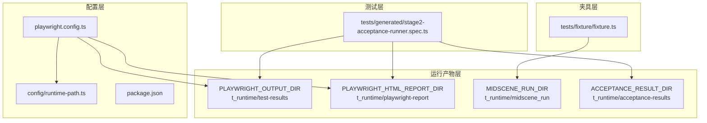
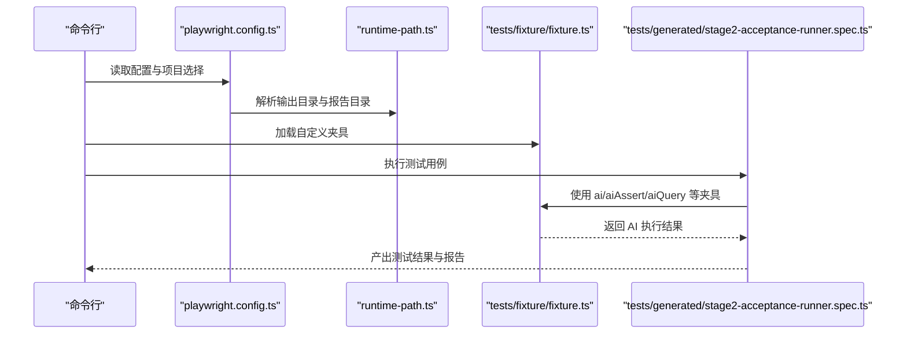
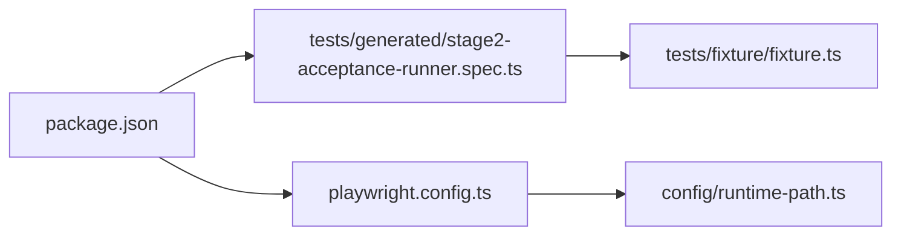

# Playwright 配置

<cite>
**本文引用的文件**
- [playwright.config.ts](file://playwright.config.ts)
- [package.json](file://package.json)
- [runtime-path.ts](file://config/runtime-path.ts)
- [fixture.ts](file://tests/fixture/fixture.ts)
- [stage2-acceptance-runner.spec.ts](file://tests/generated/stage2-acceptance-runner.spec.ts)
- [README.md](file://README.md)
- [login-e2e.md](file://specs/login-e2e.md)
</cite>

## 目录
1. [简介](#简介)
2. [项目结构](#项目结构)
3. [核心组件](#核心组件)
4. [架构总览](#架构总览)
5. [详细组件分析](#详细组件分析)
6. [依赖关系分析](#依赖关系分析)
7. [性能考虑](#性能考虑)
8. [故障排查指南](#故障排查指南)
9. [结论](#结论)
10. [附录](#附录)

## 简介
本文件系统性梳理本项目的 Playwright 配置与使用方式，覆盖以下主题：
- 浏览器与设备配置、测试超时与并发执行
- 测试输出与报告、截图与视频录制
- 测试夹具（fixtures）的全局与测试级别配置
- 浏览器启动参数与无头/有头模式
- 测试过滤与选择（含标签与文件模式）
- 性能优化与调试选项

本项目采用集中式配置与环境变量驱动的运行产物目录策略，结合自定义夹具扩展 AI 能力，形成“配置—夹具—测试”的清晰分层。

## 项目结构
- 配置层：集中于配置文件与运行时路径解析
- 夹具层：封装 AI 能力与页面交互
- 测试层：具体测试用例与项目选择
- 运行产物层：输出目录、HTML 报告、Midscene 报告与数据库落盘

图表来源
- [playwright.config.ts:22-94](file://playwright.config.ts#L22-L94)
- [runtime-path.ts:18-36](file://config/runtime-path.ts#L18-L36)
- [package.json:6-11](file://package.json#L6-L11)

章节来源
- [playwright.config.ts:22-94](file://playwright.config.ts#L22-L94)
- [runtime-path.ts:1-41](file://config/runtime-path.ts#L1-L41)
- [package.json:1-26](file://package.json#L1-L26)

## 核心组件
- 集中式配置：通过配置文件统一管理测试目录、超时、并发、重试、报告器与项目设备。
- 环境变量驱动的运行产物目录：通过运行时路径模块读取环境变量，确保产物目录可配置且收敛。
- 自定义夹具：在基础夹具之上扩展 AI 能力（ai、aiAction、aiQuery、aiAssert、aiWaitFor），并统一设置报告生成与缓存标识。
- 测试项目选择：通过命令行参数选择项目（如 chromium），并支持有头/无头模式切换。

章节来源
- [playwright.config.ts:22-94](file://playwright.config.ts#L22-L94)
- [runtime-path.ts:18-36](file://config/runtime-path.ts#L18-L36)
- [fixture.ts:23-99](file://tests/fixture/fixture.ts#L23-L99)
- [package.json:6-11](file://package.json#L6-L11)

## 架构总览
下图展示了配置、夹具与测试之间的交互关系，以及运行产物的流向。

图表来源
- [playwright.config.ts:22-94](file://playwright.config.ts#L22-L94)
- [runtime-path.ts:18-36](file://config/runtime-path.ts#L18-L36)
- [fixture.ts:23-99](file://tests/fixture/fixture.ts#L23-L99)
- [stage2-acceptance-runner.spec.ts:12-37](file://tests/generated/stage2-acceptance-runner.spec.ts#L12-L37)

## 详细组件分析

### 配置文件（playwright.config.ts）
- 测试目录与产物
  - testDir：指定测试源码目录
  - outputDir：测试产物输出目录，来自运行时路径模块
- 超时与重试
  - timeout：单个测试超时时间
  - retries：CI 环境启用重试次数
- 并发与工作线程
  - fullyParallel：启用完全并行
  - workers：CI 环境限制为 1，本地默认并行
- 报告器
  - 列表模式、HTML 报告与第三方报告器组合
- 全局 use 设置
  - trace：首次重试时收集 trace
- 项目配置
  - chromium 设备预设
  - 提供 firefox/webkit/mobile/品牌浏览器示例注释
- 本地服务器
  - 提供 webServer 示例注释（可按需启用）

章节来源
- [playwright.config.ts:22-94](file://playwright.config.ts#L22-L94)

### 运行时路径模块（runtime-path.ts）
- 通过环境变量读取运行目录前缀与各产物目录
- 提供统一的路径解析函数，保证跨平台一致性

章节来源
- [runtime-path.ts:1-41](file://config/runtime-path.ts#L1-L41)

### 自定义夹具（tests/fixture/fixture.ts）
- 基于基础 test 扩展 AI 能力，统一设置：
  - 缓存 ID 清洗规则
  - 生成报告开关
  - 组名与组描述
- 提供多个别名：
  - ai：通用 AI 操作入口
  - aiAction：动作型 AI
  - aiQuery：查询型 AI
  - aiAssert：断言型 AI
  - aiWaitFor：等待型 AI

章节来源
- [fixture.ts:23-99](file://tests/fixture/fixture.ts#L23-L99)

### 测试用例（tests/generated/stage2-acceptance-runner.spec.ts）
- 测试级别超时：针对长任务场景提升超时
- 使用自定义夹具执行任务场景
- 对失败步骤进行汇总并抛出带截图路径的错误信息

章节来源
- [stage2-acceptance-runner.spec.ts:10-37](file://tests/generated/stage2-acceptance-runner.spec.ts#L10-L37)

### 命令与脚本（package.json）
- 提供第二段执行的脚本，支持有头/无头模式切换
- 通过命令行参数选择项目（如 chromium）

章节来源
- [package.json:6-11](file://package.json#L6-L11)

### 文档与示例（README.md、specs/login-e2e.md）
- README 提供环境变量与运行产物目录说明
- login-e2e.md 提供环境变量注入与运行示例

章节来源
- [README.md:39-54](file://README.md#L39-L54)
- [specs/login-e2e.md:30-46](file://specs/login-e2e.md#L30-L46)

## 依赖关系分析
- 配置文件依赖运行时路径模块解析输出目录
- 测试用例依赖自定义夹具扩展 AI 能力
- 命令脚本通过项目参数控制浏览器类型与模式

图表来源
- [playwright.config.ts:22-94](file://playwright.config.ts#L22-L94)
- [runtime-path.ts:18-36](file://config/runtime-path.ts#L18-L36)
- [fixture.ts:23-99](file://tests/fixture/fixture.ts#L23-L99)
- [stage2-acceptance-runner.spec.ts:12-37](file://tests/generated/station2-acceptance-runner.spec.ts#L12-L37)
- [package.json:6-11](file://package.json#L6-L11)

## 性能考虑
- 并发策略
  - 本地默认启用完全并行，CI 环境限制为 1 工作线程，降低资源竞争
- 超时与重试
  - 针对长任务场景提升测试超时，CI 环境启用重试，平衡稳定性与速度
- 报告与追踪
  - 首次重试时收集 trace，有助于定位问题但会增加开销；可在调试阶段开启，日常关闭以节省资源
- 产物目录收敛
  - 通过环境变量统一收敛到运行目录，便于清理与归档

章节来源
- [playwright.config.ts:26-34](file://playwright.config.ts#L26-L34)
- [stage2-acceptance-runner.spec.ts:10](file://tests/generated/stage2-acceptance-runner.spec.ts#L10)

## 故障排查指南
- 环境变量缺失
  - 确认运行产物目录与模型配置等环境变量已正确设置
- 测试超时
  - 长任务场景可提升测试级别超时；全局超时过短会导致频繁失败
- 并发冲突
  - CI 环境默认单工作线程，若仍出现不稳定，可临时禁用并行或降低 workers 数量
- 报告与截图
  - 查看 HTML 报告与截图目录，结合失败步骤信息定位问题
- 本地服务器
  - 如需在测试前启动本地服务，可启用 webServer 配置项

章节来源
- [README.md:39-54](file://README.md#L39-L54)
- [stage2-acceptance-runner.spec.ts:27-35](file://tests/generated/stage2-acceptance-runner.spec.ts#L27-L35)
- [playwright.config.ts:88-93](file://playwright.config.ts#L88-L93)

## 结论
本项目通过集中式配置与环境变量驱动的产物目录，实现了可移植、可维护的 Playwright 测试体系。配合自定义夹具扩展 AI 能力，既满足常规 UI 自动化，又支持复杂场景的智能断言与等待。建议在本地开发时充分利用并行与列表报告，在 CI 环境中适度收紧并发与重试策略，确保稳定与效率的平衡。

## 附录

### 浏览器与设备配置
- 项目预设：chromium
- 可选设备：firefox、webkit、移动端设备、品牌浏览器通道
- 启动参数建议
  - 无头/有头：通过命令行参数切换
  - 窗口大小：可在 use 中设置视口尺寸
  - 用户代理：可在 use 中设置 UA

章节来源
- [playwright.config.ts:51-86](file://playwright.config.ts#L51-L86)
- [package.json:10](file://package.json#L10)

### 测试超时与重试
- 全局超时：单个测试超时时间
- 重试策略：CI 环境启用重试，本地关闭
- 测试级别超时：针对长任务场景提升超时

章节来源
- [playwright.config.ts:26-32](file://playwright.config.ts#L26-L32)
- [stage2-acceptance-runner.spec.ts:10](file://tests/generated/stage2-acceptance-runner.spec.ts#L10)

### 并发执行参数
- fullyParallel：启用完全并行
- workers：CI 环境限制为 1，本地默认并行

章节来源
- [playwright.config.ts:28-34](file://playwright.config.ts#L28-L34)

### 测试输出与报告
- 输出目录：来自运行时路径模块
- HTML 报告：第三方报告器生成
- Midscene 报告：夹具统一生成
- 截图与视频：由夹具与测试场景触发

章节来源
- [runtime-path.ts:18-36](file://config/runtime-path.ts#L18-L36)
- [playwright.config.ts:36-40](file://playwright.config.ts#L36-L40)
- [fixture.ts:31-33](file://tests/fixture/fixture.ts#L31-L33)

### 测试夹具配置
- 全局设置：夹具内统一设置报告生成、缓存 ID 清洗、组名与描述
- 测试级别自定义：可在测试文件中覆盖或扩展 use 配置

章节来源
- [fixture.ts:23-99](file://tests/fixture/fixture.ts#L23-L99)

### 浏览器启动参数配置指南
- 无头/有头：通过命令行参数切换
- 窗口大小：在 use 中设置视口
- 用户代理：在 use 中设置 UA

章节来源
- [package.json:10](file://package.json#L10)

### 测试过滤与选择机制
- 文件模式：通过命令行指定测试文件路径
- 项目选择：通过 --project 指定项目（如 chromium）
- 标签过滤：可通过 describe.configure 或第三方报告器进行筛选（示例注释位于依赖类型声明中）

章节来源
- [specs/login-e2e.md:30-46](file://specs/login-e2e.md#L30-L46)
- [package.json:9-10](file://package.json#L9-L10)

### 性能优化与调试选项
- 并行与工作线程：本地并行、CI 单工作线程
- 超时与重试：长任务提升超时、CI 启用重试
- Trace 收集：首次重试时开启，便于定位问题
- 产物目录收敛：统一运行目录，便于清理与归档

章节来源
- [playwright.config.ts:26-34](file://playwright.config.ts#L26-L34)
- [playwright.config.ts:46-48](file://playwright.config.ts#L46-L48)
- [README.md:76-96](file://README.md#L76-L96)