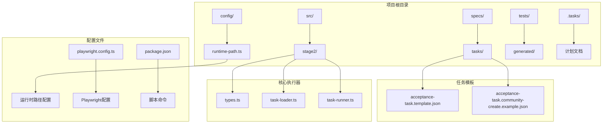
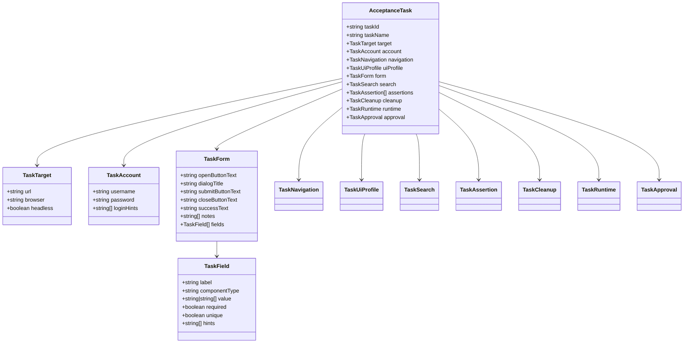
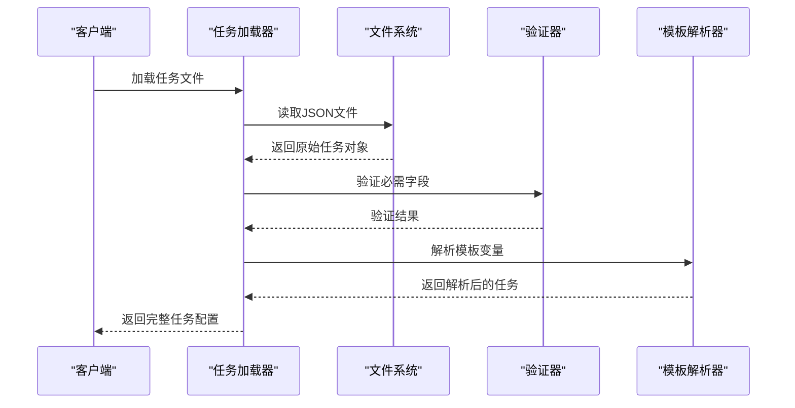
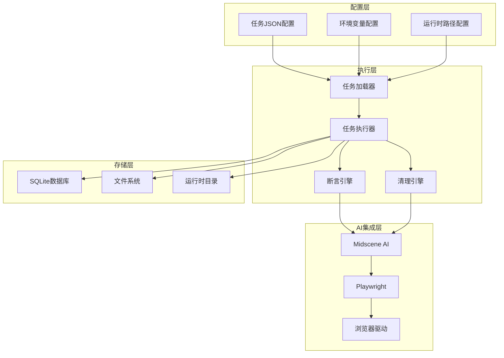
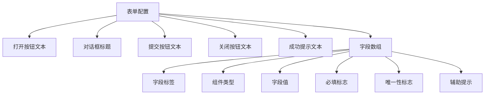
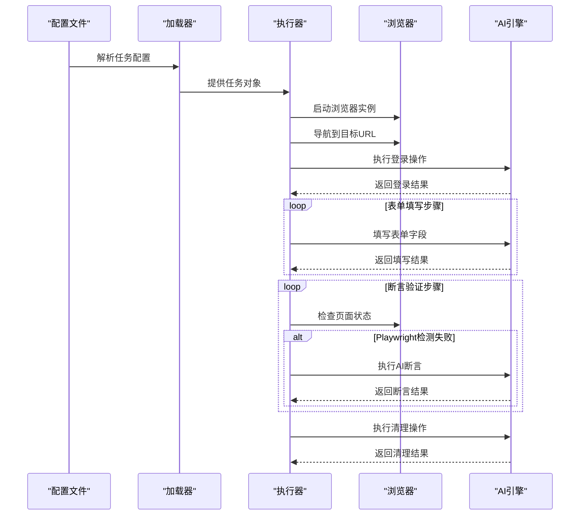
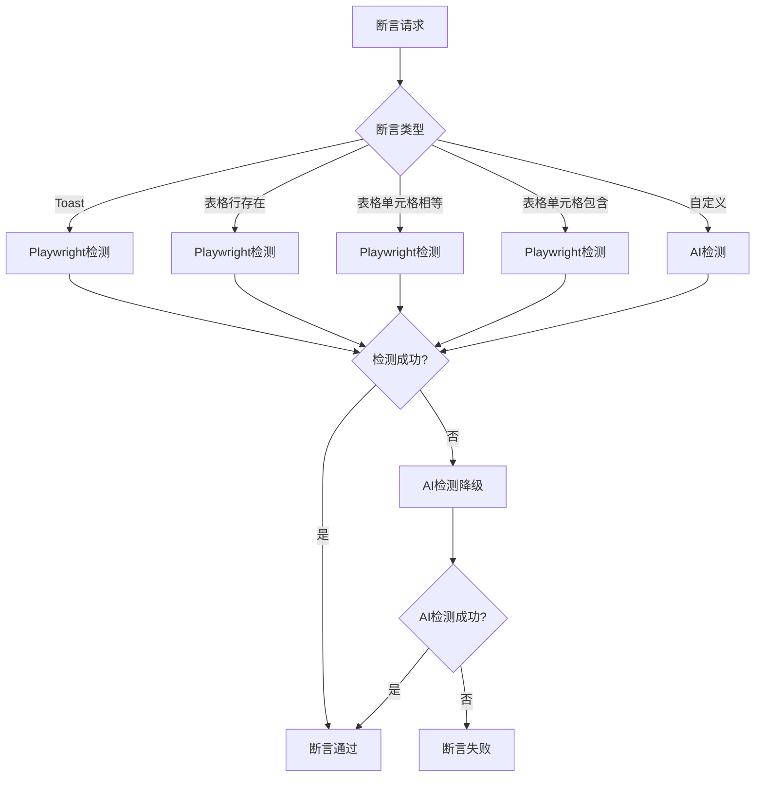
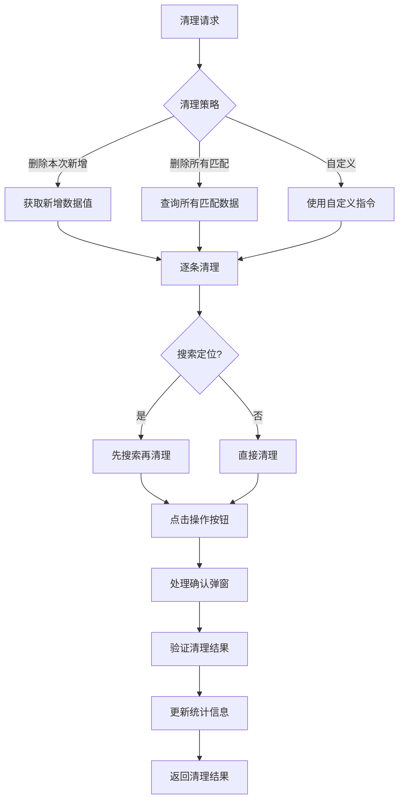
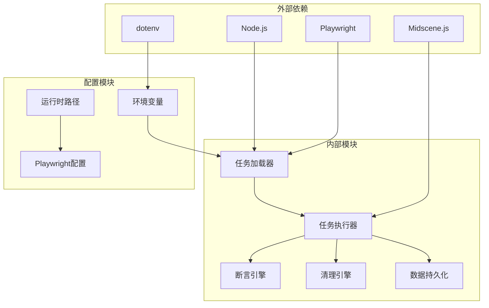

# 任务配置模板

<cite>
**本文档引用的文件**
- [acceptance-task.template.json](file://specs/tasks/acceptance-task.template.json)
- [acceptance-task.community-create.example.json](file://specs/tasks/acceptance-task.community-create.example.json)
- [types.ts](file://src/stage2/types.ts)
- [task-loader.ts](file://src/stage2/task-loader.ts)
- [task-runner.ts](file://src/stage2/task-runner.ts)
- [README.md](file://README.md)
- [runtime-path.ts](file://config/runtime-path.ts)
- [playwright.config.ts](file://playwright.config.ts)
- [package.json](file://package.json)
</cite>

## 目录
1. [简介](#简介)
2. [项目结构](#项目结构)
3. [核心组件](#核心组件)
4. [架构概览](#架构概览)
5. [详细组件分析](#详细组件分析)
6. [依赖关系分析](#依赖关系分析)
7. [性能考虑](#性能考虑)
8. [故障排除指南](#故障排除指南)
9. [结论](#结论)

## 简介

HI-TEST 项目是一个基于 Playwright 和 Midscene.js 的 AI 自动化测试框架，专门用于验收测试场景。该项目的核心是任务配置模板系统，它允许用户通过 JSON 配置文件定义复杂的端到端测试流程。

任务配置模板系统提供了以下核心功能：
- **结构化任务定义**：通过 JSON 格式定义完整的测试场景
- **AI 集成**：结合 Playwright 和 Midscene AI 能力进行智能自动化
- **跨平台兼容**：支持多种 UI 框架和浏览器环境
- **断言系统**：提供多种断言类型和重试机制
- **数据清理**：自动清理测试产生的临时数据

## 项目结构

项目采用模块化的文件组织方式，主要包含以下关键目录和文件：

**图表来源**
- [specs/tasks/acceptance-task.template.json:1-141](file://specs/tasks/acceptance-task.template.json#L1-L141)
- [src/stage2/types.ts:1-180](file://src/stage2/types.ts#L1-L180)
- [config/runtime-path.ts:1-41](file://config/runtime-path.ts#L1-L41)

**章节来源**
- [README.md:1-223](file://README.md#L1-L223)
- [package.json:1-26](file://package.json#L1-L26)

## 核心组件

### AcceptanceTask 接口定义

任务配置的核心是 `AcceptanceTask` 接口，它定义了整个任务的结构和约束条件：

**图表来源**
- [src/stage2/types.ts:141-154](file://src/stage2/types.ts#L141-L154)
- [src/stage2/types.ts:5-154](file://src/stage2/types.ts#L5-L154)

### 任务加载器

任务加载器负责解析和验证任务配置文件：

**图表来源**
- [src/stage2/task-loader.ts:79-89](file://src/stage2/task-loader.ts#L79-L89)
- [src/stage2/task-loader.ts:50-69](file://src/stage2/task-loader.ts#L50-L69)

**章节来源**
- [src/stage2/types.ts:1-180](file://src/stage2/types.ts#L1-L180)
- [src/stage2/task-loader.ts:1-91](file://src/stage2/task-loader.ts#L1-L91)

## 架构概览

HI-TEST 项目采用分层架构设计，将任务配置、执行逻辑和数据持久化分离：

**图表来源**
- [src/stage2/task-runner.ts:2318-2399](file://src/stage2/task-runner.ts#L2318-L2399)
- [src/persistence/stage2-store.ts:263-303](file://src/persistence/stage2-store.ts#L263-L303)

## 详细组件分析

### 任务配置模板详解

#### 基础配置结构

任务配置文件采用 JSON 格式，包含以下核心部分：

**目标配置 (Target)**
- `url`: 目标应用的访问地址
- `browser`: 浏览器类型（默认 chromium）
- `headless`: 是否无头模式运行

**账户配置 (Account)**
- `username`: 测试账户用户名
- `password`: 测试账户密码
- `loginHints`: 登录页面的辅助描述信息

**导航配置 (Navigation)**
- `homeReadyText`: 首页就绪标识文本
- `menuPath`: 菜单路径数组
- `menuHints`: 菜单导航的辅助信息

#### 表单配置 (Form)

表单配置是最复杂的部分，包含多个字段定义：

**图表来源**
- [specs/tasks/acceptance-task.template.json:46-64](file://specs/tasks/acceptance-task.template.json#L46-L64)
- [src/stage2/types.ts:32-40](file://src/stage2/types.ts#L32-L40)

#### 搜索配置 (Search)

搜索配置定义了列表页面的搜索功能：

- `inputLabel`: 搜索输入框标签
- `extraInputLabels`: 额外的搜索条件输入框
- `keywordFromField`: 关键词来源字段
- `triggerButtonText`: 搜索触发按钮文本
- `resultTableTitle`: 结果表格标题
- `expectedColumns`: 期望显示的列
- `rowActionButtons`: 行操作按钮列表
- `pagination`: 分页配置

#### 断言配置 (Assertions)

断言系统支持多种断言类型：

**Toast 断言**
- 类型: `toast`
- 配置: `expectedText`, `timeoutMs`, `retryCount`, `soft`

**表格行存在断言**
- 类型: `table-row-exists`
- 配置: `matchField`, `matchMode`, `timeoutMs`, `retryCount`

**表格单元格相等断言**
- 类型: `table-cell-equals`
- 配置: `matchField`, `expectedColumns`, `expectedColumnFromFields`, `retryCount`, `soft`

**表格单元格包含断言**
- 类型: `table-cell-contains`
- 配置: `matchField`, `column`, `expectedFromField`, `retryCount`, `soft`

**自定义断言**
- 类型: `custom`
- 配置: `description`, `soft`

#### 清理配置 (Cleanup)

清理配置支持多种清理策略：

**删除策略**
- `strategy`: `delete-created`（删除本次新增）
- `matchField`: 用于定位待删除数据的字段
- `searchBeforeCleanup`: 清理前是否先搜索
- `rowMatchMode`: 行匹配模式（`exact`/`contains`）
- `verifyAfterCleanup`: 删除后是否验证行消失
- `failOnError`: 清理失败是否中断任务

**清理动作**
- `actionType`: `delete`（删除）或 `custom`（自定义）
- `rowButtonText`: 行操作按钮文本（如"删除"）
- `confirmDialogTitle`: 确认弹窗标题
- `confirmButtonText`: 确认按钮文本
- `cancelButtonText`: 取消按钮文本
- `successText`: 成功提示文本
- `customInstruction`: 自定义清理指令

#### 运行时配置 (Runtime)

运行时配置控制测试执行的行为：

- `stepTimeoutMs`: 步骤超时时间（毫秒）
- `pageTimeoutMs`: 页面超时时间（毫秒）
- `screenshotOnStep`: 是否在每个步骤截图
- `trace`: 是否启用跟踪

#### 审批配置 (Approval)

审批配置用于控制任务执行权限：

- `approved`: 是否已审批
- `approvedBy`: 审批人
- `approvedAt`: 审批时间

**章节来源**
- [specs/tasks/acceptance-task.template.json:1-141](file://specs/tasks/acceptance-task.template.json#L1-L141)
- [specs/tasks/acceptance-task.community-create.example.json:1-229](file://specs/tasks/acceptance-task.community-create.example.json#L1-L229)
- [src/stage2/types.ts:67-133](file://src/stage2/types.ts#L67-L133)

### 任务执行流程

任务执行器负责按照配置文件定义的步骤执行测试：

**图表来源**
- [src/stage2/task-runner.ts:2318-2399](file://src/stage2/task-runner.ts#L2318-L2399)
- [src/stage2/task-runner.ts:1562-1917](file://src/stage2/task-runner.ts#L1562-L1917)

**章节来源**
- [src/stage2/task-runner.ts:1-800](file://src/stage2/task-runner.ts#L1-L800)
- [src/stage2/task-runner.ts:800-1600](file://src/stage2/task-runner.ts#L800-L1600)

### 断言系统实现

断言系统采用多层次的检测策略：

**图表来源**
- [src/stage2/task-runner.ts:1562-1917](file://src/stage2/task-runner.ts#L1562-L1917)

断言系统的特性包括：
- **重试机制**: 每个断言最多重试指定次数
- **超时控制**: 不同断言类型有不同的超时时间
- **软断言**: 支持软断言，失败不中断流程
- **AI降级**: Playwright检测失败时自动使用AI检测

**章节来源**
- [src/stage2/task-runner.ts:1027-1090](file://src/stage2/task-runner.ts#L1027-L1090)
- [src/stage2/task-runner.ts:1532-1556](file://src/stage2/task-runner.ts#L1532-L1556)

### 数据清理机制

数据清理系统提供了灵活的清理策略：

**图表来源**
- [src/stage2/task-runner.ts:2218-2316](file://src/stage2/task-runner.ts#L2218-L2316)

清理系统的特性包括：
- **多策略支持**: 支持删除本次新增、删除所有匹配、自定义清理
- **智能定位**: 自动识别表格行和操作按钮
- **确认处理**: 自动处理确认弹窗
- **结果验证**: 清理后验证目标数据是否已删除

**章节来源**
- [src/stage2/task-runner.ts:1920-2316](file://src/stage2/task-runner.ts#L1920-L2316)

## 依赖关系分析

项目的主要依赖关系如下：

**图表来源**
- [package.json:15-25](file://package.json#L15-L25)
- [playwright.config.ts:1-95](file://playwright.config.ts#L1-L95)

**章节来源**
- [package.json:1-26](file://package.json#L1-L26)
- [playwright.config.ts:1-95](file://playwright.config.ts#L1-L95)

## 性能考虑

### 运行时优化

项目在性能方面采用了多项优化措施：

1. **超时配置**: 每个断言类型都有合理的超时设置
2. **重试机制**: 智能的重试策略避免瞬时失败影响整体执行
3. **截图控制**: 可选的步骤截图功能平衡调试需求和性能开销
4. **AI降级**: Playwright检测失败时自动降级到AI，保证执行连续性

### 内存管理

- **渐进式结果写入**: 执行过程中实时写入进度文件
- **数据库连接池**: 使用SQLite单文件数据库减少连接开销
- **资源清理**: 自动清理临时文件和浏览器进程

## 故障排除指南

### 常见问题及解决方案

**1. 任务文件加载失败**

症状：`任务文件不存在: specs/tasks/acceptance-task.community-create.example.json`

解决方案：
- 检查任务文件路径是否正确
- 确认文件权限设置
- 验证JSON格式是否正确

**2. 登录失败**

症状：滑块验证码检测到但无法自动处理

解决方案：
- 设置 `STAGE2_CAPTCHA_MODE=manual` 手动处理
- 调整 `STAGE2_CAPTCHA_WAIT_TIMEOUT_MS` 增加等待时间
- 检查网络连接和浏览器版本

**3. 断言失败**

症状：表格断言或Toast断言失败

解决方案：
- 检查 `matchMode` 配置（`exact` vs `contains`）
- 验证 `timeoutMs` 和 `retryCount` 设置
- 使用 `soft: true` 避免中断流程

**4. 清理失败**

症状：数据清理操作失败

解决方案：
- 检查 `rowMatchMode` 配置
- 验证 `searchBeforeCleanup` 设置
- 确认 `verifyAfterCleanup` 配置

**章节来源**
- [src/stage2/task-loader.ts:79-89](file://src/stage2/task-loader.ts#L79-L89)
- [README.md:56-75](file://README.md#L56-L75)

### 调试技巧

1. **启用详细日志**: 设置 `STAGE2_CAPTCHA_MODE=auto` 并观察控制台输出
2. **截图分析**: 启用 `screenshotOnStep: true` 获取每步截图
3. **AI查询**: 使用 `aiQuery` 获取页面结构信息
4. **断言重试**: 调整 `retryCount` 参数增加重试次数
5. **超时调整**: 根据页面复杂度调整 `timeoutMs` 设置

## 结论

HI-TEST 项目的任务配置模板系统提供了一个强大而灵活的验收测试框架。通过结构化的JSON配置，用户可以定义复杂的端到端测试场景，结合AI能力和Playwright自动化技术，实现了高可靠性的测试执行。

系统的主要优势包括：
- **高度可配置**: 通过JSON配置实现灵活的任务定义
- **AI集成**: 智能的AI辅助操作和断言
- **跨平台兼容**: 支持多种UI框架和浏览器环境
- **数据清理**: 自动化的测试数据清理机制
- **可视化报告**: 详细的执行结果和截图输出

对于开发者而言，建议：
1. 仔细阅读模板文件中的注释说明
2. 根据具体应用场景调整配置参数
3. 利用示例配置作为起点进行定制
4. 建立完善的测试数据管理策略
5. 定期审查和优化断言配置

通过合理使用这个任务配置模板系统，可以显著提高验收测试的效率和质量，为Web应用的稳定性和可靠性提供有力保障。