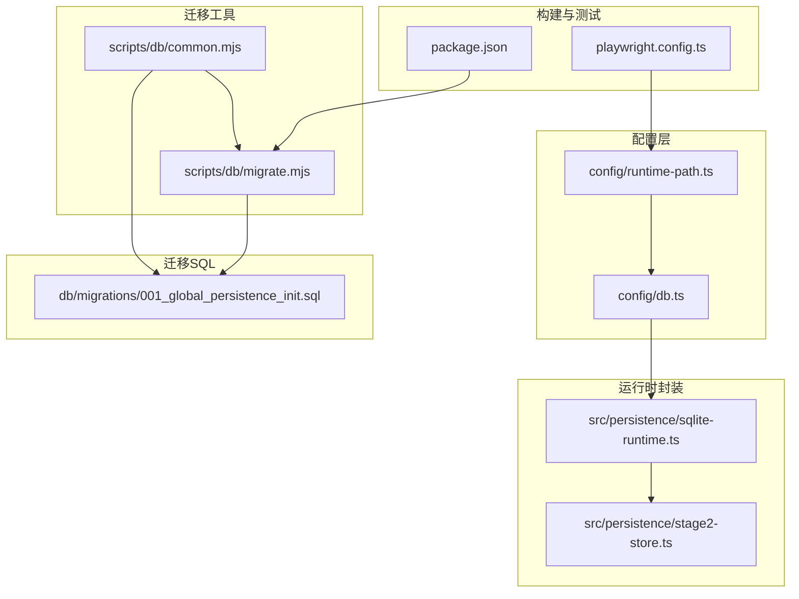
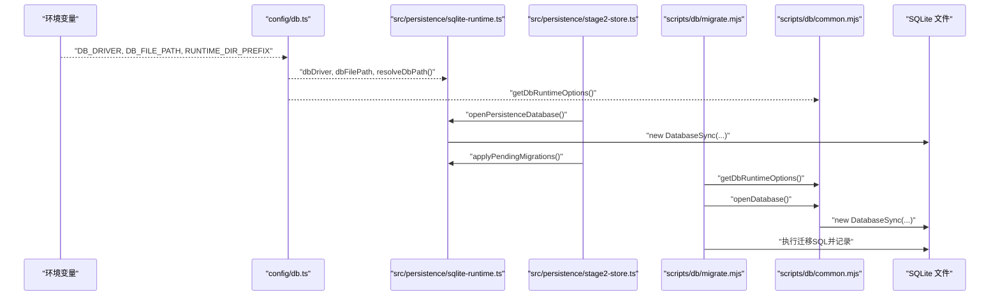
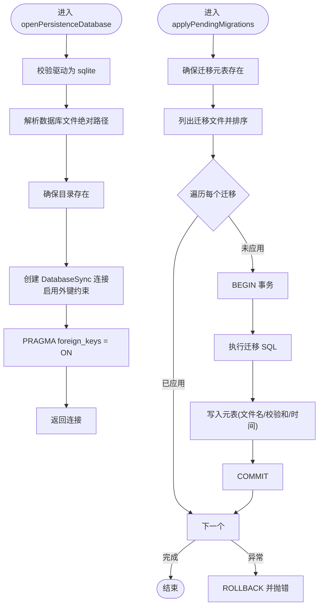
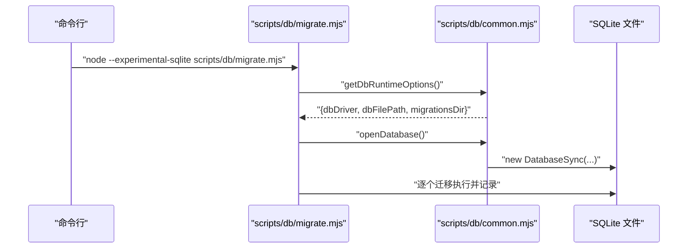
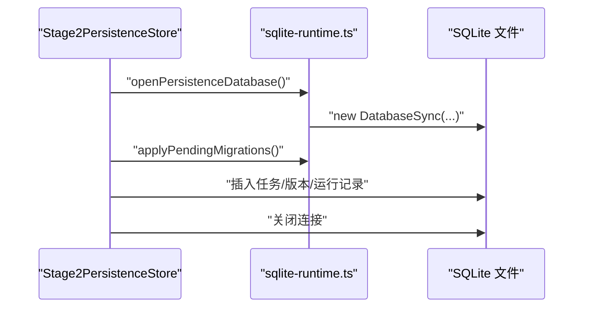
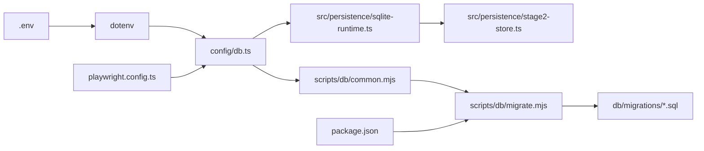

# 数据库配置

<cite>
**本文引用的文件**
- [config/db.ts](file://config/db.ts)
- [config/runtime-path.ts](file://config/runtime-path.ts)
- [src/persistence/sqlite-runtime.ts](file://src/persistence/sqlite-runtime.ts)
- [src/persistence/stage2-store.ts](file://src/persistence/stage2-store.ts)
- [scripts/db/common.mjs](file://scripts/db/common.mjs)
- [scripts/db/migrate.mjs](file://scripts/db/migrate.mjs)
- [db/migrations/001_global_persistence_init.sql](file://db/migrations/001_global_persistence_init.sql)
- [package.json](file://package.json)
- [playwright.config.ts](file://playwright.config.ts)
</cite>

## 目录
1. [简介](#简介)
2. [项目结构](#项目结构)
3. [核心组件](#核心组件)
4. [架构总览](#架构总览)
5. [详细组件分析](#详细组件分析)
6. [依赖关系分析](#依赖关系分析)
7. [性能考量](#性能考量)
8. [故障排查指南](#故障排查指南)
9. [结论](#结论)
10. [附录](#附录)

## 简介
本文件面向开发者，系统性说明本项目的 SQLite 数据库配置与使用方式，涵盖：
- 环境变量与默认值的解析机制
- 数据库文件路径的解析与相对/绝对路径处理
- 驱动初始化流程与迁移管理
- 连接生命周期与关闭策略
- 安全与性能优化建议

本项目采用 node:sqlite 的同步接口进行本地单文件 SQLite 存储，并通过迁移脚本维护表结构与索引。

## 项目结构
围绕数据库配置的关键目录与文件如下：
- 配置层：config/db.ts、config/runtime-path.ts
- 运行时封装：src/persistence/sqlite-runtime.ts、src/persistence/stage2-store.ts
- 迁移工具：scripts/db/common.mjs、scripts/db/migrate.mjs
- 迁移 SQL：db/migrations/001_global_persistence_init.sql
- 构建脚本：package.json 中的 db:* 命令
- 测试配置：playwright.config.ts（间接影响运行时路径）

图表来源
- [config/db.ts:1-28](file://config/db.ts#L1-L28)
- [config/runtime-path.ts:1-41](file://config/runtime-path.ts#L1-L41)
- [src/persistence/sqlite-runtime.ts:1-116](file://src/persistence/sqlite-runtime.ts#L1-L116)
- [src/persistence/stage2-store.ts:1-200](file://src/persistence/stage2-store.ts#L1-L200)
- [scripts/db/common.mjs:1-108](file://scripts/db/common.mjs#L1-L108)
- [scripts/db/migrate.mjs:1-52](file://scripts/db/migrate.mjs#L1-L52)
- [db/migrations/001_global_persistence_init.sql:1-128](file://db/migrations/001_global_persistence_init.sql#L1-L128)
- [package.json:1-26](file://package.json#L1-L26)
- [playwright.config.ts:1-49](file://playwright.config.ts#L1-L49)

章节来源
- [config/db.ts:1-28](file://config/db.ts#L1-L28)
- [config/runtime-path.ts:1-41](file://config/runtime-path.ts#L1-L41)
- [src/persistence/sqlite-runtime.ts:1-116](file://src/persistence/sqlite-runtime.ts#L1-L116)
- [src/persistence/stage2-store.ts:1-200](file://src/persistence/stage2-store.ts#L1-L200)
- [scripts/db/common.mjs:1-108](file://scripts/db/common.mjs#L1-L108)
- [scripts/db/migrate.mjs:1-52](file://scripts/db/migrate.mjs#L1-L52)
- [db/migrations/001_global_persistence_init.sql:1-128](file://db/migrations/001_global_persistence_init.sql#L1-L128)
- [package.json:1-26](file://package.json#L1-L26)
- [playwright.config.ts:1-49](file://playwright.config.ts#L1-L49)

## 核心组件
- 数据库配置导出项
  - 驱动名称与默认值：从环境变量读取，未设置时使用默认 sqlite
  - 数据库文件路径与默认值：基于运行时目录前缀拼接
  - 路径解析函数：将目标路径解析为绝对路径
- 运行时封装
  - 打开数据库连接：确保目录存在、启用外键约束、开启 PRAGMA
  - 应用迁移：检查迁移表、扫描迁移文件、逐个执行并记录校验和
- 迁移工具
  - 读取运行时选项：驱动、文件路径、迁移目录
  - 打开数据库连接
  - 执行迁移：事务包裹、回滚保护、记录已应用迁移
- 迁移 SQL
  - 定义核心表与索引，保证外键约束与查询性能

章节来源
- [config/db.ts:1-28](file://config/db.ts#L1-L28)
- [src/persistence/sqlite-runtime.ts:73-114](file://src/persistence/sqlite-runtime.ts#L73-L114)
- [scripts/db/common.mjs:31-58](file://scripts/db/common.mjs#L31-L58)
- [scripts/db/migrate.mjs:12-51](file://scripts/db/migrate.mjs#L12-L51)
- [db/migrations/001_global_persistence_init.sql:1-128](file://db/migrations/001_global_persistence_init.sql#L1-L128)

## 架构总览
下图展示从配置到运行时再到迁移工具的整体调用链路。

图表来源
- [config/db.ts:20-26](file://config/db.ts#L20-L26)
- [src/persistence/sqlite-runtime.ts:73-84](file://src/persistence/sqlite-runtime.ts#L73-L84)
- [src/persistence/stage2-store.ts:101-123](file://src/persistence/stage2-store.ts#L101-L123)
- [scripts/db/migrate.mjs:12-51](file://scripts/db/migrate.mjs#L12-L51)
- [scripts/db/common.mjs:31-58](file://scripts/db/common.mjs#L31-L58)

## 详细组件分析

### 配置层：环境变量与默认值
- 环境变量读取
  - 统一通过读取函数从 process.env 获取并 trim 后返回，未设置则使用默认值
  - 默认驱动为 sqlite
  - 默认数据库文件路径基于运行时目录前缀拼接
- 路径解析
  - 将传入的目标路径或默认路径解析为绝对路径，结合工作目录
- 运行时目录前缀
  - 由运行时路径配置模块提供，可被 playwright 配置间接影响

章节来源
- [config/db.ts:10-26](file://config/db.ts#L10-L26)
- [config/runtime-path.ts:8-16](file://config/runtime-path.ts#L8-L16)
- [playwright.config.ts:18-21](file://playwright.config.ts#L18-L21)

### 运行时封装：数据库打开与迁移
- 打开数据库
  - 校验驱动是否为 sqlite
  - 解析数据库文件绝对路径
  - 确保父目录存在
  - 创建同步连接并启用外键约束
  - 开启 PRAGMA 外键检查
- 应用迁移
  - 确保迁移元表存在
  - 扫描迁移目录中的 SQL 文件并排序
  - 对每个未应用的迁移：
    - 计算 SQL 内容校验和
    - 事务包裹执行 SQL 并写入元表
    - 异常时回滚并抛出错误

图表来源
- [src/persistence/sqlite-runtime.ts:73-84](file://src/persistence/sqlite-runtime.ts#L73-L84)
- [src/persistence/sqlite-runtime.ts:86-114](file://src/persistence/sqlite-runtime.ts#L86-L114)

章节来源
- [src/persistence/sqlite-runtime.ts:73-114](file://src/persistence/sqlite-runtime.ts#L73-L114)

### 迁移工具：命令行与脚本
- 运行时选项
  - 从环境变量读取驱动、数据库文件路径、迁移目录
  - 解析为绝对路径供后续使用
- 打开数据库
  - 校验驱动为 sqlite
  - 确保数据库目录存在
  - 创建同步连接并启用外键
- 执行迁移
  - 事务包裹每个迁移
  - 回滚保护
  - 记录迁移元信息

图表来源
- [scripts/db/migrate.mjs:12-51](file://scripts/db/migrate.mjs#L12-L51)
- [scripts/db/common.mjs:31-58](file://scripts/db/common.mjs#L31-L58)

章节来源
- [scripts/db/migrate.mjs:12-51](file://scripts/db/migrate.mjs#L12-L51)
- [scripts/db/common.mjs:31-58](file://scripts/db/common.mjs#L31-L58)

### 迁移 SQL：表结构与索引
- 核心表
  - ai_task、ai_task_version、ai_run、ai_run_step、ai_snapshot、ai_artifact、ai_audit_log
- 约束与索引
  - 主键、唯一约束、外键约束
  - 针对查询热点建立索引，提升查询性能
- 兼容性
  - 表结构设计参考 MySQL 兼容子集，便于未来迁移

章节来源
- [db/migrations/001_global_persistence_init.sql:1-128](file://db/migrations/001_global_persistence_init.sql#L1-L128)

### 使用示例：在业务中打开数据库与写入
- 初始化持久化存储
  - 打开数据库连接
  - 应用待执行迁移
  - 插入任务、版本、运行记录
  - 关闭连接（显式）

图表来源
- [src/persistence/stage2-store.ts:101-123](file://src/persistence/stage2-store.ts#L101-L123)
- [src/persistence/sqlite-runtime.ts:73-84](file://src/persistence/sqlite-runtime.ts#L73-L84)

章节来源
- [src/persistence/stage2-store.ts:101-123](file://src/persistence/stage2-store.ts#L101-L123)

## 依赖关系分析
- 配置层依赖 dotenv 加载 .env，读取环境变量并提供默认值
- 运行时封装依赖配置层提供的 dbDriver 与 dbFilePath，并通过 resolveDbPath 解析绝对路径
- 迁移工具同样依赖 dotenv 与配置层的运行时选项
- 迁移 SQL 作为静态资源被迁移工具读取执行
- 构建脚本通过 npm/yarn 调用迁移工具

图表来源
- [config/db.ts:5](file://config/db.ts#L5)
- [scripts/db/common.mjs:7](file://scripts/db/common.mjs#L7)
- [package.json:7-8](file://package.json#L7-L8)
- [playwright.config.ts:8-9](file://playwright.config.ts#L8-L9)

章节来源
- [config/db.ts:5](file://config/db.ts#L5)
- [scripts/db/common.mjs:7](file://scripts/db/common.mjs#L7)
- [package.json:7-8](file://package.json#L7-L8)
- [playwright.config.ts:8-9](file://playwright.config.ts#L8-L9)

## 性能考量
- 连接与事务
  - 使用同步连接，适合本地单文件 SQLite；避免并发竞争
  - 迁移与写入均采用事务包裹，减少磁盘碎片与一致性风险
- 外键约束
  - 启用外键约束与 PRAGMA，确保参照完整性，避免脏数据
- 索引
  - 迁移 SQL 中针对高频查询字段建立索引，降低查询成本
- 路径解析
  - 统一解析为绝对路径，避免相对路径导致的重复 IO 与不确定性
- I/O 优化
  - 在批量写入时尽量合并语句，减少磁盘写入次数
  - 控制日志输出频率，避免频繁落盘

[本节为通用指导，不直接分析具体文件]

## 故障排查指南
- 驱动不匹配
  - 若 DB_DRIVER 非 sqlite，运行时会抛出错误；请确认环境变量或默认值
- 路径问题
  - 确认 DB_FILE_PATH 是否为有效路径；resolveDbPath 会将其解析为绝对路径
  - 确保运行时目录前缀（RUNTIME_DIR_PREFIX）不会导致路径越界
- 权限与目录
  - 确保数据库文件所在目录可写；脚本会在打开连接前自动创建目录
- 迁移失败
  - 检查迁移 SQL 是否存在语法错误；迁移工具会回滚并抛出异常
  - 核对 schema_migrations 元表是否存在且可写
- 连接未关闭
  - 在业务完成后显式关闭数据库连接，避免进程占用文件句柄

章节来源
- [src/persistence/sqlite-runtime.ts:74-84](file://src/persistence/sqlite-runtime.ts#L74-L84)
- [src/persistence/stage2-store.ts:632-640](file://src/persistence/stage2-store.ts#L632-L640)
- [scripts/db/migrate.mjs:35-45](file://scripts/db/migrate.mjs#L35-L45)

## 结论
本项目通过清晰的配置层、运行时封装与迁移工具，实现了 SQLite 数据库的本地化、可迁移、可维护的数据存储方案。开发者只需关注环境变量与默认值，即可快速完成数据库初始化与迁移。建议在生产或共享环境中进一步加强权限控制与备份策略，并根据业务规模评估是否需要引入连接池或异步驱动。

[本节为总结性内容，不直接分析具体文件]

## 附录

### 环境变量与默认值一览
- DB_DRIVER：数据库驱动，默认 sqlite
- DB_FILE_PATH：数据库文件路径，默认基于运行时目录前缀拼接
- RUNTIME_DIR_PREFIX：运行时目录前缀，默认 t_runtime/
- PLAYWRIGHT_OUTPUT_DIR、PLAYWRIGHT_HTML_REPORT_DIR、MIDSCENE_RUN_DIR、ACCEPTANCE_RESULT_DIR：运行时输出目录（由运行时路径模块提供）

章节来源
- [config/db.ts:7-26](file://config/db.ts#L7-L26)
- [config/runtime-path.ts:13-36](file://config/runtime-path.ts#L13-L36)

### 数据库初始化与迁移命令
- 初始化/迁移：通过构建脚本调用迁移工具，使用实验性 SQLite 支持运行

章节来源
- [package.json:7-8](file://package.json#L7-L8)
- [scripts/db/migrate.mjs:12-13](file://scripts/db/migrate.mjs#L12-L13)