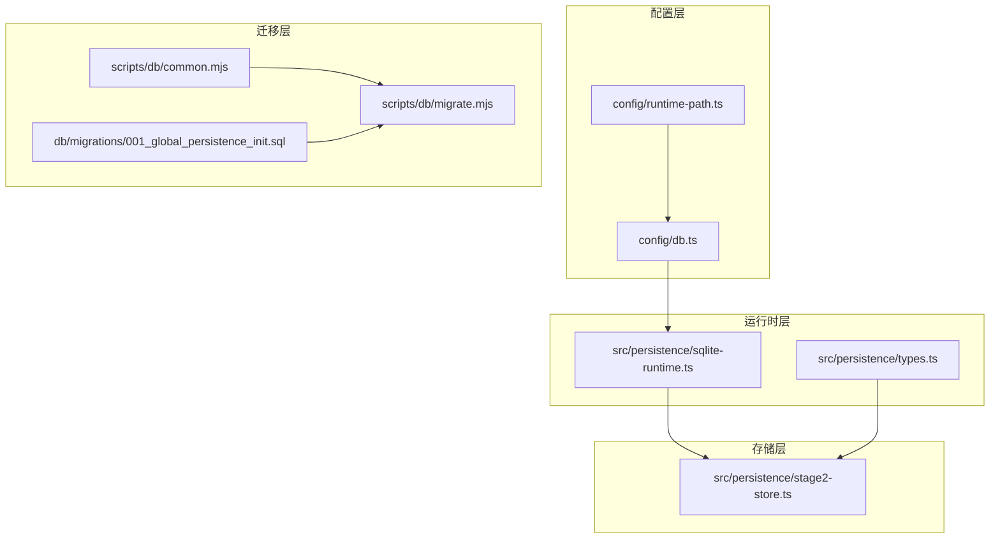
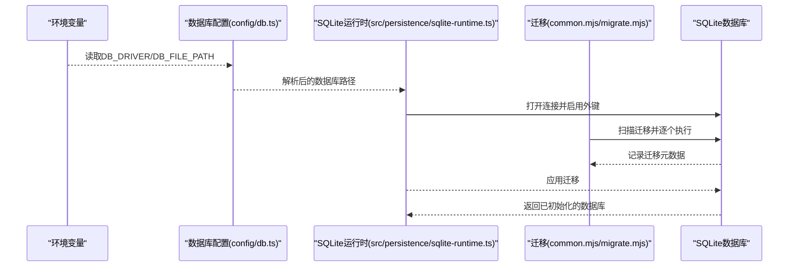
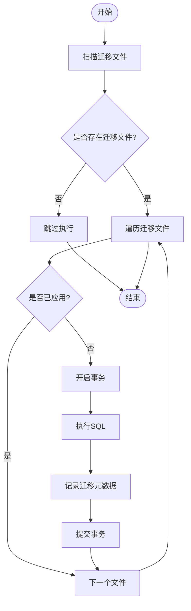
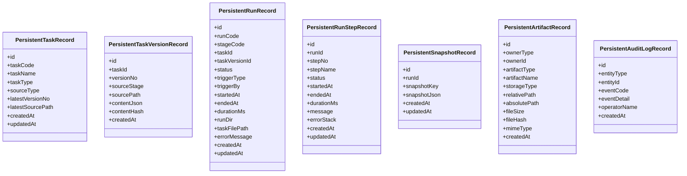
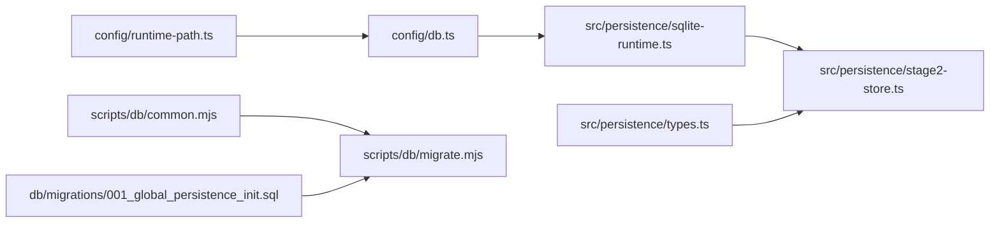

# 数据库配置

<cite>
**本文引用的文件**
- [config/db.ts](file://config/db.ts)
- [config/runtime-path.ts](file://config/runtime-path.ts)
- [src/persistence/sqlite-runtime.ts](file://src/persistence/sqlite-runtime.ts)
- [src/persistence/types.ts](file://src/persistence/types.ts)
- [src/persistence/stage2-store.ts](file://src/persistence/stage2-store.ts)
- [db/migrations/001_global_persistence_init.sql](file://db/migrations/001_global_persistence_init.sql)
- [scripts/db/migrate.mjs](file://scripts/db/migrate.mjs)
- [scripts/db/common.mjs](file://scripts/db/common.mjs)
- [README.md](file://README.md)
- [package.json](file://package.json)
</cite>

## 目录
1. [简介](#简介)
2. [项目结构](#项目结构)
3. [核心组件](#核心组件)
4. [架构总览](#架构总览)
5. [详细组件分析](#详细组件分析)
6. [依赖关系分析](#依赖关系分析)
7. [性能考虑](#性能考虑)
8. [故障排查指南](#故障排查指南)
9. [结论](#结论)
10. [附录](#附录)

## 简介
本文件面向 HI-TEST 项目的数据库配置与使用，聚焦 SQLite 单文件数据库的连接参数、初始化与迁移机制、安全与超时处理建议、备份与维护最佳实践，以及常见问题诊断与性能调优指南。当前实现基于 Node 的实验性 SQLite 组件，采用本地单文件数据库，表结构按 MySQL 兼容子集设计，便于未来迁移到标准 SQL 方言或 MySQL。

## 项目结构
与数据库相关的模块分布如下：
- 配置层：负责读取环境变量并解析数据库路径与驱动
- 运行时层：负责打开数据库连接、执行迁移、管理外键约束
- 迁移层：提供迁移脚本与工具函数
- 类型层：定义持久化数据模型
- 存储层：第二阶段执行器对接数据库进行写入与关闭

图表来源
- [config/db.ts:1-28](file://config/db.ts#L1-L28)
- [config/runtime-path.ts:1-41](file://config/runtime-path.ts#L1-L41)
- [src/persistence/sqlite-runtime.ts:1-116](file://src/persistence/sqlite-runtime.ts#L1-L116)
- [src/persistence/types.ts:1-125](file://src/persistence/types.ts#L1-L125)
- [src/persistence/stage2-store.ts:1-654](file://src/persistence/stage2-store.ts#L1-L654)
- [db/migrations/001_global_persistence_init.sql:1-128](file://db/migrations/001_global_persistence_init.sql#L1-L128)
- [scripts/db/migrate.mjs:1-52](file://scripts/db/migrate.mjs#L1-L52)
- [scripts/db/common.mjs:1-108](file://scripts/db/common.mjs#L1-L108)

章节来源
- [config/db.ts:1-28](file://config/db.ts#L1-L28)
- [config/runtime-path.ts:1-41](file://config/runtime-path.ts#L1-L41)
- [src/persistence/sqlite-runtime.ts:1-116](file://src/persistence/sqlite-runtime.ts#L1-L116)
- [src/persistence/types.ts:1-125](file://src/persistence/types.ts#L1-L125)
- [src/persistence/stage2-store.ts:1-654](file://src/persistence/stage2-store.ts#L1-L654)
- [db/migrations/001_global_persistence_init.sql:1-128](file://db/migrations/001_global_persistence_init.sql#L1-L128)
- [scripts/db/migrate.mjs:1-52](file://scripts/db/migrate.mjs#L1-L52)
- [scripts/db/common.mjs:1-108](file://scripts/db/common.mjs#L1-L108)

## 核心组件
- 数据库配置读取与解析：从环境变量读取驱动与数据库文件路径，并提供路径解析函数
- SQLite 运行时：打开数据库连接、启用外键约束、执行迁移、记录迁移元数据
- 迁移脚本：扫描迁移文件、逐个应用、事务化执行、记录校验和
- 类型定义：统一的数据持久化模型，确保写入一致性
- 存储封装：第二阶段执行器通过封装类进行数据库操作与连接关闭

章节来源
- [config/db.ts:15-26](file://config/db.ts#L15-L26)
- [src/persistence/sqlite-runtime.ts:73-114](file://src/persistence/sqlite-runtime.ts#L73-L114)
- [scripts/db/common.mjs:31-58](file://scripts/db/common.mjs#L31-L58)
- [scripts/db/migrate.mjs:12-51](file://scripts/db/migrate.mjs#L12-L51)
- [src/persistence/types.ts:34-123](file://src/persistence/types.ts#L34-L123)
- [src/persistence/stage2-store.ts:632-640](file://src/persistence/stage2-store.ts#L632-L640)

## 架构总览
数据库配置与使用的关键流程：
- 启动时读取环境变量，解析数据库文件路径
- 打开 SQLite 连接并启用外键约束
- 扫描迁移目录，逐个执行未应用的迁移
- 在事务中执行 SQL 并记录迁移元数据
- 第二阶段执行器写入结构化数据并最终关闭连接

图表来源
- [config/db.ts:20-26](file://config/db.ts#L20-L26)
- [src/persistence/sqlite-runtime.ts:73-84](file://src/persistence/sqlite-runtime.ts#L73-L84)
- [scripts/db/common.mjs:47-58](file://scripts/db/common.mjs#L47-L58)
- [scripts/db/migrate.mjs:12-51](file://scripts/db/migrate.mjs#L12-L51)

## 详细组件分析

### 数据库配置与连接参数
- 驱动选择
  - 默认驱动为 SQLite，可通过环境变量覆盖
  - 仅支持 SQLite 驱动，其他驱动会抛出错误
- 数据库文件路径
  - 默认路径位于运行时目录下的 db 子目录
  - 路径解析函数支持相对路径转绝对路径
- 外键约束
  - 连接建立后显式启用外键约束
  - 迁移表 schema_migrations 用于记录迁移元数据

章节来源
- [config/db.ts:7-26](file://config/db.ts#L7-L26)
- [src/persistence/sqlite-runtime.ts:73-84](file://src/persistence/sqlite-runtime.ts#L73-L84)
- [scripts/db/common.mjs:31-41](file://scripts/db/common.mjs#L31-L41)

### 迁移机制与初始化
- 迁移表 schema_migrations
  - 记录迁移文件名、校验和与执行时间
  - 保证迁移幂等性，避免重复执行
- 迁移扫描与执行
  - 递增扫描 db/migrations 目录中的 SQL 文件
  - 逐个执行，事务包裹，失败回滚
  - 执行成功后记录迁移元数据
- 初始化命令
  - 通过 npm 脚本触发迁移脚本
  - 使用 Node 实验性 SQLite 运行参数

图表来源
- [scripts/db/migrate.mjs:15-51](file://scripts/db/migrate.mjs#L15-L51)
- [scripts/db/common.mjs:60-106](file://scripts/db/common.mjs#L60-L106)
- [db/migrations/001_global_persistence_init.sql:1-128](file://db/migrations/001_global_persistence_init.sql#L1-L128)

章节来源
- [scripts/db/migrate.mjs:12-51](file://scripts/db/migrate.mjs#L12-L51)
- [scripts/db/common.mjs:60-106](file://scripts/db/common.mjs#L60-L106)
- [db/migrations/001_global_persistence_init.sql:1-128](file://db/migrations/001_global_persistence_init.sql#L1-L128)

### 数据模型与写入流程
- 数据模型
  - 定义任务、版本、运行、步骤、快照、附件、审计日志等实体
  - 字段涵盖标识、时间戳、状态、关联键等
- 写入流程
  - 第二阶段执行器在运行期间写入结构化数据
  - 关闭时安全地关闭数据库连接

图表来源
- [src/persistence/types.ts:34-123](file://src/persistence/types.ts#L34-L123)

章节来源
- [src/persistence/types.ts:34-123](file://src/persistence/types.ts#L34-L123)
- [src/persistence/stage2-store.ts:632-640](file://src/persistence/stage2-store.ts#L632-L640)

### 连接池与并发控制
- 当前实现
  - 使用 Node 实验性 SQLite 的同步接口
  - 无连接池概念，每个进程内使用单一连接
- 并发与事务
  - 迁移执行采用 BEGIN/COMMIT/ROLLBACK 包裹
  - 外键约束在连接层启用，确保参照完整性

章节来源
- [src/persistence/sqlite-runtime.ts:73-84](file://src/persistence/sqlite-runtime.ts#L73-L84)
- [scripts/db/common.mjs:47-58](file://scripts/db/common.mjs#L47-L58)

### 安全配置建议
- 敏感信息处理
  - 任务内容中的账号密码在入库前会被掩码处理
  - 原始任务文件仍以文件路径形式保留
- 文件权限与路径
  - 数据库文件位于运行时目录，建议限制目录访问权限
  - 避免将数据库文件置于共享或公开目录
- 环境变量保护
  - 将敏感配置放入 .env 文件并纳入版本控制排除
  - 不要将 .env 提交到仓库

章节来源
- [src/persistence/stage2-store.ts:37-48](file://src/persistence/stage2-store.ts#L37-L48)
- [README.md:49-54](file://README.md#L49-L54)

### 连接超时与错误处理
- 连接超时
  - 当前未配置连接超时参数
  - 如需超时控制，可在 Node 层通过进程信号或外部监控实现
- 错误处理
  - 迁移失败会回滚并抛出异常
  - 连接非 SQLite 驱动会抛出明确错误
  - 存储封装在关闭连接时进行安全执行

章节来源
- [src/persistence/sqlite-runtime.ts:74-76](file://src/persistence/sqlite-runtime.ts#L74-L76)
- [scripts/db/migrate.mjs:41-44](file://scripts/db/migrate.mjs#L41-L44)
- [src/persistence/stage2-store.ts:632-640](file://src/persistence/stage2-store.ts#L632-L640)

### 备份、恢复与维护
- 备份策略
  - 停机备份：停止服务后复制数据库文件
  - 在线备份：使用 SQLite 的在线备份功能（需额外实现）
- 恢复策略
  - 使用备份文件替换当前数据库文件
  - 恢复后验证迁移元数据与表结构
- 维护建议
  - 定期检查数据库文件大小与磁盘空间
  - 对历史运行数据进行归档与清理
  - 保持迁移文件的版本化管理

章节来源
- [README.md:120-130](file://README.md#L120-L130)

## 依赖关系分析
- 配置依赖
  - 数据库配置依赖运行时目录配置
  - 迁移脚本依赖配置模块提供的运行时选项
- 运行时依赖
  - SQLite 运行时依赖配置模块解析数据库路径
  - 第二阶段存储依赖运行时模块进行数据库打开与迁移
- 迁移依赖
  - 迁移脚本依赖文件系统读取 SQL 文件
  - 迁移脚本依赖校验和与日期格式化工具

图表来源
- [config/db.ts:1-28](file://config/db.ts#L1-L28)
- [config/runtime-path.ts:1-41](file://config/runtime-path.ts#L1-L41)
- [src/persistence/sqlite-runtime.ts:1-116](file://src/persistence/sqlite-runtime.ts#L1-L116)
- [src/persistence/stage2-store.ts:1-654](file://src/persistence/stage2-store.ts#L1-L654)
- [db/migrations/001_global_persistence_init.sql:1-128](file://db/migrations/001_global_persistence_init.sql#L1-L128)
- [scripts/db/migrate.mjs:1-52](file://scripts/db/migrate.mjs#L1-L52)
- [scripts/db/common.mjs:1-108](file://scripts/db/common.mjs#L1-L108)

章节来源
- [config/db.ts:1-28](file://config/db.ts#L1-L28)
- [config/runtime-path.ts:1-41](file://config/runtime-path.ts#L1-L41)
- [src/persistence/sqlite-runtime.ts:1-116](file://src/persistence/sqlite-runtime.ts#L1-L116)
- [src/persistence/stage2-store.ts:1-654](file://src/persistence/stage2-store.ts#L1-L654)
- [db/migrations/001_global_persistence_init.sql:1-128](file://db/migrations/001_global_persistence_init.sql#L1-L128)
- [scripts/db/migrate.mjs:1-52](file://scripts/db/migrate.mjs#L1-L52)
- [scripts/db/common.mjs:1-108](file://scripts/db/common.mjs#L1-L108)

## 性能考虑
- 连接与事务
  - 使用事务批量执行迁移，减少磁盘写入次数
  - 外键约束启用带来一定开销，但确保数据一致性
- 索引与查询
  - 迁移脚本中已创建多处索引，有助于查询性能
  - 建议根据实际查询模式评估索引有效性
- 文件系统与 I/O
  - SQLite 单文件适合本地开发与小规模生产
  - 大量写入场景建议评估 WAL 模式与磁盘性能
- 并发与锁
  - 同步接口在单进程内无并发问题
  - 多进程或多实例部署需谨慎处理文件锁与竞争

章节来源
- [src/persistence/sqlite-runtime.ts:79-82](file://src/persistence/sqlite-runtime.ts#L79-L82)
- [db/migrations/001_global_persistence_init.sql:120-127](file://db/migrations/001_global_persistence_init.sql#L120-L127)

## 故障排查指南
- 迁移失败
  - 检查迁移文件是否正确、语法是否符合 SQLite
  - 查看迁移元数据表是否记录了部分执行
  - 使用回滚逻辑重新执行或手动修复
- 驱动不支持
  - 确认环境变量 DB_DRIVER 是否为 sqlite
  - 确认运行时参数是否包含实验性 SQLite 支持
- 路径问题
  - 确认数据库文件路径解析是否正确
  - 确认运行时目录是否存在且可写
- 权限问题
  - 确认数据库文件与目录权限
  - 确认进程用户对文件系统的访问权限

章节来源
- [src/persistence/sqlite-runtime.ts:74-76](file://src/persistence/sqlite-runtime.ts#L74-L76)
- [scripts/db/migrate.mjs:41-44](file://scripts/db/migrate.mjs#L41-L44)
- [scripts/db/common.mjs:31-41](file://scripts/db/common.mjs#L31-L41)

## 结论
HI-TEST 项目采用本地 SQLite 单文件数据库，通过环境变量灵活配置驱动与文件路径，配合迁移机制实现结构化数据持久化。当前实现简洁可靠，适合本地开发与小规模生产；如需更高并发或更复杂的数据库特性，可考虑引入连接池与标准 SQL 方言或 MySQL。建议在生产环境中加强安全与备份策略，并持续评估索引与查询性能。

## 附录
- 环境变量与默认值
  - DB_DRIVER：默认 sqlite
  - DB_FILE_PATH：默认 t_runtime/db/hi_test.sqlite
  - RUNTIME_DIR_PREFIX：默认 t_runtime/
- 命令与脚本
  - npm run db:init：初始化数据库与迁移
  - npm run db:migrate：执行迁移
- 运行时要求
  - 需要 Node 实验性 SQLite 支持（--experimental-sqlite）

章节来源
- [README.md:49-54](file://README.md#L49-L54)
- [README.md:120-130](file://README.md#L120-L130)
- [package.json:6-11](file://package.json#L6-L11)