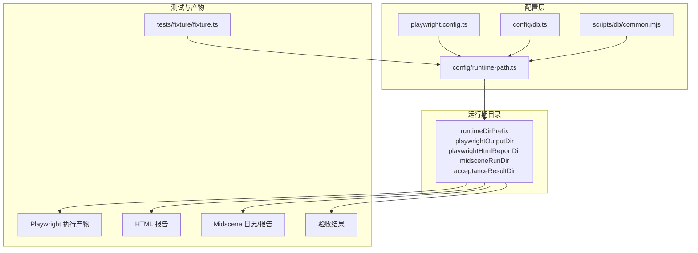
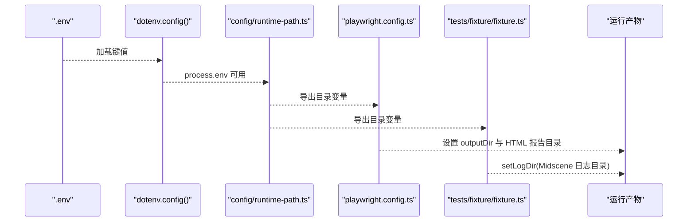
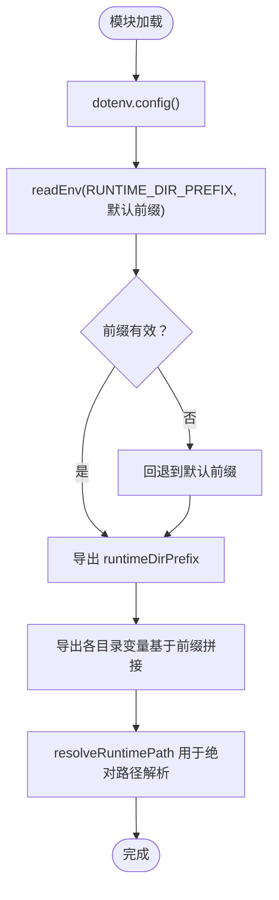
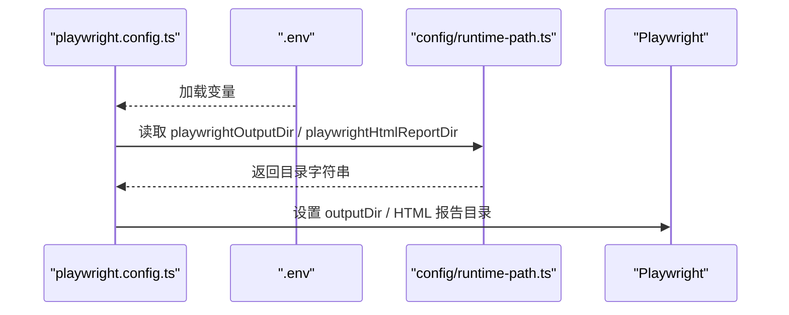
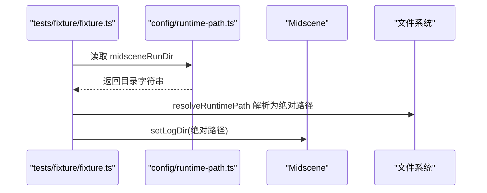
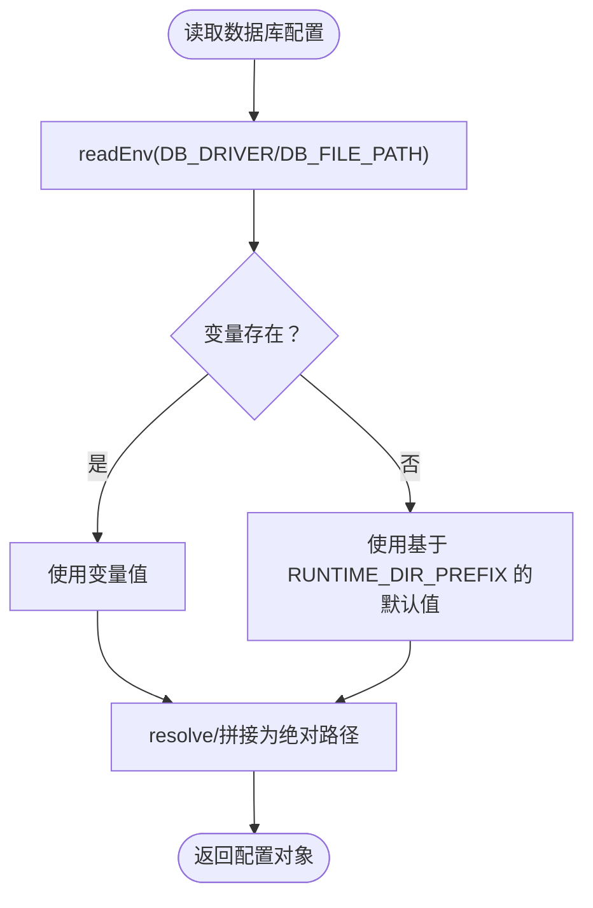
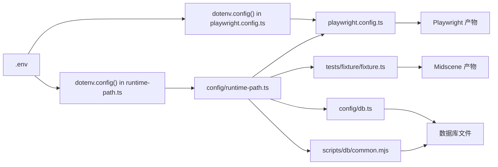

# 环境变量管理

<cite>
**本文引用的文件**
- [playwright.config.ts](file://playwright.config.ts)
- [runtime-path.ts](file://config/runtime-path.ts)
- [README.md](file://README.md)
- [AGENTS.md](file://AGENTS.md)
- [db.ts](file://config/db.ts)
- [common.mjs](file://scripts/db/common.mjs)
- [package.json](file://package.json)
- [fixture.ts](file://tests/fixture/fixture.ts)
</cite>

## 目录
1. [简介](#简介)
2. [项目结构](#项目结构)
3. [核心组件](#核心组件)
4. [架构总览](#架构总览)
5. [详细组件分析](#详细组件分析)
6. [依赖关系分析](#依赖关系分析)
7. [性能考量](#性能考量)
8. [故障排查指南](#故障排查指南)
9. [结论](#结论)
10. [附录](#附录)

## 简介
本文件系统性梳理 HI-TEST 项目的环境变量管理体系，重点覆盖运行期目录相关的关键变量：RUNTIME_DIR_PREFIX、PLAYWRIGHT_OUTPUT_DIR、PLAYWRIGHT_HTML_REPORT_DIR、MIDSCENE_RUN_DIR、ACCEPTANCE_RESULT_DIR，并说明其作用、默认值、必需性、优先级与覆盖机制，以及在不同环境（开发、测试、生产）下的配置最佳实践。同时提供 .env 格式规范、安全配置建议、常见问题与排错方法。

## 项目结构
围绕“环境变量 → 运行期目录 → 产物输出”的主线，项目中涉及的关键文件与职责如下：
- playwright.config.ts：加载 .env，将 PLAYWRIGHT_OUTPUT_DIR、PLAYWRIGHT_HTML_REPORT_DIR 注入 Playwright 配置。
- config/runtime-path.ts：集中解析并导出运行期目录变量，提供默认值与路径解析函数。
- tests/fixture/fixture.ts：在测试夹具中设置 Midscene 日志目录，确保统一输出。
- config/db.ts 与 scripts/db/common.mjs：数据库驱动与路径解析也依赖 RUNTIME_DIR_PREFIX 等变量。
- README.md 与 AGENTS.md：提供变量定义、默认值与规范约束。
- package.json：提供脚本入口，间接体现环境变量在执行流程中的使用。

图表来源
- [playwright.config.ts:1-95](file://playwright.config.ts#L1-L95)
- [runtime-path.ts:1-41](file://config/runtime-path.ts#L1-L41)
- [db.ts:1-28](file://config/db.ts#L1-L28)
- [common.mjs:1-108](file://scripts/db/common.mjs#L1-L108)
- [fixture.ts:1-100](file://tests/fixture/fixture.ts#L1-L100)

章节来源
- [playwright.config.ts:1-95](file://playwright.config.ts#L1-L95)
- [runtime-path.ts:1-41](file://config/runtime-path.ts#L1-L41)
- [README.md:1-223](file://README.md#L1-L223)
- [AGENTS.md:1-46](file://AGENTS.md#L1-L46)

## 核心组件
本节聚焦运行期目录相关的环境变量及其行为特征，包括作用、默认值、必需性与覆盖策略。

- RUNTIME_DIR_PREFIX
  - 作用：作为运行期目录的统一前缀，所有自动生成的目录均以此为根路径进行拼接。
  - 默认值：t_runtime/
  - 必需性：高。若未设置，将采用默认前缀，但建议显式配置以便与团队规范一致。
  - 覆盖机制：读取后经 trim 处理，空值或仅空白字符将被忽略并回退到默认值。

- PLAYWRIGHT_OUTPUT_DIR
  - 作用：Playwright 执行产物目录（如截图、视频等）。
  - 默认值：${RUNTIME_DIR_PREFIX}test-results
  - 必需性：中。若未设置，将基于 RUNTIME_DIR_PREFIX 自动拼接。
  - 覆盖机制：读取后经 trim 处理，空值或仅空白字符将被忽略并回退到默认值。

- PLAYWRIGHT_HTML_REPORT_DIR
  - 作用：Playwright HTML 报告输出目录。
  - 默认值：${RUNTIME_DIR_PREFIX}playwright-report
  - 必需性：中。若未设置，将基于 RUNTIME_DIR_PREFIX 自动拼接。
  - 覆盖机制：读取后经 trim 处理，空值或仅空白字符将被忽略并回退到默认值。

- MIDSCENE_RUN_DIR
  - 作用：Midscene 运行日志、缓存、报告的根目录。
  - 默认值：${RUNTIME_DIR_PREFIX}midscene_run
  - 必需性：中。若未设置，将基于 RUNTIME_DIR_PREFIX 自动拼接。
  - 覆盖机制：读取后经 trim 处理，空值或仅空白字符将被忽略并回退到默认值。

- ACCEPTANCE_RESULT_DIR
  - 作用：第二阶段验收结果目录（包含 result.json、步骤截图等）。
  - 默认值：${RUNTIME_DIR_PREFIX}acceptance-results
  - 必需性：中。若未设置，将基于 RUNTIME_DIR_PREFIX 自动拼接。
  - 覆盖机制：读取后经 trim 处理，空值或仅空白字符将被忽略并回退到默认值。

章节来源
- [runtime-path.ts:6-36](file://config/runtime-path.ts#L6-L36)
- [README.md:76-96](file://README.md#L76-L96)
- [AGENTS.md:26-46](file://AGENTS.md#L26-L46)

## 架构总览
下图展示环境变量在配置层、运行期目录层与产物输出层之间的传递关系，以及 Playwright 与 Midscene 如何消费这些变量。

图表来源
- [runtime-path.ts:1-41](file://config/runtime-path.ts#L1-L41)
- [playwright.config.ts:1-95](file://playwright.config.ts#L1-L95)
- [fixture.ts:1-100](file://tests/fixture/fixture.ts#L1-L100)

## 详细组件分析

### 运行期目录解析模块（config/runtime-path.ts）
该模块负责：
- 在模块加载时即调用 dotenv.config()，使 process.env 可用。
- 提供统一的 readEnv(name, fallbackValue) 读取逻辑，空值或仅空白字符将回退到默认值。
- 导出运行期目录变量，并提供 resolveRuntimePath 用于将相对路径解析为绝对路径。

图表来源
- [runtime-path.ts:1-41](file://config/runtime-path.ts#L1-L41)

章节来源
- [runtime-path.ts:1-41](file://config/runtime-path.ts#L1-L41)

### Playwright 配置消费（playwright.config.ts）
- 在配置文件顶部调用 dotenv.config()，确保 .env 中的变量可用。
- 将 PLAYWRIGHT_OUTPUT_DIR 与 PLAYWRIGHT_HTML_REPORT_DIR 注入 Playwright 的 outputDir 与 HTML 报告输出目录。
- 通过 CI 环境变量控制 retries、workers 等参数，体现环境差异。

图表来源
- [playwright.config.ts:1-95](file://playwright.config.ts#L1-L95)
- [runtime-path.ts:18-26](file://config/runtime-path.ts#L18-L26)

章节来源
- [playwright.config.ts:1-95](file://playwright.config.ts#L1-L95)

### Midscene 日志目录设置（tests/fixture/fixture.ts）
- 在测试夹具初始化阶段，调用 setLogDir 并传入基于 midsceneRunDir 解析后的绝对路径，保证 Midscene 的日志、缓存与报告统一输出到指定目录。

图表来源
- [fixture.ts:1-100](file://tests/fixture/fixture.ts#L1-L100)
- [runtime-path.ts:28-31](file://config/runtime-path.ts#L28-L31)

章节来源
- [fixture.ts:1-100](file://tests/fixture/fixture.ts#L1-L100)

### 数据库路径解析（config/db.ts 与 scripts/db/common.mjs）
- 两者均通过 readEnv 读取 DB_DRIVER 与 DB_FILE_PATH，并结合 RUNTIME_DIR_PREFIX 计算默认数据库文件路径。
- common.mjs 进一步封装了 getDbRuntimeOptions，返回 dbDriver、dbFilePath、resolvedDbFilePath、migrationsDir 等，便于迁移脚本与数据库操作使用。

图表来源
- [db.ts:1-28](file://config/db.ts#L1-L28)
- [common.mjs:31-41](file://scripts/db/common.mjs#L31-L41)

章节来源
- [db.ts:1-28](file://config/db.ts#L1-L28)
- [common.mjs:1-108](file://scripts/db/common.mjs#L1-L108)

## 依赖关系分析
- config/runtime-path.ts 是运行期目录的核心解析模块，被 playwright.config.ts、tests/fixture/fixture.ts、config/db.ts 与 scripts/db/common.mjs 多处依赖。
- dotenv.config() 在多个模块中被调用，确保 process.env 在模块加载时即可生效。
- README.md 与 AGENTS.md 对变量的默认值、用途与规范进行了约束，形成“文档—代码—执行”的闭环。

图表来源
- [runtime-path.ts:1-41](file://config/runtime-path.ts#L1-L41)
- [playwright.config.ts:1-95](file://playwright.config.ts#L1-L95)
- [fixture.ts:1-100](file://tests/fixture/fixture.ts#L1-L100)
- [db.ts:1-28](file://config/db.ts#L1-L28)
- [common.mjs:1-108](file://scripts/db/common.mjs#L1-L108)

章节来源
- [runtime-path.ts:1-41](file://config/runtime-path.ts#L1-L41)
- [playwright.config.ts:1-95](file://playwright.config.ts#L1-L95)
- [README.md:1-223](file://README.md#L1-L223)
- [AGENTS.md:1-46](file://AGENTS.md#L1-L46)

## 性能考量
- 目录解析与路径拼接均为常数时间操作，对整体性能影响可忽略。
- 将所有运行期目录统一收敛至 t_runtime/ 前缀，有利于磁盘 IO 与清理效率。
- 在 CI 环境中，适当调整 workers 与 retries 参数可平衡执行速度与稳定性。

## 故障排查指南
- 症状：Playwright 报告未生成或路径不正确
  - 检查 .env 中 PLAYWRIGHT_HTML_REPORT_DIR 是否设置，或是否被 RUNTIME_DIR_PREFIX 影响导致拼接异常。
  - 确认 playwright.config.ts 已加载 .env 并注入 outputDir 与 HTML 报告目录。
  - 参考：[playwright.config.ts:36-40](file://playwright.config.ts#L36-L40)

- 症状：Midscene 日志目录为空或路径错误
  - 检查 .env 中 MIDSCENE_RUN_DIR 是否设置，确认 tests/fixture/fixture.ts 已调用 setLogDir。
  - 参考：[fixture.ts:10](file://tests/fixture/fixture.ts#L10)

- 症状：验收结果目录缺失或路径异常
  - 检查 .env 中 ACCEPTANCE_RESULT_DIR 是否设置，确认第二阶段执行脚本已正确生成结果。
  - 参考：[README.md:165-180](file://README.md#L165-L180)

- 症状：数据库文件未创建或路径错误
  - 检查 .env 中 DB_DRIVER 与 DB_FILE_PATH，确认基于 RUNTIME_DIR_PREFIX 的默认值符合预期。
  - 参考：[db.ts:20-22](file://config/db.ts#L20-L22)、[common.mjs:32-34](file://scripts/db/common.mjs#L32-L34)

- 症状：CI 环境下并发或重试行为不符合预期
  - 检查 CI 环境变量是否设置，确认 playwright.config.ts 中对 CI 的特殊处理。
  - 参考：[playwright.config.ts:30-34](file://playwright.config.ts#L30-L34)

章节来源
- [playwright.config.ts:1-95](file://playwright.config.ts#L1-L95)
- [fixture.ts:1-100](file://tests/fixture/fixture.ts#L1-L100)
- [db.ts:1-28](file://config/db.ts#L1-L28)
- [common.mjs:1-108](file://scripts/db/common.mjs#L1-L108)
- [README.md:1-223](file://README.md#L1-L223)

## 结论
HI-TEST 项目通过 config/runtime-path.ts 将运行期目录变量集中管理，并在 Playwright 与 Midscene 等关键环节消费这些变量，实现了“变量驱动、路径统一、产物可追踪”。配合 README 与 AGENTS 的规范约束，形成了从配置到执行的一致性闭环。建议在团队内统一 .env 示例与默认值，确保不同环境（开发、测试、生产）的一致性与可维护性。

## 附录

### .env 格式规范与安全建议
- 格式规范
  - 使用 KEY=value 的键值对形式，建议使用双引号包裹含空格的值。
  - 注释以 # 开头，每行一个配置项。
  - 保持 RUNTIME_DIR_PREFIX 以斜杠结尾，便于与其他子目录拼接。
  - 所有运行期目录变量建议以 t_ 前缀，便于 .gitignore 忽略与清理。
  - 参考示例与默认值：[README.md:39-54](file://README.md#L39-L54)

- 安全建议
  - 不要将敏感信息（如 API Key）提交到仓库，请使用 .gitignore 忽略 .env。
  - 在 CI 环境中，通过密钥管理服务注入变量，避免明文存储。
  - 对外共享的示例文件请移除真实密钥，仅保留占位符与说明。
  - 参考规范约束：[AGENTS.md:24-31](file://AGENTS.md#L24-L31)

- 环境变量优先级与覆盖机制
  - 模块加载时调用 dotenv.config()，使 .env 中的变量进入 process.env。
  - config/runtime-path.ts 使用 readEnv(name, fallbackValue) 读取变量，空值或仅空白字符将回退到默认值。
  - README 与 AGENTS 提供默认值与用途说明，作为团队共识与基线。
  - 参考实现：[runtime-path.ts:8-11](file://config/runtime-path.ts#L8-L11)

- 不同环境的最佳实践
  - 开发环境：建议将 RUNTIME_DIR_PREFIX 指向本地工作目录，便于快速迭代与调试。
  - 测试环境：建议为 CI 独立设置 .env，确保 HTML 报告与产物路径与流水线一致。
  - 生产环境：严格限制写权限，确保数据库与产物目录位于受控路径；必要时通过 CI 注入变量。
  - 参考：[playwright.config.ts:30-34](file://playwright.config.ts#L30-L34)、[AGENTS.md:48-61](file://AGENTS.md#L48-L61)

- 常见问题与解决方法
  - 问题：目录拼接错误（末尾缺少斜杠）
    - 解决：确保 RUNTIME_DIR_PREFIX 以斜杠结尾，避免与子目录拼接时产生非法路径。
  - 问题：CI 与本地路径不一致
    - 解决：在 CI 中显式设置相关变量，或在脚本中根据 CI 环境变量动态调整。
  - 问题：产物目录未被 Git 忽略
    - 解决：在 .gitignore 中增加 t_* 前缀规则，并同步更新 CI 与 README 说明。
  - 参考：[AGENTS.md:18-20](file://AGENTS.md#L18-L20)、[README.md:76-96](file://README.md#L76-L96)