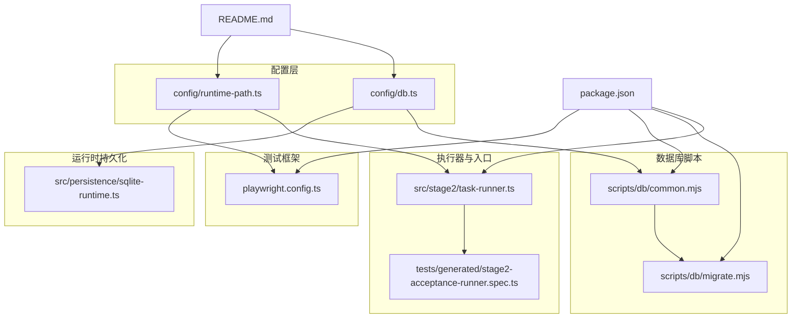
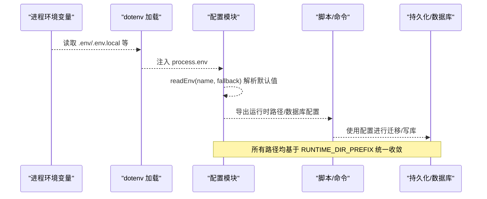
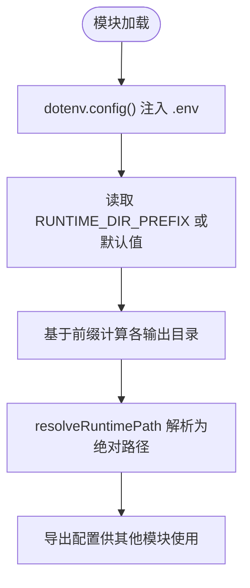
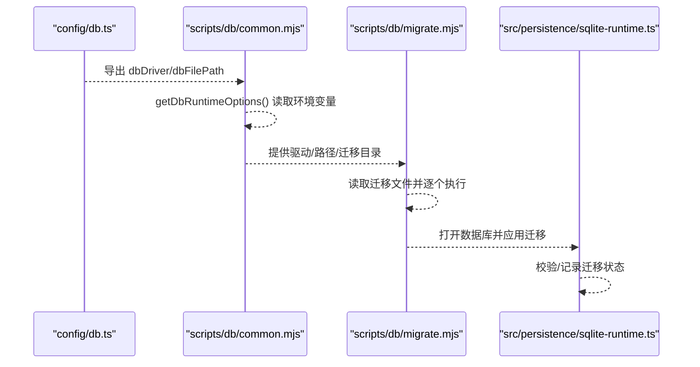
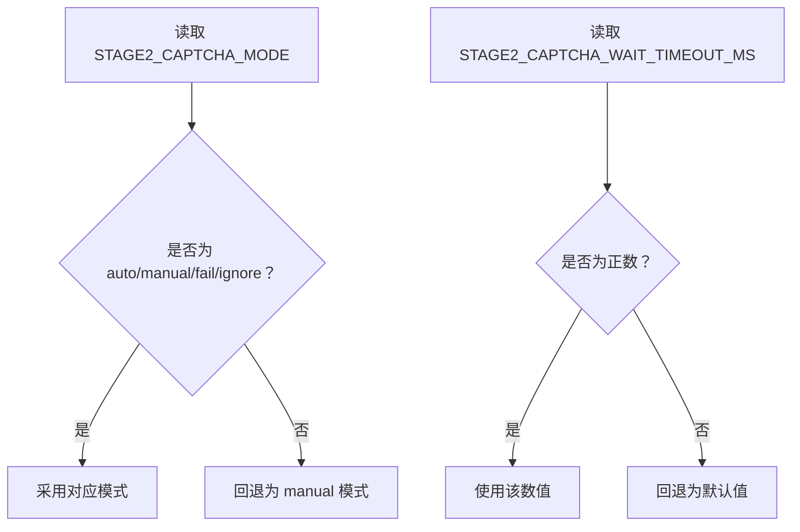
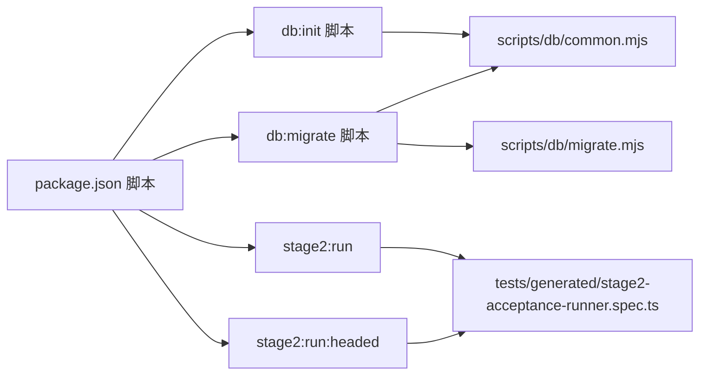

# 环境变量管理

<cite>
**本文引用的文件**
- [package.json](file://package.json)
- [README.md](file://README.md)
- [.gitignore](file://.gitignore)
- [config/runtime-path.ts](file://config/runtime-path.ts)
- [config/db.ts](file://config/db.ts)
- [playwright.config.ts](file://playwright.config.ts)
- [scripts/db/common.mjs](file://scripts/db/common.mjs)
- [scripts/db/migrate.mjs](file://scripts/db/migrate.mjs)
- [src/persistence/sqlite-runtime.ts](file://src/persistence/sqlite-runtime.ts)
- [src/stage2/task-runner.ts](file://src/stage2/task-runner.ts)
- [tests/generated/stage2-acceptance-runner.spec.ts](file://tests/generated/stage2-acceptance-runner.spec.ts)
</cite>

## 目录
1. [简介](#简介)
2. [项目结构](#项目结构)
3. [核心组件](#核心组件)
4. [架构总览](#架构总览)
5. [详细组件分析](#详细组件分析)
6. [依赖关系分析](#依赖关系分析)
7. [性能考量](#性能考量)
8. [故障排查指南](#故障排查指南)
9. [结论](#结论)
10. [附录](#附录)

## 简介
本文件系统性梳理本项目中的环境变量管理机制，涵盖变量定义、加载顺序与优先级、默认值与覆盖规则、分类与环境策略、敏感信息安全管理、验证与错误处理，以及实际的 .env 示例与配置模板，帮助开发者快速、安全地完成项目配置。

## 项目结构
围绕环境变量的关键文件分布如下：
- 配置层：config/runtime-path.ts、config/db.ts
- 测试框架：playwright.config.ts
- 数据库脚本：scripts/db/common.mjs、scripts/db/migrate.mjs
- 运行时持久化：src/persistence/sqlite-runtime.ts
- 第二阶段执行器：src/stage2/task-runner.ts
- 任务入口：tests/generated/stage2-acceptance-runner.spec.ts
- 依赖与脚本：package.json
- 示例与忽略：README.md、.gitignore

图表来源
- [config/runtime-path.ts:1-41](file://config/runtime-path.ts#L1-L41)
- [config/db.ts:1-28](file://config/db.ts#L1-L28)
- [playwright.config.ts:1-95](file://playwright.config.ts#L1-L95)
- [scripts/db/common.mjs:1-108](file://scripts/db/common.mjs#L1-L108)
- [scripts/db/migrate.mjs:1-52](file://scripts/db/migrate.mjs#L1-L52)
- [src/persistence/sqlite-runtime.ts:1-116](file://src/persistence/sqlite-runtime.ts#L1-L116)
- [src/stage2/task-runner.ts:1-800](file://src/stage2/task-runner.ts#L1-L800)
- [tests/generated/stage2-acceptance-runner.spec.ts:1-39](file://tests/generated/stage2-acceptance-runner.spec.ts#L1-L39)
- [package.json:1-26](file://package.json#L1-L26)
- [README.md:1-229](file://README.md#L1-L229)

章节来源
- [config/runtime-path.ts:1-41](file://config/runtime-path.ts#L1-L41)
- [config/db.ts:1-28](file://config/db.ts#L1-L28)
- [playwright.config.ts:1-95](file://playwright.config.ts#L1-L95)
- [scripts/db/common.mjs:1-108](file://scripts/db/common.mjs#L1-L108)
- [scripts/db/migrate.mjs:1-52](file://scripts/db/migrate.mjs#L1-L52)
- [src/persistence/sqlite-runtime.ts:1-116](file://src/persistence/sqlite-runtime.ts#L1-L116)
- [src/stage2/task-runner.ts:1-800](file://src/stage2/task-runner.ts#L1-L800)
- [tests/generated/stage2-acceptance-runner.spec.ts:1-39](file://tests/generated/stage2-acceptance-runner.spec.ts#L1-L39)
- [package.json:1-26](file://package.json#L1-L26)
- [README.md:1-229](file://README.md#L1-L229)

## 核心组件
- 运行时目录前缀与输出目录
  - RUNTIME_DIR_PREFIX：运行时目录前缀，默认 t_runtime/
  - PLAYWRIGHT_OUTPUT_DIR：Playwright 执行产物目录，默认基于运行时前缀
  - PLAYWRIGHT_HTML_REPORT_DIR：Playwright HTML 报告目录，默认基于运行时前缀
  - MIDSCENE_RUN_DIR：Midscene 运行日志、缓存、报告根目录，默认基于运行时前缀
  - ACCEPTANCE_RESULT_DIR：第二段结构化结果目录，默认基于运行时前缀
  - resolveRuntimePath：将相对路径解析为绝对路径
- 数据库配置
  - DB_DRIVER：数据库驱动，默认 sqlite
  - DB_FILE_PATH：数据库文件路径，默认基于运行时前缀与驱动
  - resolveDbPath：将数据库路径解析为绝对路径
- 第二阶段执行器相关
  - STAGE2_TASK_FILE：任务 JSON 文件路径
  - STAGE2_REQUIRE_APPROVAL：是否需要审批
  - STAGE2_CAPTCHA_MODE：滑块验证码处理模式（auto/manual/fail/ignore）
  - STAGE2_CAPTCHA_WAIT_TIMEOUT_MS：人工处理等待超时（毫秒）
- 测试框架
  - Playwright 配置通过环境变量控制输出目录与报告目录

章节来源
- [config/runtime-path.ts:6-40](file://config/runtime-path.ts#L6-L40)
- [config/db.ts:7-26](file://config/db.ts#L7-L26)
- [playwright.config.ts:22-40](file://playwright.config.ts#L22-L40)
- [README.md:39-54](file://README.md#L39-L54)
- [src/stage2/task-runner.ts:35-87](file://src/stage2/task-runner.ts#L35-L87)

## 架构总览
环境变量的加载与使用贯穿配置层、脚本层、持久化层与执行器层，形成“统一前缀 + 默认值 + 覆盖”的分层策略。

图表来源
- [config/runtime-path.ts:4-16](file://config/runtime-path.ts#L4-L16)
- [config/db.ts:5-22](file://config/db.ts#L5-L22)
- [scripts/db/common.mjs:7-41](file://scripts/db/common.mjs#L7-L41)
- [src/persistence/sqlite-runtime.ts:73-84](file://src/persistence/sqlite-runtime.ts#L73-L84)

## 详细组件分析

### 运行时目录与输出目录管理（config/runtime-path.ts）
- 作用：集中管理运行时目录前缀与各类输出目录，保证所有产物收敛到统一前缀下
- 关键点：
  - 通过 dotenv.config() 在模块加载时注入环境变量
  - readEnv(name, fallback) 实现默认值与空值处理
  - 各目录基于 runtimeDirPrefix 计算，最终通过 resolveRuntimePath 解析为绝对路径

图表来源
- [config/runtime-path.ts:4-40](file://config/runtime-path.ts#L4-L40)

章节来源
- [config/runtime-path.ts:1-41](file://config/runtime-path.ts#L1-L41)

### 数据库配置与迁移（config/db.ts、scripts/db/common.mjs、scripts/db/migrate.mjs、src/persistence/sqlite-runtime.ts）
- 作用：统一数据库驱动与文件路径，支持 SQLite 单文件数据库，并提供迁移能力
- 关键点：
  - DB_DRIVER 与 DB_FILE_PATH 通过 readEnv 读取，支持默认值与覆盖
  - 迁移脚本在 common.mjs 中解析运行时选项，确保路径与驱动一致
  - sqlite-runtime.ts 打开数据库并应用未执行的迁移

图表来源
- [config/db.ts:5-26](file://config/db.ts#L5-L26)
- [scripts/db/common.mjs:31-41](file://scripts/db/common.mjs#L31-L41)
- [scripts/db/migrate.mjs:12-51](file://scripts/db/migrate.mjs#L12-L51)
- [src/persistence/sqlite-runtime.ts:73-114](file://src/persistence/sqlite-runtime.ts#L73-L114)

章节来源
- [config/db.ts:1-28](file://config/db.ts#L1-L28)
- [scripts/db/common.mjs:1-108](file://scripts/db/common.mjs#L1-L108)
- [scripts/db/migrate.mjs:1-52](file://scripts/db/migrate.mjs#L1-L52)
- [src/persistence/sqlite-runtime.ts:1-116](file://src/persistence/sqlite-runtime.ts#L1-L116)

### 第二阶段执行器与滑块验证码处理（src/stage2/task-runner.ts）
- 作用：根据环境变量决定滑块验证码处理策略与等待超时
- 关键点：
  - STAGE2_CAPTCHA_MODE：auto/manual/fail/ignore
  - STAGE2_CAPTCHA_WAIT_TIMEOUT_MS：人工模式等待超时
  - 对非法数值回退到默认值，确保执行稳定性

图表来源
- [src/stage2/task-runner.ts:61-87](file://src/stage2/task-runner.ts#L61-L87)

章节来源
- [src/stage2/task-runner.ts:1-800](file://src/stage2/task-runner.ts#L1-L800)

### 测试框架与报告目录（playwright.config.ts）
- 作用：通过环境变量控制 Playwright 输出目录与 HTML 报告目录
- 关键点：
  - dotenv.config() 在配置文件中加载 .env
  - outputDir 与 html 报告目录来自 runtime-path.ts 导出的配置

章节来源
- [playwright.config.ts:1-95](file://playwright.config.ts#L1-L95)
- [config/runtime-path.ts:18-26](file://config/runtime-path.ts#L18-L26)

### 任务入口与结果落盘（tests/generated/stage2-acceptance-runner.spec.ts）
- 作用：执行第二阶段任务并将结果写入运行时目录
- 关键点：
  - 接收 runTaskScenario 返回的执行结果
  - 失败时抛出错误并指向运行目录下的 result.json

章节来源
- [tests/generated/stage2-acceptance-runner.spec.ts:1-39](file://tests/generated/stage2-acceptance-runner.spec.ts#L1-L39)

## 依赖关系分析
- dotenv 依赖：dotenv 版本 16.4.7，用于加载 .env 文件
- 脚本与命令：
  - db:init 与 db:migrate：通过 node --experimental-sqlite 执行迁移脚本
  - stage2:run 与 stage2:run:headed：通过 Playwright 执行第二阶段测试

图表来源
- [package.json:6-11](file://package.json#L6-L11)
- [scripts/db/common.mjs:1-108](file://scripts/db/common.mjs#L1-L108)
- [scripts/db/migrate.mjs:1-52](file://scripts/db/migrate.migrate.mjs#L1-L52)
- [tests/generated/stage2-acceptance-runner.spec.ts:1-39](file://tests/generated/stage2-acceptance-runner.spec.ts#L1-L39)

章节来源
- [package.json:1-26](file://package.json#L1-L26)
- [scripts/db/common.mjs:1-108](file://scripts/db/common.mjs#L1-L108)
- [scripts/db/migrate.mjs:1-52](file://scripts/db/migrate.mjs#L1-L52)
- [tests/generated/stage2-acceptance-runner.spec.ts:1-39](file://tests/generated/stage2-acceptance-runner.spec.ts#L1-L39)

## 性能考量
- 路径解析：所有目录均基于 RUNTIME_DIR_PREFIX 统一收敛，避免重复 IO 与路径拼接错误
- 默认值策略：通过 readEnv 提供默认值，减少分支判断与异常处理开销
- 迁移幂等：迁移脚本记录已执行的迁移文件，避免重复执行带来的性能损耗
- 执行器超时：滑块验证码等待超时可配置，防止长时间阻塞

## 故障排查指南
- 环境变量未生效
  - 确认 .env 文件位于项目根目录，且未被 .gitignore 忽略
  - 确认各模块在加载时调用了 dotenv.config()
- 路径解析异常
  - 检查 RUNTIME_DIR_PREFIX 是否以斜杠结尾，避免路径拼接错误
  - 使用 resolveRuntimePath/resolveDbPath 确认最终绝对路径
- 数据库迁移失败
  - 检查 DB_DRIVER 是否为 sqlite，否则迁移脚本会抛出错误
  - 查看迁移记录表 schema_migrations，确认已执行的迁移文件
- 执行器滑块验证码处理异常
  - 调整 STAGE2_CAPTCHA_MODE 与 STAGE2_CAPTCHA_WAIT_TIMEOUT_MS
  - 若自动模式失败，切换为 manual 模式并延长等待时间

章节来源
- [.gitignore:1-4](file://.gitignore#L1-L4)
- [config/runtime-path.ts:4-40](file://config/runtime-path.ts#L4-L40)
- [config/db.ts:5-26](file://config/db.ts#L5-L26)
- [scripts/db/common.mjs:47-58](file://scripts/db/common.mjs#L47-L58)
- [src/stage2/task-runner.ts:61-87](file://src/stage2/task-runner.ts#L61-L87)

## 结论
本项目通过 dotenv 统一加载环境变量，在配置层集中管理运行时目录与数据库路径，并在脚本与执行器层严格遵循默认值与覆盖规则。通过将所有产物收敛到 RUNTIME_DIR_PREFIX，实现了清晰的目录结构与可维护性。建议在团队内统一 .env 模板与命名规范，配合 CI/CD 的密钥管理，进一步提升安全性与可移植性。

## 附录

### 环境变量分类与组织结构
- 运行时与输出目录
  - RUNTIME_DIR_PREFIX：运行时目录前缀
  - PLAYWRIGHT_OUTPUT_DIR：Playwright 执行产物目录
  - PLAYWRIGHT_HTML_REPORT_DIR：Playwright HTML 报告目录
  - MIDSCENE_RUN_DIR：Midscene 运行日志、缓存、报告根目录
  - ACCEPTANCE_RESULT_DIR：第二段结构化结果目录
- 数据库
  - DB_DRIVER：数据库驱动（默认 sqlite）
  - DB_FILE_PATH：数据库文件路径
- 第二阶段执行器
  - STAGE2_TASK_FILE：任务 JSON 文件路径
  - STAGE2_REQUIRE_APPROVAL：是否需要审批
  - STAGE2_CAPTCHA_MODE：滑块验证码处理模式（auto/manual/fail/ignore）
  - STAGE2_CAPTCHA_WAIT_TIMEOUT_MS：人工处理等待超时（毫秒）

章节来源
- [README.md:39-54](file://README.md#L39-L54)
- [config/runtime-path.ts:6-36](file://config/runtime-path.ts#L6-L36)
- [config/db.ts:7-22](file://config/db.ts#L7-L22)
- [src/stage2/task-runner.ts:35-41](file://src/stage2/task-runner.ts#L35-L41)

### 加载顺序与优先级机制
- 加载顺序
  - 各模块在启动时调用 dotenv.config()，将 .env 中的键值注入 process.env
  - 配置模块通过 readEnv(name, fallback) 读取并返回默认值或覆盖值
- 优先级规则
  - process.env 中显式设置的值优先于 .env
  - readEnv 的 fallback 作为最终兜底
- 覆盖规则
  - 任何模块均可覆盖默认值，但建议集中在 config 层统一管理

章节来源
- [config/runtime-path.ts:4-16](file://config/runtime-path.ts#L4-L16)
- [config/db.ts:5-13](file://config/db.ts#L5-L13)
- [playwright.config.ts:8-9](file://playwright.config.ts#L8-L9)
- [scripts/db/common.mjs:7-15](file://scripts/db/common.mjs#L7-L15)

### 开发/测试/生产环境配置策略
- 开发环境
  - 使用默认的 RUNTIME_DIR_PREFIX 与 sqlite
  - 可开启 headless=false（通过命令行参数）以便调试
- 测试环境（CI）
  - CI 场景下启用 retries、禁用 headless
  - 使用稳定的等待超时与报告目录
- 生产环境
  - 建议将敏感信息放入受控的密钥管理服务，避免直接写入 .env
  - 保持 RUNTIME_DIR_PREFIX 与输出目录的可观察性

章节来源
- [playwright.config.ts:30-34](file://playwright.config.ts#L30-L34)
- [README.md:154-179](file://README.md#L154-L179)

### 敏感信息安全管理
- 建议
  - 将 OPENAI_API_KEY、数据库密码等敏感信息放入 CI 密钥管理或系统环境变量
  - .env 文件加入 .gitignore，避免提交到版本库
- 当前项目
  - .env 被 .gitignore 忽略，README 提供了示例键名
  - 数据库密码未在示例中出现，建议在真实环境中通过外部密管注入

章节来源
- [.gitignore:1-4](file://.gitignore#L1-L4)
- [README.md:39-54](file://README.md#L39-L54)

### 验证与错误处理机制
- 配置层
  - readEnv 提供默认值与空值处理
  - resolveRuntimePath/resolveDbPath 确保路径有效
- 数据库层
  - openDatabase 限制仅支持 sqlite，非 sqlite 将抛出错误
  - 迁移脚本记录已执行的迁移文件，避免重复执行
- 执行器层
  - 滑块验证码模式与等待超时的数值校验，非法值回退到默认值
  - 失败时抛出明确错误并指向运行目录下的 result.json

章节来源
- [config/runtime-path.ts:8-16](file://config/runtime-path.ts#L8-L16)
- [config/db.ts:10-13](file://config/db.ts#L10-L13)
- [scripts/db/common.mjs:47-58](file://scripts/db/common.mjs#L47-L58)
- [src/stage2/task-runner.ts:61-87](file://src/stage2/task-runner.ts#L61-L87)

### .env 示例与配置模板
- 示例键值（来源于 README）
  - OPENAI_API_KEY、OPENAI_BASE_URL、MIDSCENE_MODEL_NAME
  - RUNTIME_DIR_PREFIX、PLAYWRIGHT_OUTPUT_DIR、PLAYWRIGHT_HTML_REPORT_DIR、MIDSCENE_RUN_DIR、ACCEPTANCE_RESULT_DIR
  - DB_DRIVER、DB_FILE_PATH
  - STAGE2_TASK_FILE、STAGE2_REQUIRE_APPROVAL、STAGE2_CAPTCHA_MODE、STAGE2_CAPTCHA_WAIT_TIMEOUT_MS

章节来源
- [README.md:39-54](file://README.md#L39-L54)