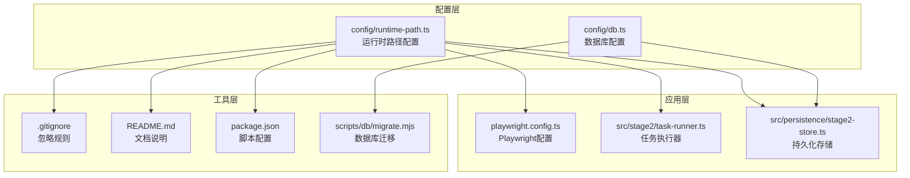
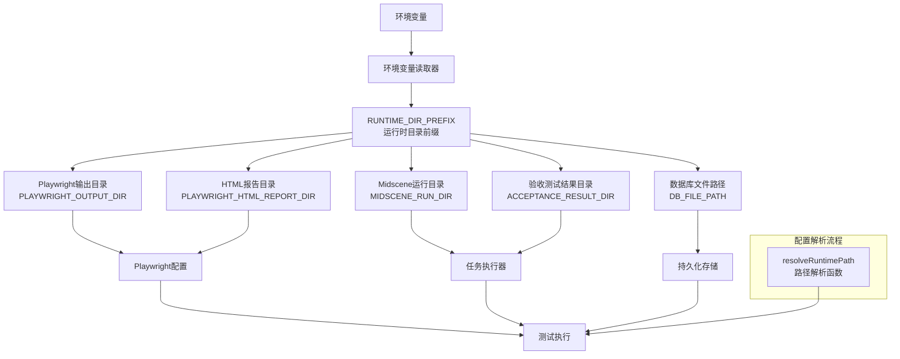
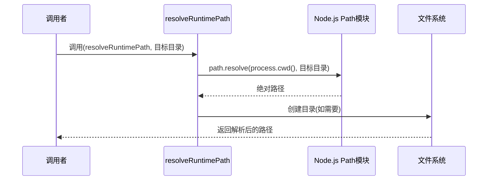
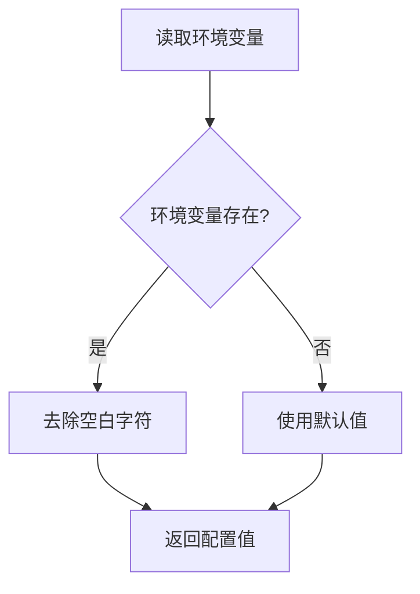
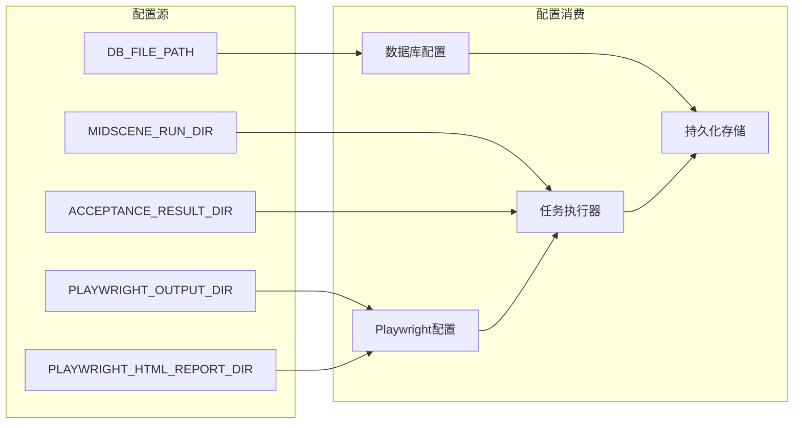
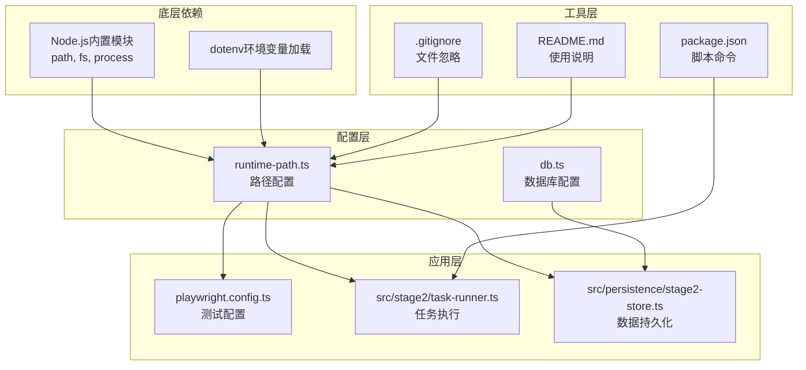

# 运行时路径配置

<cite>
**本文档引用的文件**
- [config/runtime-path.ts](file://config/runtime-path.ts)
- [playwright.config.ts](file://playwright.config.ts)
- [config/db.ts](file://config/db.ts)
- [src/stage2/task-runner.ts](file://src/stage2/task-runner.ts)
- [src/persistence/stage2-store.ts](file://src/persistence/stage2-store.ts)
- [.gitignore](file://.gitignore)
- [README.md](file://README.md)
- [package.json](file://package.json)
- [scripts/db/migrate.mjs](file://scripts/db/migrate.mjs)
</cite>

## 目录
1. [简介](#简介)
2. [项目结构](#项目结构)
3. [核心组件](#核心组件)
4. [架构概览](#架构概览)
5. [详细组件分析](#详细组件分析)
6. [依赖关系分析](#依赖关系分析)
7. [性能考虑](#性能考虑)
8. [故障排除指南](#故障排除指南)
9. [结论](#结论)
10. [附录](#附录)

## 简介

运行时路径配置是本项目的核心基础设施之一，负责统一管理所有运行时生成的目录和文件路径。该配置系统采用环境变量驱动的方式，提供了高度的灵活性和可定制性，使得开发者可以根据不同的部署环境和需求来调整运行时产物的存储位置。

本系统的运行时路径配置主要包含以下几个方面：
- 运行时目录前缀配置（RUNTIME_DIR_PREFIX）
- Playwright 输出目录配置
- HTML 报告目录配置
- Midscene 运行目录配置
- 验收测试结果目录配置
- 数据库文件路径配置

## 项目结构

项目的运行时路径配置分布在多个关键文件中，形成了一个完整的配置体系：



**图表来源**
- [config/runtime-path.ts:1-41](file://config/runtime-path.ts#L1-L41)
- [config/db.ts:1-28](file://config/db.ts#L1-L28)
- [playwright.config.ts:1-95](file://playwright.config.ts#L1-L95)

**章节来源**
- [config/runtime-path.ts:1-41](file://config/runtime-path.ts#L1-L41)
- [config/db.ts:1-28](file://config/db.ts#L1-L28)
- [playwright.config.ts:1-95](file://playwright.config.ts#L1-L95)

## 核心组件

### 运行时路径前缀配置

运行时路径前缀是整个配置系统的基础，所有相对路径都会基于这个前缀进行解析。

**默认值设置**：`RUNTIME_DIR_PREFIX` 的默认值为 `t_runtime/`，这是一个相对路径，表示相对于项目根目录的运行时目录。

**环境变量覆盖机制**：
- 如果设置了 `RUNTIME_DIR_PREFIX` 环境变量，则使用环境变量值
- 如果未设置环境变量，则使用默认值 `t_runtime/`
- 值会被自动去除首尾空白字符

**章节来源**
- [config/runtime-path.ts:6](file://config/runtime-path.ts#L6)
- [config/runtime-path.ts:13-16](file://config/runtime-path.ts#L13-L16)

### Playwright 输出目录配置

Playwright 的测试结果输出目录通过 `PLAYWRIGHT_OUTPUT_DIR` 环境变量控制。

**默认值设置**：`${runtimeDirPrefix}test-results`
- 基于运行时路径前缀动态生成
- 默认生成路径：`t_runtime/test-results/`

**配置集成**：在 `playwright.config.ts` 中直接使用该配置作为 `outputDir` 参数。

**章节来源**
- [config/runtime-path.ts:18-21](file://config/runtime-path.ts#L18-L21)
- [playwright.config.ts:24](file://playwright.config.ts#L24)

### HTML 报告目录配置

HTML 报告目录通过 `PLAYWRIGHT_HTML_REPORT_DIR` 环境变量控制。

**默认值设置**：`${runtimeDirPrefix}playwright-report`
- 基于运行时路径前缀动态生成
- 默认生成路径：`t_runtime/playwright-report/`

**配置集成**：在 `playwright.config.ts` 中作为 HTML 报告的输出目录。

**章节来源**
- [config/runtime-path.ts:23-26](file://config/runtime-path.ts#L23-L26)
- [playwright.config.ts:38](file://playwright.config.ts#L38)

### Midscene 运行目录配置

Midscene 的运行目录通过 `MIDSCENE_RUN_DIR` 环境变量控制。

**默认值设置**：`${runtimeDirPrefix}midscene_run`
- 基于运行时路径前缀动态生成
- 默认生成路径：`t_runtime/midscene_run/`

**目录结构**：Midscene 会在该目录下自动生成多个子目录，包括 report、dump、tmp、cache 等。

**章节来源**
- [config/runtime-path.ts:28-31](file://config/runtime-path.ts#L28-L31)

### 验收测试结果目录配置

验收测试结果目录通过 `ACCEPTANCE_RESULT_DIR` 环境变量控制。

**默认值设置**：`${runtimeDirPrefix}acceptance-results`
- 基于运行时路径前缀动态生成
- 默认生成路径：`t_runtime/acceptance-results/`

**使用场景**：主要用于存储第二段执行器生成的结构化结果文件和截图。

**章节来源**
- [config/runtime-path.ts:33-36](file://config/runtime-path.ts#L33-L36)

### 数据库文件路径配置

数据库文件路径通过 `DB_FILE_PATH` 环境变量控制，位于独立的数据库配置文件中。

**默认值设置**：`${runtimeDirPrefix}db/hi_test.sqlite`
- 基于运行时路径前缀动态生成
- 默认生成路径：`t_runtime/db/hi_test.sqlite`

**章节来源**
- [config/db.ts:8](file://config/db.ts#L8)
- [config/db.ts:22](file://config/db.ts#L22)

## 架构概览

运行时路径配置系统采用分层架构设计，确保了配置的一致性和可维护性：



**图表来源**
- [config/runtime-path.ts:8-16](file://config/runtime-path.ts#L8-L16)
- [config/runtime-path.ts:38-40](file://config/runtime-path.ts#L38-L40)
- [playwright.config.ts:22-40](file://playwright.config.ts#L22-L40)

## 详细组件分析

### 路径解析函数实现

`resolveRuntimePath` 函数是运行时路径配置系统的核心组件，负责将相对路径转换为绝对路径。

**实现原理**：
1. 接收目标目录路径参数
2. 获取当前工作目录（process.cwd()）
3. 使用 path.resolve 将相对路径解析为绝对路径
4. 返回最终的绝对路径

**使用方式**：
- 在任务执行器中用于创建验收测试结果目录
- 在数据库配置中用于解析数据库文件绝对路径
- 在持久化存储中用于处理文件路径



**图表来源**
- [config/runtime-path.ts:38-40](file://config/runtime-path.ts#L38-L40)
- [src/stage2/task-runner.ts:115-119](file://src/stage2/task-runner.ts#L115-L119)

**章节来源**
- [config/runtime-path.ts:38-40](file://config/runtime-path.ts#L38-L40)
- [src/stage2/task-runner.ts:115-119](file://src/stage2/task-runner.ts#L115-L119)

### 环境变量覆盖机制

环境变量覆盖机制遵循"环境变量优先"的原则，确保了配置的灵活性和可控性。

**覆盖优先级**：
1. 环境变量设置（最高优先级）
2. 默认值设置（最低优先级）

**实现逻辑**：


**图表来源**
- [config/runtime-path.ts:8-11](file://config/runtime-path.ts#L8-L11)

**章节来源**
- [config/runtime-path.ts:8-11](file://config/runtime-path.ts#L8-L11)

### 配置集成与使用

运行时路径配置在项目中的集成使用情况如下：



**图表来源**
- [playwright.config.ts:3-6](file://playwright.config.ts#L3-L6)
- [src/stage2/task-runner.ts:5](file://src/stage2/task-runner.ts#L5)
- [src/persistence/stage2-store.ts:6-13](file://src/persistence/stage2-store.ts#L6-L13)
- [config/db.ts:3](file://config/db.ts#L3)

**章节来源**
- [playwright.config.ts:3-6](file://playwright.config.ts#L3-L6)
- [src/stage2/task-runner.ts:5](file://src/stage2/task-runner.ts#L5)
- [src/persistence/stage2-store.ts:6-13](file://src/persistence/stage2-store.ts#L6-L13)
- [config/db.ts:3](file://config/db.ts#L3)

## 依赖关系分析

运行时路径配置系统与其他组件的依赖关系体现了清晰的分层架构：



**图表来源**
- [config/runtime-path.ts:1-4](file://config/runtime-path.ts#L1-L4)
- [config/db.ts:1-5](file://config/db.ts#L1-L5)

**章节来源**
- [config/runtime-path.ts:1-4](file://config/runtime-path.ts#L1-L4)
- [config/db.ts:1-5](file://config/db.ts#L1-L5)

## 性能考虑

运行时路径配置系统在性能方面的考虑主要包括：

1. **路径解析效率**：使用 Node.js 内置的 path.resolve 方法，具有良好的性能表现
2. **环境变量读取**：通过 dotenv 库一次性加载环境变量，避免重复读取
3. **配置缓存**：配置值在模块加载时计算并缓存，避免重复计算
4. **文件系统操作**：仅在必要时进行目录创建操作，减少不必要的文件系统调用

## 故障排除指南

### 常见问题及解决方案

**问题1：路径解析异常**
- 检查 `RUNTIME_DIR_PREFIX` 环境变量是否正确设置
- 确认路径末尾的斜杠是否正确
- 验证项目根目录的访问权限

**问题2：目录创建失败**
- 检查目标目录的父级目录是否存在
- 验证当前用户的文件系统权限
- 确认磁盘空间是否充足

**问题3：环境变量未生效**
- 确认 `.env` 文件的正确性
- 检查 dotenv 加载顺序
- 验证环境变量名称的大小写

**问题4：路径包含特殊字符**
- 确保路径中不包含非法字符
- 检查路径中的空格处理
- 验证跨平台路径分隔符

**章节来源**
- [config/runtime-path.ts:8-11](file://config/runtime-path.ts#L8-L11)
- [src/stage2/task-runner.ts:115-119](file://src/stage2/task-runner.ts#L115-L119)

## 结论

运行时路径配置系统通过环境变量驱动的方式，为项目提供了灵活、可定制的运行时产物管理机制。该系统的主要优势包括：

1. **统一管理**：所有运行时路径集中在一个配置文件中管理
2. **环境隔离**：不同环境可以使用不同的配置值
3. **易于扩展**：新的运行时目录可以轻松添加到配置系统中
4. **向后兼容**：默认值确保了现有配置的兼容性

通过合理的配置和使用，开发者可以轻松地管理和组织项目的所有运行时产物，提高开发和测试的效率。

## 附录

### 配置示例

以下是一些常见的配置示例：

**基础配置示例**：
```dotenv
RUNTIME_DIR_PREFIX=t_runtime/
PLAYWRIGHT_OUTPUT_DIR=t_runtime/test-results
PLAYWRIGHT_HTML_REPORT_DIR=t_runtime/playwright-report
MIDSCENE_RUN_DIR=t_runtime/midscene_run
ACCEPTANCE_RESULT_DIR=t_runtime/acceptance-results
DB_FILE_PATH=t_runtime/db/hi_test.sqlite
```

**自定义路径示例**：
```dotenv
RUNTIME_DIR_PREFIX=build/runtime/
PLAYWRIGHT_OUTPUT_DIR=build/runtime/test-results
PLAYWRIGHT_HTML_REPORT_DIR=build/runtime/html-report
MIDSCENE_RUN_DIR=build/runtime/midscene
ACCEPTANCE_RESULT_DIR=build/runtime/results
DB_FILE_PATH=build/runtime/database.sqlite
```

### 最佳实践

1. **统一前缀管理**：建议使用统一的运行时目录前缀，便于管理和清理
2. **环境隔离**：不同环境使用不同的前缀，避免冲突
3. **路径规范化**：确保路径末尾包含适当的分隔符
4. **权限考虑**：确保运行用户对目标目录有适当的读写权限
5. **清理策略**：定期清理旧的运行时产物，避免占用过多磁盘空间

**章节来源**
- [README.md:39-54](file://README.md#L39-L54)
- [README.md:76-96](file://README.md#L76-L96)