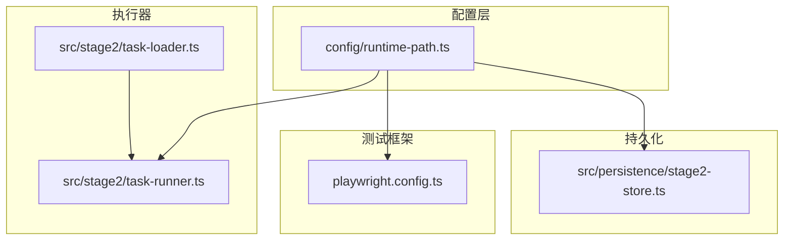
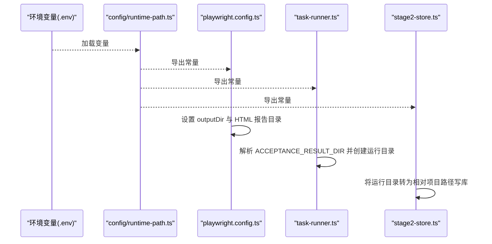
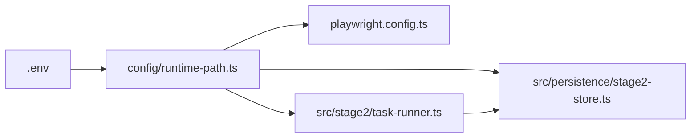

# 运行时配置

<cite>
**本文引用的文件**
- [config/runtime-path.ts](file://config/runtime-path.ts)
- [playwright.config.ts](file://playwright.config.ts)
- [src/stage2/task-runner.ts](file://src/stage2/task-runner.ts)
- [src/persistence/stage2-store.ts](file://src/persistence/stage2-store.ts)
- [src/stage2/task-loader.ts](file://src/stage2/task-loader.ts)
- [.tasks/运行目录与项目规范统一_2026-03-11.md](file://.tasks/运行目录与项目规范统一_2026-03-11.md)
- [README.md](file://README.md)
- [AGENTS.md](file://AGENTS.md)
- [package.json](file://package.json)
</cite>

## 目录
1. [简介](#简介)
2. [项目结构](#项目结构)
3. [核心组件](#核心组件)
4. [架构总览](#架构总览)
5. [详细组件分析](#详细组件分析)
6. [依赖关系分析](#依赖关系分析)
7. [性能考量](#性能考量)
8. [故障排查指南](#故障排查指南)
9. [结论](#结论)
10. [附录](#附录)

## 简介
本文件系统性阐述 HI-TEST 项目的运行时路径配置机制，重点围绕以下关键配置项进行说明：
- RUNTIME_DIR_PREFIX：运行时目录前缀
- PLAYWRIGHT_OUTPUT_DIR：Playwright 执行产物目录
- PLAYWRIGHT_HTML_REPORT_DIR：Playwright HTML 报告目录
- MIDSCENE_RUN_DIR：Midscene 运行日志/缓存/报告根目录
- ACCEPTANCE_RESULT_DIR：第二段验收结果目录

文档涵盖默认值、可选值范围、环境变量覆盖机制、路径解析逻辑、跨平台适配最佳实践、运行时目录组织原则与权限管理建议，以及常见问题排查与解决方案。

## 项目结构
运行时配置主要集中在 config/runtime-path.ts 中集中管理，并被 Playwright 配置、第二段执行器、持久化存储等模块消费。关键文件与职责如下：
- config/runtime-path.ts：统一读取环境变量并导出运行时目录常量与解析函数
- playwright.config.ts：读取运行时目录常量，设置 Playwright 的 outputDir 与 HTML 报告输出目录
- src/stage2/task-runner.ts：使用运行时目录常量创建验收结果目录、截图目录
- src/persistence/stage2-store.ts：将运行时目录转换为相对项目路径，写入数据库
- src/stage2/task-loader.ts：读取任务文件路径（间接影响运行时目录的相对解析）
- README.md / AGENTS.md：提供默认值、目录约定与规范
- package.json：提供脚本入口，便于在不同环境中运行

图表来源
- [config/runtime-path.ts:1-41](file://config/runtime-path.ts#L1-L41)
- [playwright.config.ts:1-95](file://playwright.config.ts#L1-L95)
- [src/stage2/task-runner.ts:1-120](file://src/stage2/task-runner.ts#L1-L120)
- [src/stage2/task-loader.ts:1-91](file://src/stage2/task-loader.ts#L1-L91)
- [src/persistence/stage2-store.ts:1-655](file://src/persistence/stage2-store.ts#L1-L655)

章节来源
- [config/runtime-path.ts:1-41](file://config/runtime-path.ts#L1-L41)
- [playwright.config.ts:1-95](file://playwright.config.ts#L1-L95)
- [src/stage2/task-runner.ts:1-120](file://src/stage2/task-runner.ts#L1-L120)
- [src/stage2/task-loader.ts:1-91](file://src/stage2/task-loader.ts#L1-L91)
- [src/persistence/stage2-store.ts:1-655](file://src/persistence/stage2-store.ts#L1-L655)
- [README.md:76-96](file://README.md#L76-L96)
- [AGENTS.md:26-46](file://AGENTS.md#L26-L46)

## 核心组件
- 运行时目录常量与解析函数
  - RUNTIME_DIR_PREFIX：默认值为 t_runtime/，可通过环境变量覆盖
  - PLAYWRIGHT_OUTPUT_DIR：默认值为 ${RUNTIME_DIR_PREFIX}test-results
  - PLAYWRIGHT_HTML_REPORT_DIR：默认值为 ${RUNTIME_DIR_PREFIX}playwright-report
  - MIDSCENE_RUN_DIR：默认值为 ${RUNTIME_DIR_PREFIX}midscene_run
  - ACCEPTANCE_RESULT_DIR：默认值为 ${RUNTIME_DIR_PREFIX}acceptance-results
  - resolveRuntimePath：将相对路径解析为绝对路径（基于 process.cwd）

- Playwright 配置消费
  - playwright.config.ts 读取上述常量，分别设置 outputDir 与 HTML 报告输出目录

- 第二段执行器消费
  - task-runner.ts 使用 ACCEPTANCE_RESULT_DIR 创建验收结果目录与截图目录，并写入运行时信息

- 持久化存储消费
  - stage2-store.ts 将运行时目录转换为相对项目路径后写入数据库，避免绝对路径泄露

章节来源
- [config/runtime-path.ts:6-40](file://config/runtime-path.ts#L6-L40)
- [playwright.config.ts:22-40](file://playwright.config.ts#L22-L40)
- [src/stage2/task-runner.ts:111-120](file://src/stage2/task-runner.ts#L111-L120)
- [src/persistence/stage2-store.ts:54-59](file://src/persistence/stage2-store.ts#L54-L59)

## 架构总览
运行时配置的调用链路如下：
- 环境变量加载：config/runtime-path.ts 在模块初始化时加载 .env
- 常量导出：读取环境变量并提供默认值
- 消费端：
  - Playwright：读取常量设置 outputDir 与 HTML 报告目录
  - 第二段执行器：读取 ACCEPTANCE_RESULT_DIR 创建运行目录
  - 持久化：将运行目录转换为相对路径写入数据库

图表来源
- [config/runtime-path.ts:4-40](file://config/runtime-path.ts#L4-L40)
- [playwright.config.ts:22-40](file://playwright.config.ts#L22-L40)
- [src/stage2/task-runner.ts:111-120](file://src/stage2/task-runner.ts#L111-L120)
- [src/persistence/stage2-store.ts:54-59](file://src/persistence/stage2-store.ts#L54-L59)

## 详细组件分析

### 运行时目录常量与解析
- 默认值与可选值范围
  - RUNTIME_DIR_PREFIX：字符串，建议以斜杠结尾，例如 t_runtime/。可选值为任意合法目录名（建议以 t_ 开头）
  - PLAYWRIGHT_OUTPUT_DIR：字符串，建议为 RUNTIME_DIR_PREFIX 下的子目录，例如 t_runtime/test-results
  - PLAYWRIGHT_HTML_REPORT_DIR：字符串，建议为 RUNTIME_DIR_PREFIX 下的子目录，例如 t_runtime/playwright-report
  - MIDSCENE_RUN_DIR：字符串，建议为 RUNTIME_DIR_PREFIX 下的子目录，例如 t_runtime/midscene_run
  - ACCEPTANCE_RESULT_DIR：字符串，建议为 RUNTIME_DIR_PREFIX 下的子目录，例如 t_runtime/acceptance-results
- 环境变量覆盖机制
  - config/runtime-path.ts 提供 readEnv(name, fallbackValue) 读取环境变量并去除首尾空白，若为空则使用默认值
  - resolveRuntimePath(targetDir) 将相对路径解析为绝对路径（基于 process.cwd）
- 路径解析逻辑
  - 常量默认值中使用 RUNTIME_DIR_PREFIX 进行拼接
  - resolveRuntimePath 保证消费端始终得到绝对路径，避免相对路径导致的跨平台差异

章节来源
- [config/runtime-path.ts:6-40](file://config/runtime-path.ts#L6-L40)
- [README.md:43-54](file://README.md#L43-L54)
- [AGENTS.md:26-31](file://AGENTS.md#L26-L31)

### Playwright 配置消费
- 消费方式
  - playwright.config.ts 导入运行时目录常量，并设置 outputDir 与 HTML 报告目录
- 影响范围
  - Playwright 执行产物与 HTML 报告均落盘到指定目录，便于统一管理与 CI 上传

章节来源
- [playwright.config.ts:22-40](file://playwright.config.ts#L22-L40)
- [README.md:160-164](file://README.md#L160-L164)

### 第二段执行器消费
- 目录创建
  - task-runner.ts 使用 ACCEPTANCE_RESULT_DIR 解析绝对路径，创建以 taskId 与时间戳命名的运行目录，并创建 screenshots 子目录
- 结果落盘
  - 运行结束后，执行器将 result.json、过程快照与截图写入该目录
- 与持久化的衔接
  - stage2-store.ts 将运行目录转换为相对项目路径后写入数据库，避免绝对路径泄露

章节来源
- [src/stage2/task-runner.ts:111-120](file://src/stage2/task-runner.ts#L111-L120)
- [src/persistence/stage2-store.ts:54-59](file://src/persistence/stage2-store.ts#L54-L59)
- [README.md:173-179](file://README.md#L173-L179)

### 任务文件路径解析（间接影响运行时目录）
- 任务文件路径解析
  - task-loader.ts 提供 resolveTaskFilePath，若传入绝对路径则直接使用，否则基于 process.cwd() 解析为绝对路径
- 对运行时目录的影响
  - 由于运行时目录解析基于 process.cwd()，任务文件路径解析与运行时目录解析相互独立，但都依赖 process.cwd()

章节来源
- [src/stage2/task-loader.ts:71-77](file://src/stage2/task-loader.ts#L71-L77)
- [config/runtime-path.ts:38-40](file://config/runtime-path.ts#L38-L40)

### 目录组织原则与权限管理建议
- 组织原则
  - 所有运行时目录统一以 RUNTIME_DIR_PREFIX 为根目录，便于集中管理与清理
  - Playwright、HTML 报告、Midscene、验收结果目录均为 RUNTIME_DIR_PREFIX 的子目录
  - README 与 AGENTS.md 明确了默认目录约定与规范
- 权限管理建议
  - 运行时目录建议仅授予执行用户读写权限，避免在 CI 环境暴露敏感信息
  - 数据库文件（默认 t_runtime/db/hi_test.sqlite）应单独控制权限，防止未授权访问
  - 生成的截图、报告等文件建议定期清理，避免占用磁盘空间

章节来源
- [README.md:76-96](file://README.md#L76-L96)
- [AGENTS.md:40-46](file://AGENTS.md#L40-L46)

## 依赖关系分析
- 模块耦合
  - config/runtime-path.ts 为纯配置模块，被 playwright.config.ts、task-runner.ts、stage2-store.ts 多处导入
  - task-runner.ts 与 stage2-store.ts 之间通过运行时目录进行数据传递（目录路径）
- 外部依赖
  - dotenv：用于加载 .env 文件
  - path：用于路径解析与拼接
  - process.env：用于读取环境变量

图表来源
- [config/runtime-path.ts:4-40](file://config/runtime-path.ts#L4-L40)
- [playwright.config.ts:22-40](file://playwright.config.ts#L22-L40)
- [src/stage2/task-runner.ts:111-120](file://src/stage2/task-runner.ts#L111-L120)
- [src/persistence/stage2-store.ts:54-59](file://src/persistence/stage2-store.ts#L54-L59)

章节来源
- [config/runtime-path.ts:1-41](file://config/runtime-path.ts#L1-L41)
- [playwright.config.ts:1-95](file://playwright.config.ts#L1-L95)
- [src/stage2/task-runner.ts:1-120](file://src/stage2/task-runner.ts#L1-L120)
- [src/persistence/stage2-store.ts:1-655](file://src/persistence/stage2-store.ts#L1-L655)

## 性能考量
- 路径解析开销
  - resolveRuntimePath 仅在模块初始化时调用，开销极低
- 目录创建
  - task-runner.ts 在创建验收结果目录时使用递归创建，避免重复 IO
- 报告与截图
  - Playwright 与 Midscene 的报告与截图写入为 I/O 密集型，建议合理规划磁盘与网络共享盘的可用空间

## 故障排查指南
- 症状：运行后找不到 Playwright 报告或执行产物
  - 检查 PLAYWRIGHT_OUTPUT_DIR 与 PLAYWRIGHT_HTML_REPORT_DIR 是否正确设置
  - 确认 .env 已被加载（config/runtime-path.ts 在模块初始化时调用 dotenv.config()）
  - 确认 playwright.config.ts 正确导入并使用了运行时目录常量
- 症状：验收结果目录未生成或路径异常
  - 检查 ACCEPTANCE_RESULT_DIR 是否为合法目录名
  - 确认 resolveRuntimePath 返回的绝对路径符合预期
  - 检查 task-runner.ts 是否正确创建运行目录与 screenshots 子目录
- 症状：数据库中运行目录路径为绝对路径而非相对路径
  - 检查 stage2-store.ts 是否使用 toRelativeProjectPath 将绝对路径转换为相对路径
- 症状：任务文件路径解析错误
  - 检查 task-loader.ts 的 resolveTaskFilePath 是否正确处理绝对/相对路径
- 症状：跨平台路径分隔符不一致
  - 使用 path.resolve 与 path.join 进行路径拼接，避免硬编码分隔符
  - 使用 toRelativeProjectPath 将路径标准化为正斜杠分隔的相对路径

章节来源
- [config/runtime-path.ts:4-40](file://config/runtime-path.ts#L4-L40)
- [playwright.config.ts:22-40](file://playwright.config.ts#L22-L40)
- [src/stage2/task-runner.ts:111-120](file://src/stage2/task-runner.ts#L111-L120)
- [src/persistence/stage2-store.ts:32-41](file://src/persistence/stage2-store.ts#L32-L41)
- [src/stage2/task-loader.ts:71-77](file://src/stage2/task-loader.ts#L71-L77)

## 结论
HI-TEST 项目的运行时配置通过 config/runtime-path.ts 实现集中管理，结合 .env 的环境变量覆盖机制，实现了对 Playwright、Midscene、验收结果与数据库的统一路径控制。遵循 AGENTS.md 与 README.md 的规范，可确保跨平台一致性与可维护性。建议在 CI 环境中统一设置 RUNTIME_DIR_PREFIX 与相关目录，以获得一致的产物输出与报告上传体验。

## 附录
- 默认值与目录约定
  - RUNTIME_DIR_PREFIX：t_runtime/
  - PLAYWRIGHT_OUTPUT_DIR：t_runtime/test-results
  - PLAYWRIGHT_HTML_REPORT_DIR：t_runtime/playwright-report
  - MIDSCENE_RUN_DIR：t_runtime/midscene_run
  - ACCEPTANCE_RESULT_DIR：t_runtime/acceptance-results
- 相关文档与规范
  - README.md：运行产物目录说明与默认生成结果
  - AGENTS.md：配置规范与目录命名规范
  - .tasks/运行目录与项目规范统一_2026-03-11.md：变更内容与默认目录约定
- 脚本入口
  - package.json：提供 db 初始化与第二段执行脚本入口

章节来源
- [README.md:43-54](file://README.md#L43-L54)
- [README.md:76-96](file://README.md#L76-L96)
- [AGENTS.md:26-46](file://AGENTS.md#L26-L46)
- [.tasks/运行目录与项目规范统一_2026-03-11.md:18-27](file://.tasks/运行目录与项目规范统一_2026-03-11.md#L18-L27)
- [package.json:6-11](file://package.json#L6-L11)