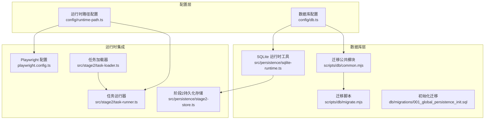
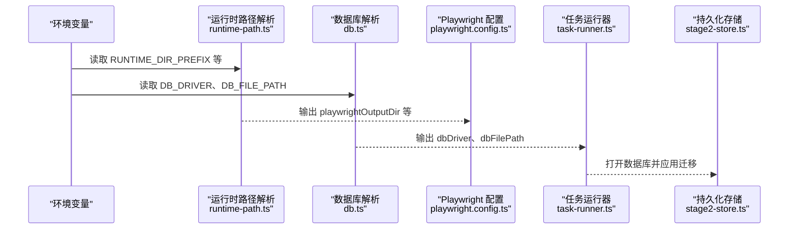
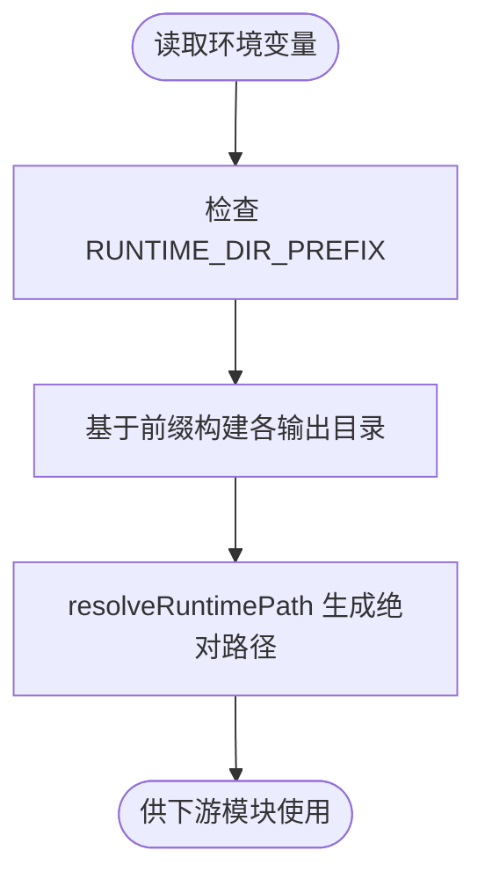
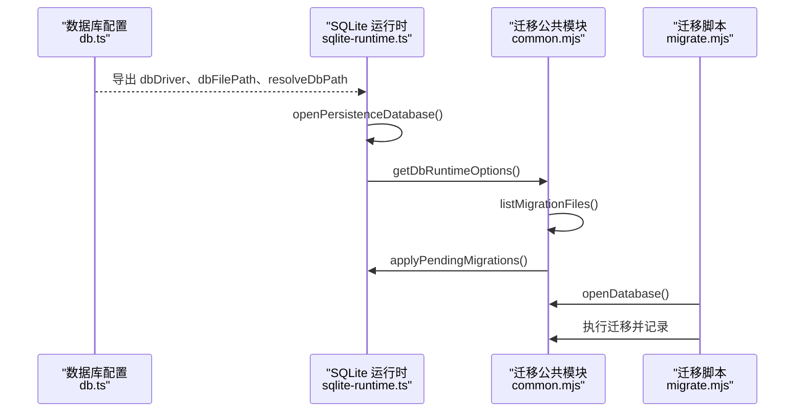
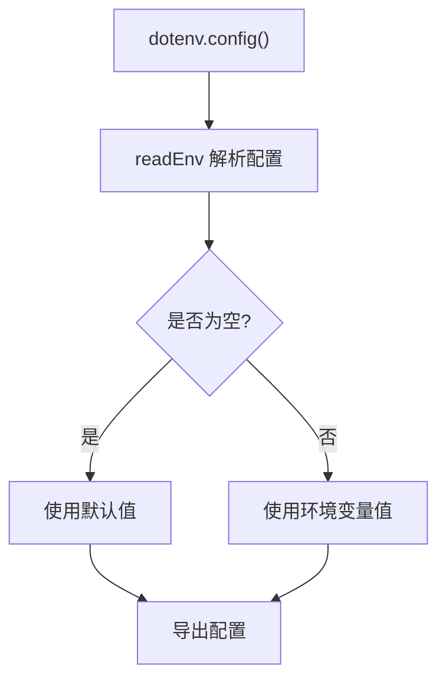
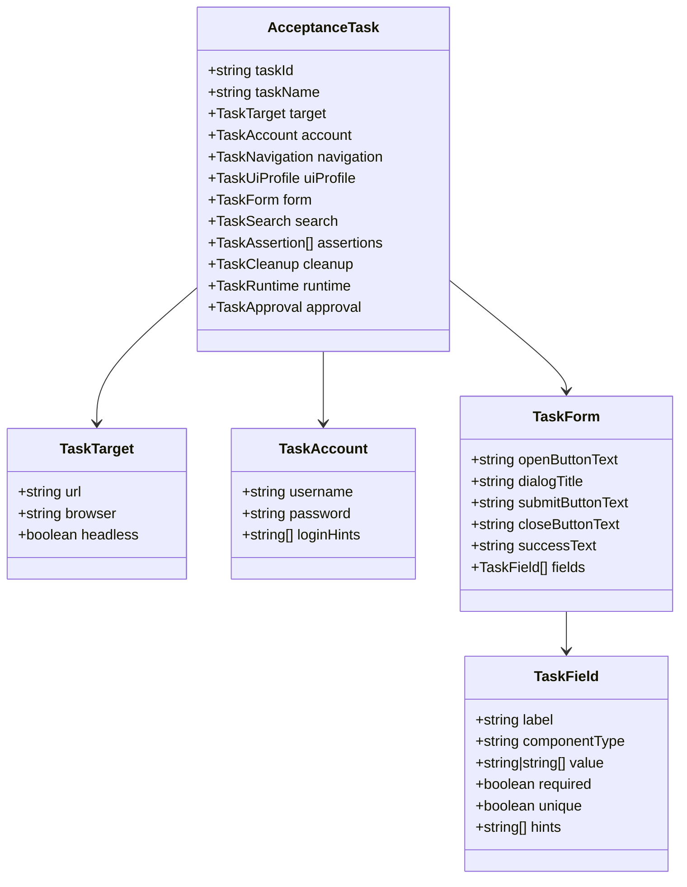
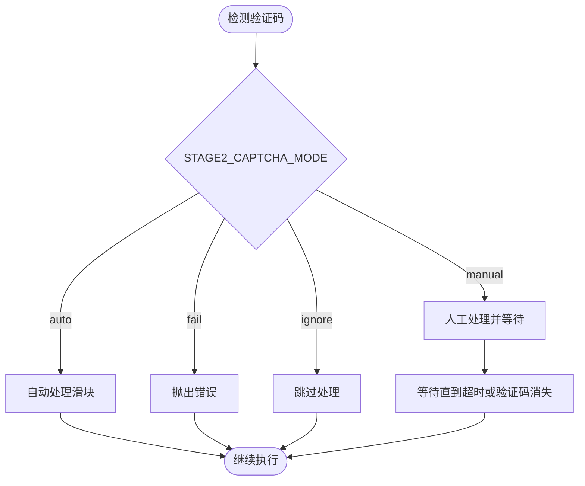
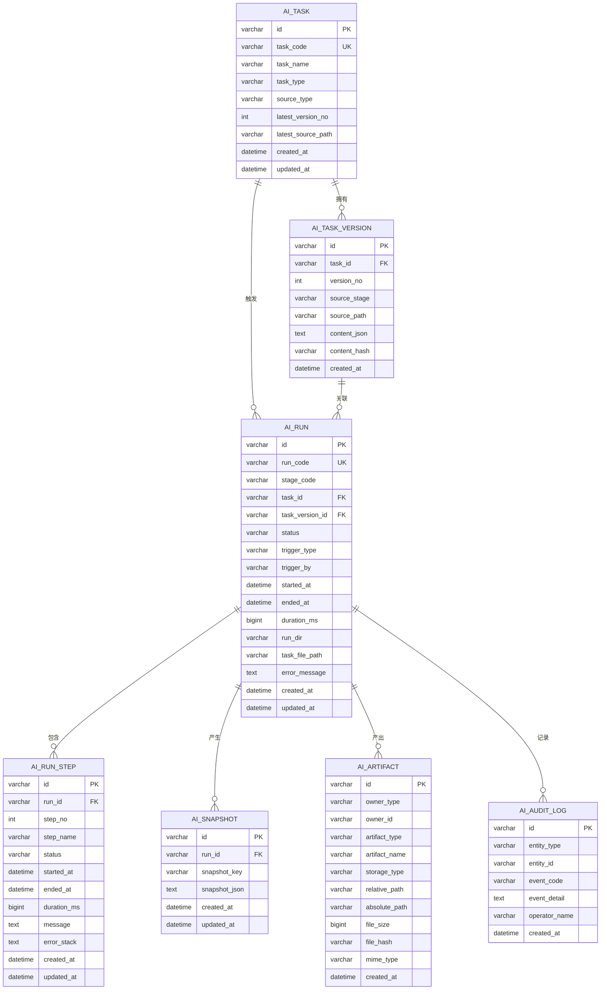
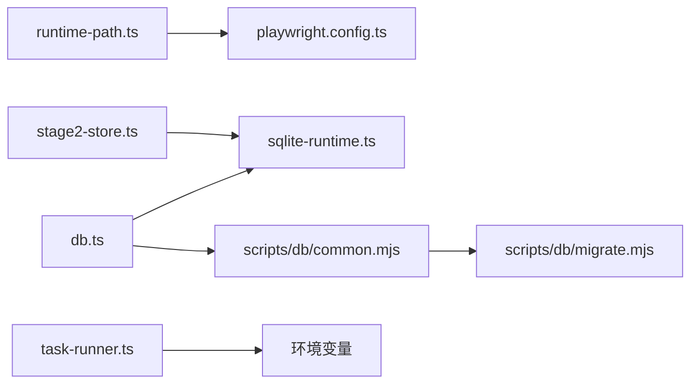

# 配置管理系统

<cite>
**本文引用的文件**
- [config/db.ts](file://config/db.ts)
- [config/runtime-path.ts](file://config/runtime-path.ts)
- [playwright.config.ts](file://playwright.config.ts)
- [src/persistence/sqlite-runtime.ts](file://src/persistence/sqlite-runtime.ts)
- [scripts/db/common.mjs](file://scripts/db/common.mjs)
- [scripts/db/migrate.mjs](file://scripts/db/migrate.mjs)
- [db/migrations/001_global_persistence_init.sql](file://db/migrations/001_global_persistence_init.sql)
- [specs/tasks/acceptance-task.template.json](file://specs/tasks/acceptance-task.template.json)
- [specs/tasks/acceptance-task.community-create.example.json](file://specs/tasks/acceptance-task.community-create.example.json)
- [src/stage2/task-loader.ts](file://src/stage2/task-loader.ts)
- [src/stage2/task-runner.ts](file://src/stage2/task-runner.ts)
- [src/stage2/types.ts](file://src/stage2/types.ts)
- [src/persistence/stage2-store.ts](file://src/persistence/stage2-store.ts)
- [.gitignore](file://.gitignore)
- [package.json](file://package.json)
</cite>

## 目录
1. [简介](#简介)
2. [项目结构](#项目结构)
3. [核心组件](#核心组件)
4. [架构总览](#架构总览)
5. [详细组件分析](#详细组件分析)
6. [依赖分析](#依赖分析)
7. [性能考虑](#性能考虑)
8. [故障排查指南](#故障排查指南)
9. [结论](#结论)
10. [附录](#附录)

## 简介
本文件系统性梳理 HI-TEST 项目的配置管理体系，覆盖运行时路径、数据库、环境变量与任务配置模板。内容包括：
- 各配置项的作用、默认值与取值范围
- 跨平台适配与动态加载机制
- 配置验证与冲突处理
- 最佳实践与安全建议
- 常见场景示例与故障排查

## 项目结构
配置相关的关键目录与文件：
- config：集中存放运行时路径与数据库配置
- scripts/db：数据库迁移脚本与运行时选项解析
- db/migrations：SQLite 初始化迁移脚本
- specs/tasks：任务配置模板与示例
- src/stage2：任务加载与运行时行为控制
- src/persistence：持久化存储与数据库访问
- 根目录：.gitignore、package.json 等

**图表来源**
- [config/runtime-path.ts:1-41](file://config/runtime-path.ts#L1-L41)
- [config/db.ts:1-28](file://config/db.ts#L1-L28)
- [playwright.config.ts:1-95](file://playwright.config.ts#L1-L95)
- [src/stage2/task-loader.ts:1-91](file://src/stage2/task-loader.ts#L1-L91)
- [src/stage2/task-runner.ts:1-800](file://src/stage2/task-runner.ts#L1-L800)
- [src/persistence/stage2-store.ts:1-655](file://src/persistence/stage2-store.ts#L1-L655)
- [src/persistence/sqlite-runtime.ts:1-116](file://src/persistence/sqlite-runtime.ts#L1-L116)
- [scripts/db/common.mjs:1-108](file://scripts/db/common.mjs#L1-L108)
- [scripts/db/migrate.mjs:1-52](file://scripts/db/migrate.mjs#L1-L52)
- [db/migrations/001_global_persistence_init.sql:1-128](file://db/migrations/001_global_persistence_init.sql#L1-L128)

**章节来源**
- [config/runtime-path.ts:1-41](file://config/runtime-path.ts#L1-L41)
- [config/db.ts:1-28](file://config/db.ts#L1-L28)
- [playwright.config.ts:1-95](file://playwright.config.ts#L1-L95)
- [src/stage2/task-loader.ts:1-91](file://src/stage2/task-loader.ts#L1-L91)
- [src/stage2/task-runner.ts:1-800](file://src/stage2/task-runner.ts#L1-L800)
- [src/persistence/stage2-store.ts:1-655](file://src/persistence/stage2-store.ts#L1-L655)
- [src/persistence/sqlite-runtime.ts:1-116](file://src/persistence/sqlite-runtime.ts#L1-L116)
- [scripts/db/common.mjs:1-108](file://scripts/db/common.mjs#L1-L108)
- [scripts/db/migrate.mjs:1-52](file://scripts/db/migrate.mjs#L1-L52)
- [db/migrations/001_global_persistence_init.sql:1-128](file://db/migrations/001_global_persistence_init.sql#L1-L128)

## 核心组件
- 运行时路径配置：集中解析 RUNTIME_DIR_PREFIX、各输出目录等，统一生成相对/绝对路径
- 数据库配置：解析 DB_DRIVER、DB_FILE_PATH，提供路径解析与 SQLite 打开能力
- 任务配置模板：JSON 模板与示例，支持环境变量与时间戳占位符动态替换
- 运行时行为控制：通过环境变量控制验证码处理模式与超时
- 持久化与迁移：统一的 SQLite 打开、迁移应用与审计日志记录

**章节来源**
- [config/runtime-path.ts:13-41](file://config/runtime-path.ts#L13-L41)
- [config/db.ts:7-26](file://config/db.ts#L7-L26)
- [src/stage2/task-loader.ts:19-48](file://src/stage2/task-loader.ts#L19-L48)
- [src/stage2/task-runner.ts:61-87](file://src/stage2/task-runner.ts#L61-L87)
- [src/persistence/sqlite-runtime.ts:73-114](file://src/persistence/sqlite-runtime.ts#L73-L114)

## 架构总览
配置系统围绕“环境变量 → 解析器 → 运行时使用”的链路工作，Playwright、任务运行器与持久化模块均从统一的解析器读取配置。

**图表来源**
- [config/runtime-path.ts:8-41](file://config/runtime-path.ts#L8-L41)
- [config/db.ts:10-26](file://config/db.ts#L10-L26)
- [playwright.config.ts:22-40](file://playwright.config.ts#L22-L40)
- [src/stage2/task-runner.ts:61-87](file://src/stage2/task-runner.ts#L61-L87)
- [src/persistence/stage2-store.ts:101-123](file://src/persistence/stage2-store.ts#L101-L123)

## 详细组件分析

### 运行时路径配置
- 关键项
  - RUNTIME_DIR_PREFIX：运行时根目录前缀，默认 t_runtime/
  - PLAYWRIGHT_OUTPUT_DIR：Playwright 测试输出目录，默认基于 RUNTIME_DIR_PREFIX 的子目录
  - PLAYWRIGHT_HTML_REPORT_DIR：HTML 报告目录
  - MIDSCENE_RUN_DIR：中间场景运行目录
  - ACCEPTANCE_RESULT_DIR：验收结果目录
- 解析与路径生成
  - 通过统一的 readEnv 读取并 trim
  - resolveRuntimePath 将相对路径解析为绝对路径
- 跨平台适配
  - 统一使用 path.resolve 生成绝对路径，避免相对路径差异
  - 目录分隔符由 path 处理，无需手工拼接

**图表来源**
- [config/runtime-path.ts:8-41](file://config/runtime-path.ts#L8-L41)

**章节来源**
- [config/runtime-path.ts:13-41](file://config/runtime-path.ts#L13-L41)
- [playwright.config.ts:22-40](file://playwright.config.ts#L22-L40)

### 数据库配置
- 关键项
  - DB_DRIVER：数据库驱动，默认 sqlite
  - DB_FILE_PATH：数据库文件路径，默认基于 RUNTIME_DIR_PREFIX 的 db/hi_test.sqlite
- 解析与路径解析
  - readEnv 读取并转小写
  - resolveDbPath 将相对路径解析为绝对路径
- 运行时加载与迁移
  - openPersistenceDatabase 仅支持 sqlite
  - applyPendingMigrations 应用迁移并记录校验和
- 迁移脚本
  - scripts/db/common.mjs 提供 getDbRuntimeOptions、openDatabase、迁移文件扫描与记录
  - scripts/db/migrate.mjs 顺序执行未应用的迁移

**图表来源**
- [config/db.ts:7-26](file://config/db.ts#L7-L26)
- [src/persistence/sqlite-runtime.ts:73-114](file://src/persistence/sqlite-runtime.ts#L73-L114)
- [scripts/db/common.mjs:31-108](file://scripts/db/common.mjs#L31-L108)
- [scripts/db/migrate.mjs:12-52](file://scripts/db/migrate.mjs#L12-L52)

**章节来源**
- [config/db.ts:7-26](file://config/db.ts#L7-L26)
- [src/persistence/sqlite-runtime.ts:73-114](file://src/persistence/sqlite-runtime.ts#L73-L114)
- [scripts/db/common.mjs:31-108](file://scripts/db/common.mjs#L31-L108)
- [scripts/db/migrate.mjs:12-52](file://scripts/db/migrate.mjs#L12-L52)
- [db/migrations/001_global_persistence_init.sql:1-128](file://db/migrations/001_global_persistence_init.sql#L1-L128)

### 环境变量管理与动态加载
- dotenv 加载
  - config/runtime-path.ts 与 config/db.ts 在模块导入时即调用 dotenv.config()
  - playwright.config.ts 同样显式加载 .env
- 动态配置加载
  - 任务加载器支持从环境变量 STAGE2_TASK_FILE 指定任务文件路径
  - 任务模板支持 ${NOW_YYYYMMDDHHMMSS} 与 ${ENV_VAR_NAME} 占位符动态替换
- 验证与回退
  - readEnv 对空值进行回退，保证默认值可用
  - 任务加载器对必需字段进行断言，缺失时报错

**图表来源**
- [config/runtime-path.ts:4-11](file://config/runtime-path.ts#L4-L11)
- [config/db.ts:5-13](file://config/db.ts#L5-L13)
- [playwright.config.ts:8-9](file://playwright.config.ts#L8-L9)
- [src/stage2/task-loader.ts:19-48](file://src/stage2/task-loader.ts#L19-L48)

**章节来源**
- [config/runtime-path.ts:4-11](file://config/runtime-path.ts#L4-L11)
- [config/db.ts:5-13](file://config/db.ts#L5-L13)
- [playwright.config.ts:8-9](file://playwright.config.ts#L8-L9)
- [src/stage2/task-loader.ts:19-48](file://src/stage2/task-loader.ts#L19-L48)

### 任务配置模板
- 模板与示例
  - acceptance-task.template.json：通用模板，包含 target、account、navigation、uiProfile、form、search、assertions、cleanup、approval、runtime 等字段
  - acceptance-task.community-create.example.json：具体业务示例，展示字段、断言与清理策略
- 动态占位符
  - ${NOW_YYYYMMDDHHMMSS}：注入当前时间戳，避免重复数据
  - ${ENV_VAR_NAME}：注入环境变量值，如 TEST_USERNAME、TEST_PASSWORD
- 配置验证
  - 任务加载器对 taskId、taskName、target.url、account.username/password、form.openButtonText/submitButtonText、form.fields 等进行断言

**图表来源**
- [src/stage2/types.ts:5-154](file://src/stage2/types.ts#L5-L154)
- [specs/tasks/acceptance-task.template.json:1-141](file://specs/tasks/acceptance-task.template.json#L1-L141)
- [specs/tasks/acceptance-task.community-create.example.json:1-229](file://specs/tasks/acceptance-task.community-create.example.json#L1-L229)

**章节来源**
- [src/stage2/types.ts:5-154](file://src/stage2/types.ts#L5-L154)
- [specs/tasks/acceptance-task.template.json:1-141](file://specs/tasks/acceptance-task.template.json#L1-L141)
- [specs/tasks/acceptance-task.community-create.example.json:1-229](file://specs/tasks/acceptance-task.community-create.example.json#L1-L229)
- [src/stage2/task-loader.ts:50-89](file://src/stage2/task-loader.ts#L50-L89)

### 验证码处理与运行时行为控制
- 配置项
  - STAGE2_CAPTCHA_MODE：验证码处理模式，支持 auto、fail、ignore、manual（默认）
  - STAGE2_CAPTCHA_WAIT_TIMEOUT_MS：人工模式等待超时（毫秒），默认 120000
- 行为逻辑
  - auto：自动尝试滑块验证码
  - fail：检测到验证码直接报错
  - ignore：忽略验证码
  - manual：人工处理，按超时等待

**图表来源**
- [src/stage2/task-runner.ts:61-87](file://src/stage2/task-runner.ts#L61-L87)
- [src/stage2/task-runner.ts:650-706](file://src/stage2/task-runner.ts#L650-L706)

**章节来源**
- [src/stage2/task-runner.ts:61-87](file://src/stage2/task-runner.ts#L61-L87)
- [src/stage2/task-runner.ts:650-706](file://src/stage2/task-runner.ts#L650-L706)

### 持久化与审计
- 存储结构
  - ai_task、ai_task_version、ai_run、ai_run_step、ai_snapshot、ai_artifact、ai_audit_log
- 关键流程
  - 初始化：创建任务、版本、运行记录
  - 进度：写入 resolved_values、query_snapshots、progress_json
  - 步骤：逐步写入 run_step 并关联截图
  - 结束：更新运行状态、写入最终结果与审计日志
- 安全与合规
  - 敏感字段脱敏（如 password）

**图表来源**
- [db/migrations/001_global_persistence_init.sql:1-128](file://db/migrations/001_global_persistence_init.sql#L1-L128)
- [src/persistence/stage2-store.ts:135-331](file://src/persistence/stage2-store.ts#L135-L331)

**章节来源**
- [db/migrations/001_global_persistence_init.sql:1-128](file://db/migrations/001_global_persistence_init.sql#L1-L128)
- [src/persistence/stage2-store.ts:135-331](file://src/persistence/stage2-store.ts#L135-L331)

## 依赖分析
- 模块耦合
  - config/runtime-path.ts 与 playwright.config.ts 强耦合（共享运行时路径）
  - config/db.ts 与 src/persistence/sqlite-runtime.ts、scripts/db/common.mjs 强耦合（共享数据库配置）
  - src/stage2/task-runner.ts 依赖环境变量控制验证码处理
  - src/persistence/stage2-store.ts 依赖 sqlite-runtime.ts 与迁移表结构
- 外部依赖
  - dotenv：加载 .env
  - node:sqlite：SQLite 访问
  - @playwright/test：测试框架配置

**图表来源**
- [config/runtime-path.ts:1-41](file://config/runtime-path.ts#L1-L41)
- [config/db.ts:1-28](file://config/db.ts#L1-L28)
- [playwright.config.ts:1-95](file://playwright.config.ts#L1-L95)
- [src/persistence/sqlite-runtime.ts:1-116](file://src/persistence/sqlite-runtime.ts#L1-L116)
- [scripts/db/common.mjs:1-108](file://scripts/db/common.mjs#L1-L108)
- [scripts/db/migrate.mjs:1-52](file://scripts/db/migrate.mjs#L1-L52)
- [src/stage2/task-runner.ts:1-800](file://src/stage2/task-runner.ts#L1-L800)
- [src/persistence/stage2-store.ts:1-655](file://src/persistence/stage2-store.ts#L1-L655)

**章节来源**
- [config/runtime-path.ts:1-41](file://config/runtime-path.ts#L1-L41)
- [config/db.ts:1-28](file://config/db.ts#L1-L28)
- [playwright.config.ts:1-95](file://playwright.config.ts#L1-L95)
- [src/persistence/sqlite-runtime.ts:1-116](file://src/persistence/sqlite-runtime.ts#L1-L116)
- [scripts/db/common.mjs:1-108](file://scripts/db/common.mjs#L1-L108)
- [scripts/db/migrate.mjs:1-52](file://scripts/db/migrate.mjs#L1-L52)
- [src/stage2/task-runner.ts:1-800](file://src/stage2/task-runner.ts#L1-L800)
- [src/persistence/stage2-store.ts:1-655](file://src/persistence/stage2-store.ts#L1-L655)

## 性能考虑
- 路径解析与 I/O
  - 统一使用 path.resolve，减少跨平台路径差异带来的额外判断
  - 数据库文件目录在首次打开时 mkdirSync 创建，避免多次检查
- 迁移执行
  - 仅对未应用的迁移执行，避免重复 SQL 执行
  - 事务包裹迁移，失败回滚，保证一致性
- 运行时超时
  - 通过环境变量控制验证码等待时间，平衡稳定性与耗时

[本节为通用指导，无需列出具体文件来源]

## 故障排查指南
- 环境变量未生效
  - 确认 .env 文件存在且路径正确
  - 检查 dotenv.config() 是否在模块导入处执行
- 数据库驱动不支持
  - 当前仅支持 sqlite，若 DB_DRIVER 非 sqlite 将抛出错误
- 数据库文件路径异常
  - 使用 resolveDbPath 确认最终绝对路径
  - 确认 db/migrations 目录存在且包含 .sql 文件
- 任务文件缺失或格式错误
  - 检查 STAGE2_TASK_FILE 或默认路径
  - 确认必需字段存在（taskId、taskName、target.url、account.username/password、form.openButtonText/submitButtonText、form.fields）
- 验证码导致阻塞
  - 设置 STAGE2_CAPTCHA_MODE=ignore 跳过验证码
  - 设置 STAGE2_CAPTCHA_MODE=manual 并增大 STAGE2_CAPTCHA_WAIT_TIMEOUT_MS
- 结果目录未生成
  - 检查 ACCEPTANCE_RESULT_DIR 与运行时前缀
  - 确认 .gitignore 中未误排除 t_runtime

**章节来源**
- [config/db.ts:74-76](file://config/db.ts#L74-L76)
- [src/stage2/task-loader.ts:50-89](file://src/stage2/task-loader.ts#L50-L89)
- [src/stage2/task-runner.ts:650-706](file://src/stage2/task-runner.ts#L650-L706)
- [.gitignore:1-4](file://.gitignore#L1-L4)

## 结论
HI-TEST 的配置体系以 dotenv 为核心，通过集中解析器将环境变量转换为运行时可用的路径与参数，贯穿 Playwright、任务运行与持久化全流程。系统具备良好的默认值、严格的配置验证与清晰的错误提示，适合在多环境下稳定运行。建议在团队内统一 .env 规范与任务模板使用方式，以提升协作效率与可维护性。

[本节为总结性内容，无需列出具体文件来源]

## 附录

### 配置项一览与最佳实践
- 运行时路径
  - RUNTIME_DIR_PREFIX：默认 t_runtime/，建议在 CI 中覆盖为可缓存目录
  - PLAYWRIGHT_OUTPUT_DIR、PLAYWRIGHT_HTML_REPORT_DIR、MIDSCENE_RUN_DIR、ACCEPTANCE_RESULT_DIR：建议与 RUNTIME_DIR_PREFIX 保持层级关系
  - 最佳实践：统一前缀、避免绝对路径硬编码、在 CI 中使用相对路径
- 数据库
  - DB_DRIVER：默认 sqlite，不建议修改
  - DB_FILE_PATH：默认基于 RUNTIME_DIR_PREFIX 的 db/hi_test.sqlite
  - 最佳实践：将数据库文件纳入缓存目录；迁移脚本仅在首次运行或变更时执行
- 任务配置
  - STAGE2_TASK_FILE：指定任务文件路径
  - 占位符：${NOW_YYYYMMDDHHMMSS} 用于去重；${ENV_VAR_NAME} 注入敏感信息
  - 最佳实践：将敏感信息放入 .env；模板字段按需裁剪
- 验证码处理
  - STAGE2_CAPTCHA_MODE：auto/fail/ignore/manual
  - STAGE2_CAPTCHA_WAIT_TIMEOUT_MS：默认 120000
  - 最佳实践：本地开发使用 auto；CI 使用 fail 或 ignore；必要时 manual 并适当增大超时

**章节来源**
- [config/runtime-path.ts:13-41](file://config/runtime-path.ts#L13-L41)
- [config/db.ts:7-26](file://config/db.ts#L7-L26)
- [src/stage2/task-loader.ts:71-89](file://src/stage2/task-loader.ts#L71-L89)
- [src/stage2/task-runner.ts:61-87](file://src/stage2/task-runner.ts#L61-L87)

### 跨平台配置适配
- 路径处理：统一使用 path.resolve 与 path.relative，避免手动拼接分隔符
- 目录创建：mkdirSync 递归创建，确保路径存在
- 报告与截图：统一相对路径存储，便于在不同平台查看

**章节来源**
- [config/runtime-path.ts:38-40](file://config/runtime-path.ts#L38-L40)
- [src/persistence/sqlite-runtime.ts:78-82](file://src/persistence/sqlite-runtime.ts#L78-L82)
- [src/persistence/stage2-store.ts:50-67](file://src/persistence/stage2-store.ts#L50-L67)

### 安全建议
- 敏感信息：通过 .env 注入，不要硬编码在模板中
- 数据库：默认 sqlite 本地文件，生产环境建议迁移到远程数据库
- 权限控制：.env 与 t_runtime 目录应限制权限，避免泄露

**章节来源**
- [specs/tasks/acceptance-task.template.json:9-11](file://specs/tasks/acceptance-task.template.json#L9-L11)
- [src/persistence/stage2-store.ts:37-48](file://src/persistence/stage2-store.ts#L37-L48)
- [.gitignore:1-4](file://.gitignore#L1-L4)

### 常见场景示例
- 本地开发
  - RUNTIME_DIR_PREFIX=t_runtime/
  - DB_DRIVER=sqlite
  - STAGE2_CAPTCHA_MODE=auto
- CI 环境
  - RUNTIME_DIR_PREFIX=cache/t_runtime/
  - DB_DRIVER=sqlite
  - STAGE2_CAPTCHA_MODE=fail
  - 使用 package.json 中的 db:migrate 脚本初始化数据库

**章节来源**
- [package.json:6-11](file://package.json#L6-L11)
- [scripts/db/migrate.mjs:15-52](file://scripts/db/migrate.mjs#L15-L52)