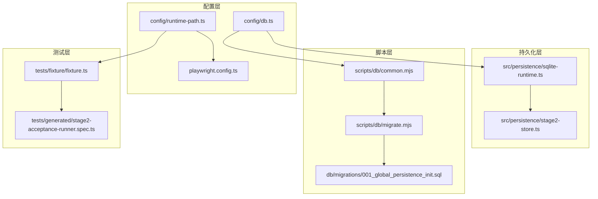
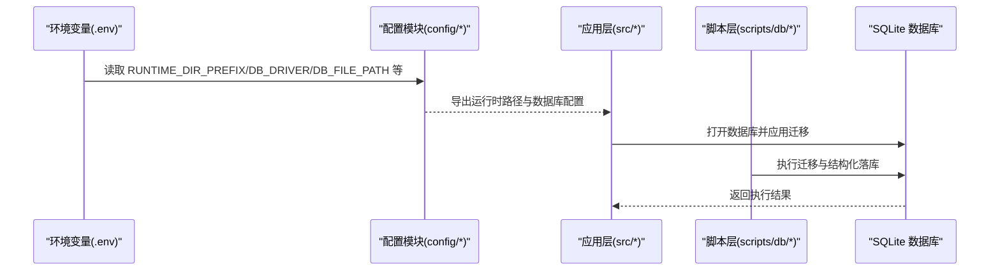
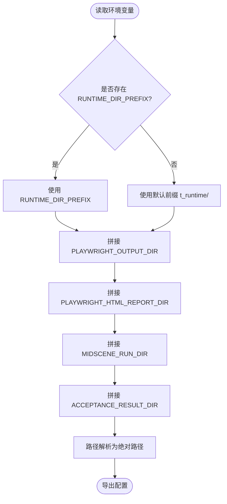
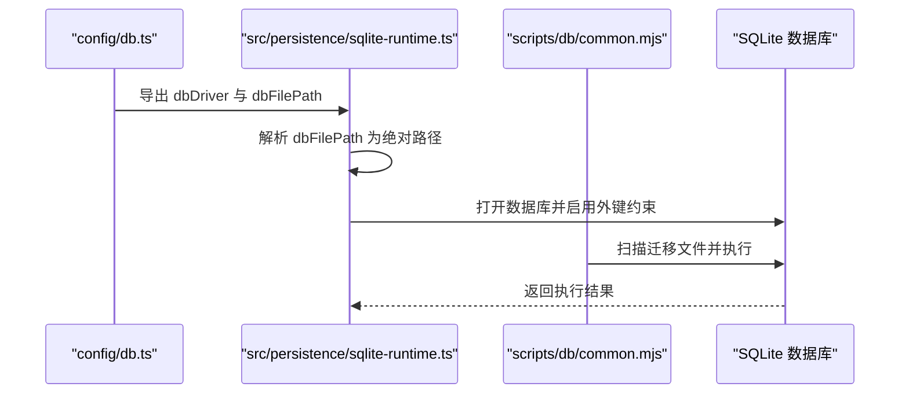
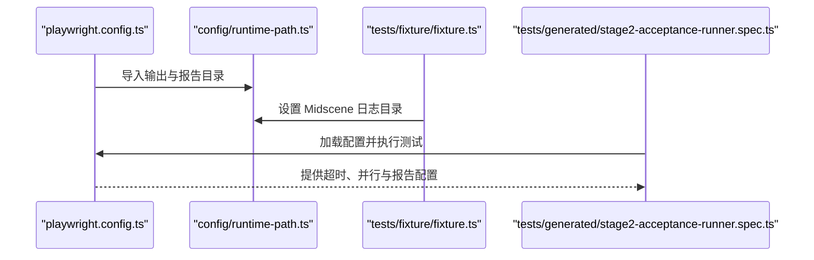
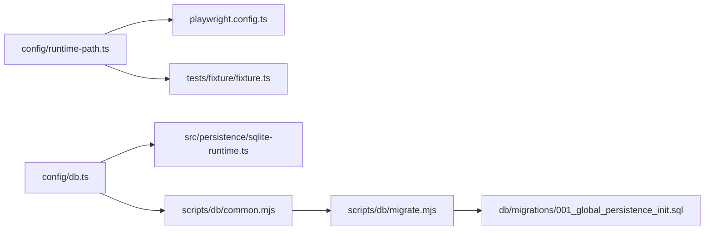

# 配置管理系统

<cite>
**本文档引用的文件**
- [config/runtime-path.ts](file://config/runtime-path.ts)
- [config/db.ts](file://config/db.ts)
- [playwright.config.ts](file://playwright.config.ts)
- [package.json](file://package.json)
- [README.md](file://README.md)
- [src/persistence/sqlite-runtime.ts](file://src/persistence/sqlite-runtime.ts)
- [src/persistence/stage2-store.ts](file://src/persistence/stage2-store.ts)
- [scripts/db/common.mjs](file://scripts/db/common.mjs)
- [scripts/db/migrate.mjs](file://scripts/db/migrate.mjs)
- [db/migrations/001_global_persistence_init.sql](file://db/migrations/001_global_persistence_init.sql)
- [src/stage2/types.ts](file://src/stage2/types.ts)
- [tests/generated/stage2-acceptance-runner.spec.ts](file://tests/generated/stage2-acceptance-runner.spec.ts)
- [tests/fixture/fixture.ts](file://tests/fixture/fixture.ts)
</cite>

## 目录
1. [简介](#简介)
2. [项目结构](#项目结构)
3. [核心组件](#核心组件)
4. [架构总览](#架构总览)
5. [详细组件分析](#详细组件分析)
6. [依赖关系分析](#依赖关系分析)
7. [性能考量](#性能考量)
8. [故障排查指南](#故障排查指南)
9. [结论](#结论)
10. [附录](#附录)

## 简介
本项目是一个基于 Playwright 与 Midscene.js 的 AI 自动化测试系统，围绕“统一运行时路径配置”“数据库配置与连接管理”“Playwright 测试配置”三大主题构建了完整的配置管理体系。通过环境变量与集中式配置模块，实现了输出目录、日志路径、资源路径的统一管理；通过 SQLite 驱动与迁移脚本，提供了本地数据库的初始化与演进能力；通过 Playwright 配置，统一了测试超时、并行度、报告输出等关键参数。

## 项目结构
项目采用按功能域划分的组织方式：
- config：集中式配置模块，包含运行时路径与数据库配置
- src：核心业务逻辑，包含持久化层与第二阶段执行器
- scripts/db：数据库迁移与初始化脚本
- tests：测试用例与夹具
- db/migrations：数据库迁移 SQL 文件
- 根目录：Playwright 配置、包管理与说明文档

图表来源
- [config/runtime-path.ts:1-41](file://config/runtime-path.ts#L1-L41)
- [config/db.ts:1-28](file://config/db.ts#L1-L28)
- [playwright.config.ts:1-95](file://playwright.config.ts#L1-L95)
- [src/persistence/sqlite-runtime.ts:1-116](file://src/persistence/sqlite-runtime.ts#L1-L116)
- [src/persistence/stage2-store.ts:1-655](file://src/persistence/stage2-store.ts#L1-L655)
- [scripts/db/common.mjs:1-108](file://scripts/db/common.mjs#L1-L108)
- [scripts/db/migrate.mjs:1-52](file://scripts/db/migrate.mjs#L1-L52)
- [db/migrations/001_global_persistence_init.sql:1-128](file://db/migrations/001_global_persistence_init.sql#L1-L128)
- [tests/fixture/fixture.ts:1-100](file://tests/fixture/fixture.ts#L1-L100)
- [tests/generated/stage2-acceptance-runner.spec.ts:1-39](file://tests/generated/stage2-acceptance-runner.spec.ts#L1-L39)

章节来源
- [README.md:1-223](file://README.md#L1-L223)

## 核心组件
- 运行时路径配置模块：统一管理输出目录、日志路径与资源路径，支持环境变量覆盖与默认值回退
- 数据库配置模块：集中定义 SQLite 驱动与数据库文件路径，提供路径解析与校验
- Playwright 配置：集中定义测试超时、并行度、报告输出与浏览器设备配置
- 数据库迁移与持久化：提供 SQLite 数据库初始化、迁移执行与结构化落库
- 测试夹具与入口：统一 Midscene 日志目录设置与测试生命周期管理

章节来源
- [config/runtime-path.ts:1-41](file://config/runtime-path.ts#L1-L41)
- [config/db.ts:1-28](file://config/db.ts#L1-L28)
- [playwright.config.ts:1-95](file://playwright.config.ts#L1-L95)
- [src/persistence/sqlite-runtime.ts:1-116](file://src/persistence/sqlite-runtime.ts#L1-L116)
- [src/persistence/stage2-store.ts:1-655](file://src/persistence/stage2-store.ts#L1-L655)
- [scripts/db/common.mjs:1-108](file://scripts/db/common.mjs#L1-L108)
- [scripts/db/migrate.mjs:1-52](file://scripts/db/migrate.mjs#L1-L52)
- [tests/fixture/fixture.ts:1-100](file://tests/fixture/fixture.ts#L1-L100)
- [tests/generated/stage2-acceptance-runner.spec.ts:1-39](file://tests/generated/stage2-acceptance-runner.spec.ts#L1-L39)

## 架构总览
配置管理贯穿“配置层 → 应用层 → 脚本层”的多层级调用链，形成统一的环境变量读取、默认值回退与路径解析机制。

图表来源
- [config/runtime-path.ts:1-41](file://config/runtime-path.ts#L1-L41)
- [config/db.ts:1-28](file://config/db.ts#L1-L28)
- [src/persistence/sqlite-runtime.ts:1-116](file://src/persistence/sqlite-runtime.ts#L1-L116)
- [scripts/db/common.mjs:1-108](file://scripts/db/common.mjs#L1-L108)
- [scripts/db/migrate.mjs:1-52](file://scripts/db/migrate.mjs#L1-L52)

## 详细组件分析

### 运行时路径配置管理
- 统一前缀与相对路径：通过统一的运行时目录前缀，将测试产物、报告与中间结果收敛至单一目录树
- 环境变量覆盖：支持通过环境变量覆盖默认路径，便于不同环境下的灵活部署
- 路径解析：提供绝对路径解析函数，确保跨平台路径一致性
- Playwright 输出与 Midscene 日志：分别配置 Playwright 的测试结果目录与 HTML 报告目录，以及 Midscene 的运行日志与缓存目录

图表来源
- [config/runtime-path.ts:8-40](file://config/runtime-path.ts#L8-L40)

章节来源
- [config/runtime-path.ts:1-41](file://config/runtime-path.ts#L1-L41)
- [README.md:76-96](file://README.md#L76-L96)

### 数据库配置与连接管理
- 驱动与文件路径：集中定义 SQLite 驱动与数据库文件路径，支持环境变量覆盖
- 路径解析与目录创建：在打开数据库前确保目录存在，并解析为绝对路径
- 迁移机制：提供迁移表、迁移文件扫描、校验与记录，保证数据库结构演进的幂等性
- 错误处理：在非 SQLite 场景下抛出明确错误，避免不支持的驱动导致的隐性失败

图表来源
- [config/db.ts:15-26](file://config/db.ts#L15-L26)
- [src/persistence/sqlite-runtime.ts:73-84](file://src/persistence/sqlite-runtime.ts#L73-L84)
- [scripts/db/common.mjs:31-58](file://scripts/db/common.mjs#L31-L58)

章节来源
- [config/db.ts:1-28](file://config/db.ts#L1-L28)
- [src/persistence/sqlite-runtime.ts:1-116](file://src/persistence/sqlite-runtime.ts#L1-L116)
- [scripts/db/common.mjs:1-108](file://scripts/db/common.mjs#L1-L108)
- [scripts/db/migrate.mjs:1-52](file://scripts/db/migrate.mjs#L1-L52)
- [db/migrations/001_global_persistence_init.sql:1-128](file://db/migrations/001_global_persistence_init.sql#L1-L128)

### Playwright 配置
- 测试目录与输出：统一测试目录与输出目录，确保产物集中管理
- 超时与并行：定义测试超时、并行策略与重试策略，适配 CI/本地差异
- 报告器：配置多种报告器，包括列表、HTML 报告与自定义 Midscene 报告
- 设备与追踪：预置浏览器设备配置与首次重试时的追踪策略
- 夹具集成：在夹具中设置 Midscene 日志目录，确保日志与报告一致收敛

图表来源
- [playwright.config.ts:22-48](file://playwright.config.ts#L22-L48)
- [config/runtime-path.ts:18-36](file://config/runtime-path.ts#L18-L36)
- [tests/fixture/fixture.ts:10](file://tests/fixture/fixture.ts#L10)
- [tests/generated/stage2-acceptance-runner.spec.ts:10](file://tests/generated/stage2-acceptance-runner.spec.ts#L10)

章节来源
- [playwright.config.ts:1-95](file://playwright.config.ts#L1-L95)
- [tests/fixture/fixture.ts:1-100](file://tests/fixture/fixture.ts#L1-L100)
- [tests/generated/stage2-acceptance-runner.spec.ts:1-39](file://tests/generated/stage2-acceptance-runner.spec.ts#L1-L39)

### 配置验证与错误处理机制
- 环境变量读取：统一的读取函数在缺失时返回默认值，避免空值传播
- 驱动校验：在数据库与迁移脚本中显式校验驱动类型，防止不支持的驱动被使用
- 路径解析：在关键路径上进行解析与目录创建，降低路径错误导致的运行时异常
- 异常捕获：持久化写库服务对每个写入动作进行 try/catch 包裹，记录失败原因但不影响整体流程

章节来源
- [config/runtime-path.ts:8-16](file://config/runtime-path.ts#L8-L16)
- [config/db.ts:10-13](file://config/db.ts#L10-L13)
- [src/persistence/sqlite-runtime.ts:74-76](file://src/persistence/sqlite-runtime.ts#L74-L76)
- [src/persistence/stage2-store.ts:125-133](file://src/persistence/stage2-store.ts#L125-L133)

### 配置优先级与命名规范
- 优先级：环境变量 > 默认值
- 命名规范：统一使用大写变量名，路径类变量以目录结尾并以斜杠分隔
- 组织结构：将运行时路径、数据库配置与 Playwright 配置分别置于独立模块，便于维护与复用

章节来源
- [README.md:39-54](file://README.md#L39-L54)
- [config/runtime-path.ts:6-16](file://config/runtime-path.ts#L6-L16)
- [config/db.ts:7-22](file://config/db.ts#L7-L22)

### 最佳实践与安全考虑
- 最小暴露原则：敏感信息（如密码）在落库时进行掩码处理，避免明文存储
- 路径安全：统一使用绝对路径解析，避免相对路径导致的跨平台问题
- 迁移幂等：通过迁移表与校验逻辑，确保重复执行不会产生副作用
- 报告与日志：统一收敛到运行时目录，便于 CI/CD 与审计

章节来源
- [src/persistence/stage2-store.ts:37-48](file://src/persistence/stage2-store.ts#L37-L48)
- [src/persistence/sqlite-runtime.ts:32-41](file://src/persistence/sqlite-runtime.ts#L32-L41)
- [scripts/db/common.mjs:60-69](file://scripts/db/common.mjs#L60-L69)

## 依赖关系分析
配置模块之间存在清晰的依赖关系：运行时路径配置被 Playwright 配置与夹具使用；数据库配置被持久化层与迁移脚本使用；迁移脚本依赖配置模块提供的运行时选项。

图表来源
- [config/runtime-path.ts:1-41](file://config/runtime-path.ts#L1-L41)
- [config/db.ts:1-28](file://config/db.ts#L1-L28)
- [playwright.config.ts:1-95](file://playwright.config.ts#L1-L95)
- [src/persistence/sqlite-runtime.ts:1-116](file://src/persistence/sqlite-runtime.ts#L1-L116)
- [scripts/db/common.mjs:1-108](file://scripts/db/common.mjs#L1-L108)
- [scripts/db/migrate.mjs:1-52](file://scripts/db/migrate.mjs#L1-L52)
- [db/migrations/001_global_persistence_init.sql:1-128](file://db/migrations/001_global_persistence_init.sql#L1-L128)

章节来源
- [package.json:6-11](file://package.json#L6-L11)

## 性能考量
- 并行与超时：合理设置并行度与超时，避免资源争用与长时间阻塞
- 迁移批处理：批量执行迁移并在事务中提交，减少 I/O 开销
- 路径解析：在启动阶段完成路径解析与目录创建，避免运行时重复计算

## 故障排查指南
- 环境变量未生效：确认 .env 文件路径与加载顺序，检查变量名大小写与前后空格
- 数据库驱动不匹配：确保 DB_DRIVER 为 sqlite，否则迁移脚本与持久化层会抛出错误
- 路径权限问题：检查运行时目录的写权限，确保迁移脚本能创建数据库文件
- 报告路径异常：确认 PLAYWRIGHT_OUTPUT_DIR 与 PLAYWRIGHT_HTML_REPORT_DIR 的相对路径解析结果

章节来源
- [config/runtime-path.ts:8-16](file://config/runtime-path.ts#L8-L16)
- [config/db.ts:20](file://config/db.ts#L20)
- [src/persistence/sqlite-runtime.ts:77-78](file://src/persistence/sqlite-runtime.ts#L77-L78)
- [playwright.config.ts:36-40](file://playwright.config.ts#L36-L40)

## 结论
本配置管理系统通过集中式配置模块与严格的环境变量处理机制，实现了运行时路径、数据库与 Playwright 的统一管理。配合完善的迁移与错误处理机制，确保了在不同环境与 CI/CD 场景下的稳定性与可维护性。建议在团队内推广统一的变量命名规范与目录结构，持续完善配置文档与自动化校验。

## 附录
- 变量清单与默认值：见 README 中的 .env 示例与各配置模块的默认值定义
- 运行产物目录：见 README 中的“运行产物目录”与“默认生成结果”
- 数据库表结构：见 db/migrations/001_global_persistence_init.sql

章节来源
- [README.md:39-54](file://README.md#L39-L54)
- [README.md:76-96](file://README.md#L76-L96)
- [db/migrations/001_global_persistence_init.sql:1-128](file://db/migrations/001_global_persistence_init.sql#L1-L128)