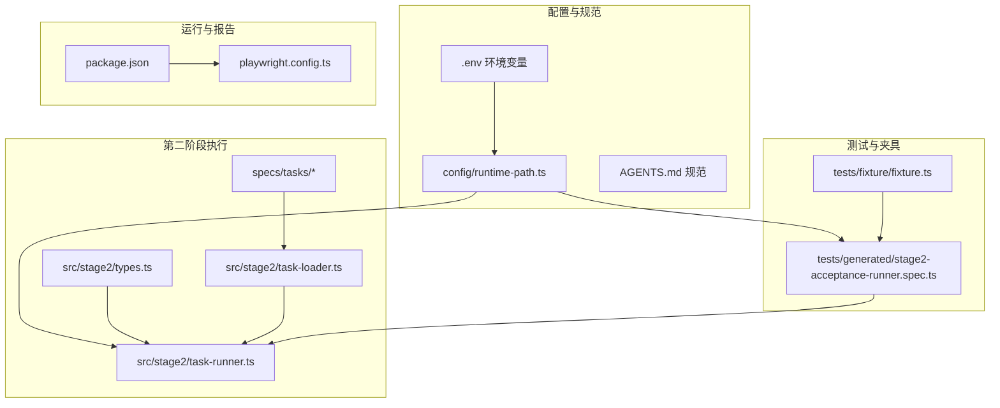
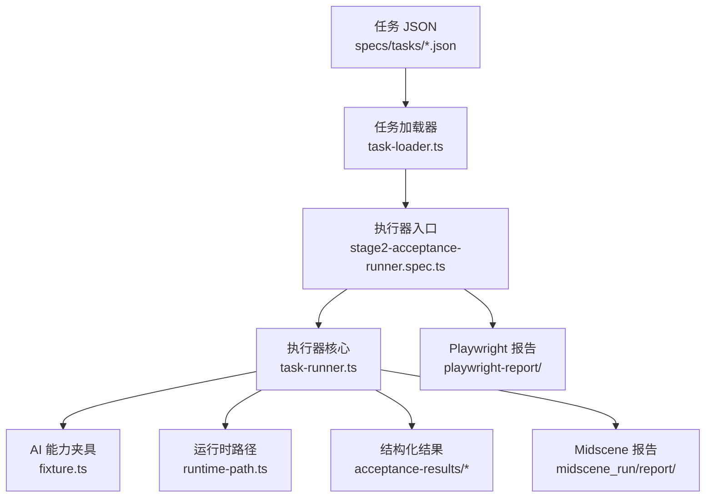
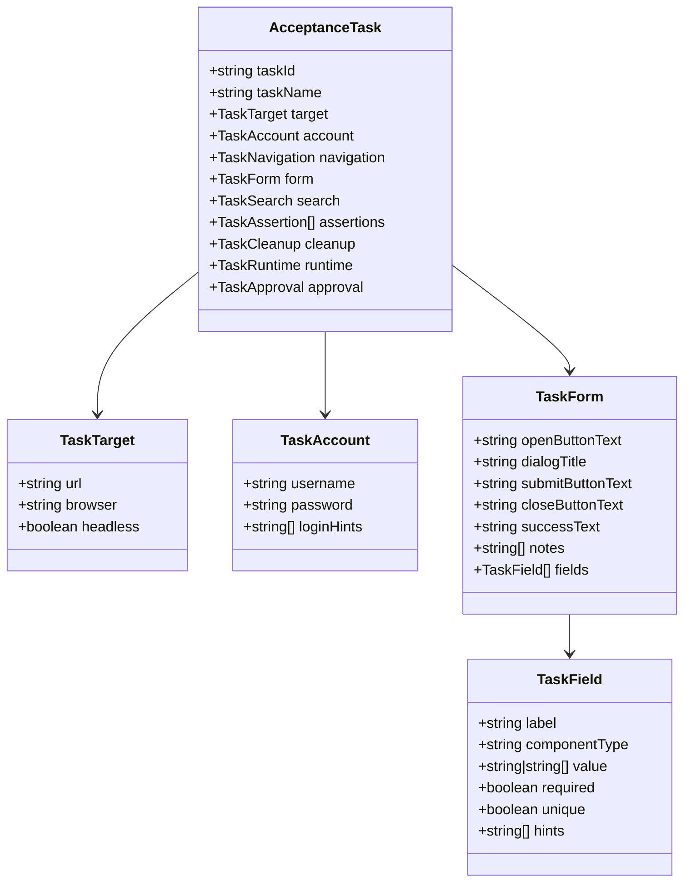
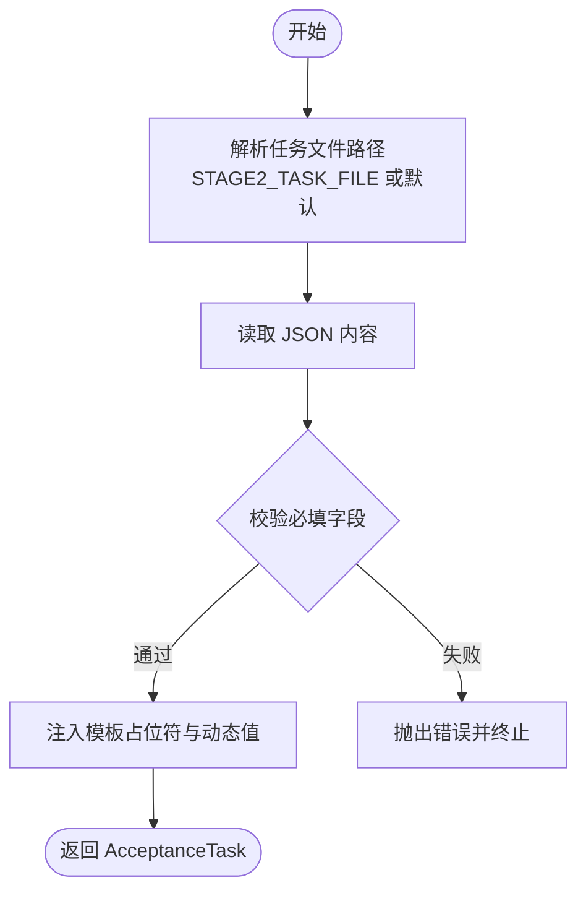
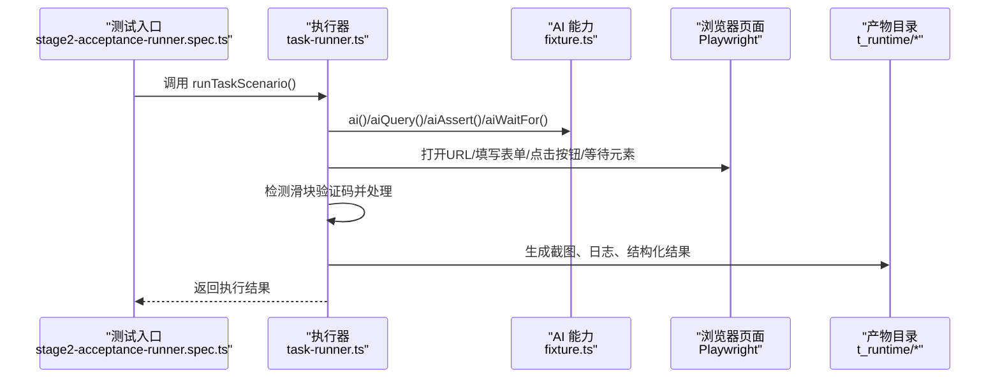
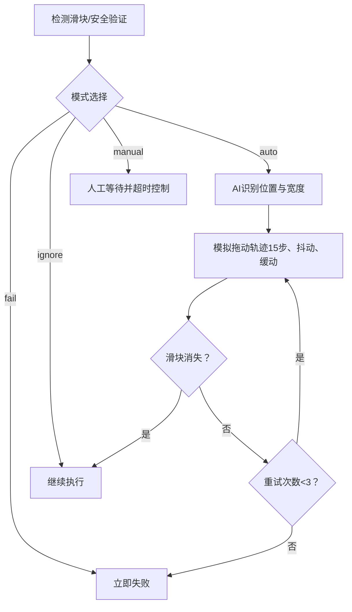
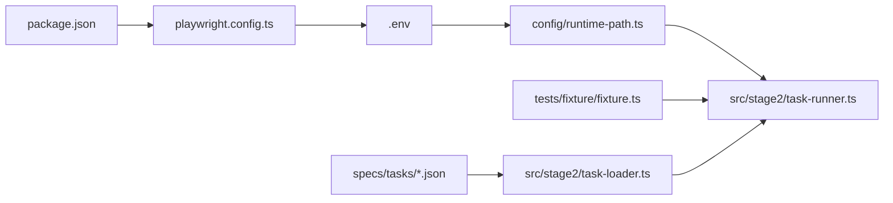

# 项目概述

<cite>
**本文引用的文件**
- [README.md](file://README.md)
- [package.json](file://package.json)
- [playwright.config.ts](file://playwright.config.ts)
- [AGENTS.md](file://AGENTS.md)
- [config/runtime-path.ts](file://config/runtime-path.ts)
- [src/stage2/types.ts](file://src/stage2/types.ts)
- [src/stage2/task-runner.ts](file://src/stage2/task-runner.ts)
- [src/stage2/task-loader.ts](file://src/stage2/task-loader.ts)
- [tests/generated/stage2-acceptance-runner.spec.ts](file://tests/generated/stage2-acceptance-runner.spec.ts)
- [tests/fixture/fixture.ts](file://tests/fixture/fixture.ts)
- [specs/tasks/acceptance-task.template.json](file://specs/tasks/acceptance-task.template.json)
- [.tasks/AI自主代理验收系统开发改造方案_2026-03-11.md](file://.tasks/AI自主代理验收系统开发改造方案_2026-03-11.md)
- [.plans/stage2登录安全验证人工兜底方案_2026-03-12.md](file://.plans/stage2登录安全验证人工兜底方案_2026-03-12.md)
</cite>

## 目录
1. [引言](#引言)
2. [项目结构](#项目结构)
3. [核心组件](#核心组件)
4. [架构总览](#架构总览)
5. [详细组件分析](#详细组件分析)
6. [依赖关系分析](#依赖关系分析)
7. [性能考量](#性能考量)
8. [故障排查指南](#故障排查指南)
9. [结论](#结论)
10. [附录](#附录)

## 引言
本项目是一个基于 Playwright 与 Midscene.js 的 AI 自动化测试项目，旨在通过 AI 辅助的页面元素识别与传统浏览器自动化测试相结合，构建一个“任务驱动”的验收测试框架。项目采用“同仓双阶段”开发模式：第一阶段以自然语言探索页面、提取流程并生成任务 JSON；第二阶段以任务 JSON 驱动 Midscene + Playwright 执行，输出结构化结果与可复盘报告。项目还实现了 AI 自主代理验收系统的初步落地，并提供了滑块验证码的自动处理与人工兜底能力，显著提升了自动化测试的稳定性与可维护性。

## 项目结构
项目采用“同仓双阶段”组织方式，核心目录与文件如下：
- config：集中管理运行期目录与路径解析
- specs：任务输入模板与示例
- src/stage2：第二阶段执行器与类型定义
- tests：Playwright 测试与 Midscene 夹具
- 根目录配置：README、package.json、playwright.config.ts、.env 示例等

图表来源
- [config/runtime-path.ts](file://config/runtime-path.ts#L1-L41)
- [src/stage2/task-runner.ts](file://src/stage2/task-runner.ts#L1-L120)
- [src/stage2/task-loader.ts](file://src/stage2/task-loader.ts#L1-L91)
- [src/stage2/types.ts](file://src/stage2/types.ts#L1-L125)
- [specs/tasks/acceptance-task.template.json](file://specs/tasks/acceptance-task.template.json#L1-L85)
- [tests/generated/stage2-acceptance-runner.spec.ts](file://tests/generated/stage2-acceptance-runner.spec.ts#L1-L39)
- [tests/fixture/fixture.ts](file://tests/fixture/fixture.ts#L1-L100)
- [playwright.config.ts](file://playwright.config.ts#L1-L95)
- [package.json](file://package.json#L1-L24)

章节来源
- [README.md](file://README.md#L1-L144)
- [AGENTS.md](file://AGENTS.md#L1-L61)

## 核心组件
- 运行时路径解析：集中管理 t_runtime/ 下的产物目录，统一收敛运行产物，便于 CI 与本地复盘。
- 任务加载器：从环境变量或默认路径解析任务 JSON，支持模板占位符与动态时间戳注入。
- 任务执行器：以 Midscene AI 能力与 Playwright 浏览器控制为核心，实现登录、菜单导航、弹窗表单、列表查询与断言等步骤的可复用封装。
- 测试夹具：为 Playwright 注入 ai、aiQuery、aiAssert、aiWaitFor 等 AI 能力，统一缓存与报告生成。
- 配置与报告：Playwright HTML 报告与 Midscene 报告并行输出，配合结构化结果文件，满足可追溯性需求。

章节来源
- [config/runtime-path.ts](file://config/runtime-path.ts#L1-L41)
- [src/stage2/task-loader.ts](file://src/stage2/task-loader.ts#L1-L91)
- [src/stage2/task-runner.ts](file://src/stage2/task-runner.ts#L1-L120)
- [tests/fixture/fixture.ts](file://tests/fixture/fixture.ts#L1-L100)
- [playwright.config.ts](file://playwright.config.ts#L1-L95)

## 架构总览
项目采用“任务驱动 + AI 辅助 + 可复盘报告”的三层架构：
- 输入层：任务 JSON（含目标系统、账号、导航、表单、断言、清理、运行参数等）
- 执行层：Midscene AI 能力 + Playwright 控制，按步骤执行并生成中间产物
- 输出层：Playwright HTML 报告、Midscene 报告、结构化结果文件（result.json、步骤截图）

图表来源
- [specs/tasks/acceptance-task.template.json](file://specs/tasks/acceptance-task.template.json#L1-L85)
- [src/stage2/task-loader.ts](file://src/stage2/task-loader.ts#L1-L91)
- [tests/generated/stage2-acceptance-runner.spec.ts](file://tests/generated/stage2-acceptance-runner.spec.ts#L1-L39)
- [src/stage2/task-runner.ts](file://src/stage2/task-runner.ts#L1-L120)
- [tests/fixture/fixture.ts](file://tests/fixture/fixture.ts#L1-L100)
- [config/runtime-path.ts](file://config/runtime-path.ts#L1-L41)
- [playwright.config.ts](file://playwright.config.ts#L1-L95)

## 详细组件分析

### 任务模型与类型定义
- 任务目标、账号、导航、表单字段、搜索、断言、清理、运行时参数、审批等结构化定义，确保任务输入可读、可校验、可扩展。
- 字段类型覆盖 input、textarea、cascader 等控件，支持多选值与唯一性约束，便于 AI 与 Playwright 稳定定位。

图表来源
- [src/stage2/types.ts](file://src/stage2/types.ts#L1-L125)

章节来源
- [src/stage2/types.ts](file://src/stage2/types.ts#L1-L125)
- [specs/tasks/acceptance-task.template.json](file://specs/tasks/acceptance-task.template.json#L1-L85)

### 任务加载与模板解析
- 从环境变量或默认路径解析任务文件，支持模板占位符（如 ${TEST_USERNAME}、${TEST_PASSWORD}、NOW_YYYYMMDDHHMMSS）解析与注入。
- 校验任务结构完整性，确保必填字段存在，避免无效任务进入执行阶段。

图表来源
- [src/stage2/task-loader.ts](file://src/stage2/task-loader.ts#L1-L91)

章节来源
- [src/stage2/task-loader.ts](file://src/stage2/task-loader.ts#L1-L91)

### 执行器与步骤编排
- 执行器以 Midscene AI 能力与 Playwright 控制为核心，封装登录、菜单导航、弹窗表单、列表查询与断言等步骤。
- 支持滑块验证码自动处理（AI 识别 + Playwright 模拟拖动），并提供人工兜底与失败回退策略。
- 生成结构化执行结果（包含步骤状态、耗时、截图路径、错误堆栈等），并输出到 t_runtime/acceptance-results。

图表来源
- [tests/generated/stage2-acceptance-runner.spec.ts](file://tests/generated/stage2-acceptance-runner.spec.ts#L1-L39)
- [src/stage2/task-runner.ts](file://src/stage2/task-runner.ts#L1-L120)
- [tests/fixture/fixture.ts](file://tests/fixture/fixture.ts#L1-L100)

章节来源
- [src/stage2/task-runner.ts](file://src/stage2/task-runner.ts#L1-L120)
- [tests/generated/stage2-acceptance-runner.spec.ts](file://tests/generated/stage2-acceptance-runner.spec.ts#L1-L39)
- [tests/fixture/fixture.ts](file://tests/fixture/fixture.ts#L1-L100)

### 滑块验证码自动处理流程
- 检测页面是否存在滑块/安全验证（基于常见文案与选择器）。
- AI 查询滑块按钮位置与滑槽宽度，计算目标拖动距离。
- Playwright 模拟真人拖动轨迹（15步、easeOut 缓动、随机抖动），并最多重试 3 次。
- 验证滑块是否消失，若仍存在则根据模式（fail/manual/auto/ignore）进行失败、人工等待或忽略。

图表来源
- [src/stage2/task-runner.ts](file://src/stage2/task-runner.ts#L480-L703)
- [.plans/stage2登录安全验证人工兜底方案_2026-03-12.md](file://.plans/stage2登录安全验证人工兜底方案_2026-03-12.md#L1-L57)

章节来源
- [src/stage2/task-runner.ts](file://src/stage2/task-runner.ts#L480-L703)
- [.plans/stage2登录安全验证人工兜底方案_2026-03-12.md](file://.plans/stage2登录安全验证人工兜底方案_2026-03-12.md#L1-L57)

### 运行产物与报告
- 运行产物统一收敛至 t_runtime/，包括 Playwright 报告、Midscene 报告、结构化结果与步骤截图。
- Playwright 配置启用 HTML 报告与 Midscene 报告插件，便于人工复盘与问题定位。

章节来源
- [README.md](file://README.md#L74-L131)
- [playwright.config.ts](file://playwright.config.ts#L1-L95)
- [config/runtime-path.ts](file://config/runtime-path.ts#L1-L41)

## 依赖关系分析
- package.json 定义了 Playwright 测试与 Midscene Web 插件的依赖，以及运行脚本（stage2:run、stage2:run:headed）。
- playwright.config.ts 通过 dotenv 加载环境变量，配置报告输出目录与项目设备。
- config/runtime-path.ts 从环境变量读取运行目录前缀与各产物目录，统一解析绝对路径。
- tests/fixture/fixture.ts 注入 Midscene AI 能力到 Playwright 测试夹具，设置日志目录与缓存 ID。
- src/stage2/task-runner.ts 依赖夹具提供的 ai/aiQuery/aiAssert/aiWaitFor 能力与运行时路径解析。

图表来源
- [package.json](file://package.json#L1-L24)
- [playwright.config.ts](file://playwright.config.ts#L1-L95)
- [config/runtime-path.ts](file://config/runtime-path.ts#L1-L41)
- [src/stage2/task-runner.ts](file://src/stage2/task-runner.ts#L1-L120)
- [src/stage2/task-loader.ts](file://src/stage2/task-loader.ts#L1-L91)
- [specs/tasks/acceptance-task.template.json](file://specs/tasks/acceptance-task.template.json#L1-L85)
- [tests/fixture/fixture.ts](file://tests/fixture/fixture.ts#L1-L100)

章节来源
- [package.json](file://package.json#L1-L24)
- [playwright.config.ts](file://playwright.config.ts#L1-L95)
- [config/runtime-path.ts](file://config/runtime-path.ts#L1-L41)
- [src/stage2/task-runner.ts](file://src/stage2/task-runner.ts#L1-L120)
- [src/stage2/task-loader.ts](file://src/stage2/task-loader.ts#L1-L91)
- [specs/tasks/acceptance-task.template.json](file://specs/tasks/acceptance-task.template.json#L1-L85)
- [tests/fixture/fixture.ts](file://tests/fixture/fixture.ts#L1-L100)

## 性能考量
- 并行与重试：Playwright 配置启用完全并行与 CI 环境下的重试策略，提升执行效率与稳定性。
- 超时与等待：执行器与配置提供步骤超时、页面超时与显式等待策略，减少因页面异步加载导致的失败。
- 缓存与报告：Midscene 提供缓存能力与报告生成，降低重复计算与提升可复盘性。
- 产物收敛：统一运行产物目录，便于磁盘空间管理与 CI 产物归档。

章节来源
- [playwright.config.ts](file://playwright.config.ts#L1-L95)
- [tests/fixture/fixture.ts](file://tests/fixture/fixture.ts#L1-L100)
- [config/runtime-path.ts](file://config/runtime-path.ts#L1-L41)

## 故障排查指南
- 环境变量与路径
  - 确认 .env 中 RUNTIME_DIR_PREFIX、PLAYWRIGHT_OUTPUT_DIR、PLAYWRIGHT_HTML_REPORT_DIR、MIDSCENE_RUN_DIR、ACCEPTANCE_RESULT_DIR 等变量正确。
  - 若路径解析异常，检查 config/runtime-path.ts 的 resolveRuntimePath 逻辑与工作目录。
- 任务文件与模板
  - 确认任务 JSON 的必填字段（taskId、taskName、target.url、account.username/password、form.openButtonText、form.submitButtonText、form.fields）完整。
  - 检查模板占位符（如 ${TEST_USERNAME}）是否在 .env 或 CI 中正确注入。
- 滑块验证码
  - 若自动处理失败，检查 STAGE2_CAPTCHA_MODE 与 STAGE2_CAPTCHA_WAIT_TIMEOUT_MS 设置。
  - 可切换为 manual 模式人工处理，或调整检测选择器与 AI 查询提示词。
- 执行失败定位
  - 查看 tests/generated/stage2-acceptance-runner.spec.ts 的失败步骤详情与截图路径。
  - 检查 t_runtime/acceptance-results/<taskId>/<timestamp>/result.json 与 screenshots/ 目录。

章节来源
- [README.md](file://README.md#L31-L131)
- [config/runtime-path.ts](file://config/runtime-path.ts#L1-L41)
- [src/stage2/task-loader.ts](file://src/stage2/task-loader.ts#L50-L89)
- [src/stage2/task-runner.ts](file://src/stage2/task-runner.ts#L480-L703)
- [tests/generated/stage2-acceptance-runner.spec.ts](file://tests/generated/stage2-acceptance-runner.spec.ts#L27-L36)

## 结论
本项目通过“同仓双阶段”模式，将自然语言探索与任务驱动执行有机结合，借助 Midscene 的 AI 能力与 Playwright 的稳定控制，构建了可复用、可追溯、可扩展的验收测试框架。第二阶段的最小执行器已稳定落地，支持滑块验证码的自动处理与人工兜底，运行产物统一收敛，便于 CI 与本地复盘。未来可在现有基础上进一步完善第一阶段的探索建模能力、断言硬化与补偿清理机制，并为后续前端页面与任务调度预留标准接口。

## 附录
- 项目状态与里程碑：当前已完成运行目录规范统一、Midscene + Playwright 基础样例、AI 自主代理验收系统改造方案、任务输入 JSON 模板、第二段最小执行器、目录结构整理与登录滑块验证码自动处理等。
- 规范与约定：统一使用中文交流、作者标注、优先复用现有实现、配置通过 .env 管理、运行产物目录统一以 t_ 开头等。

章节来源
- [README.md](file://README.md#L133-L144)
- [AGENTS.md](file://AGENTS.md#L1-L61)
- [.tasks/AI自主代理验收系统开发改造方案_2026-03-11.md](file://.tasks/AI自主代理验收系统开发改造方案_2026-03-11.md#L434-L463)