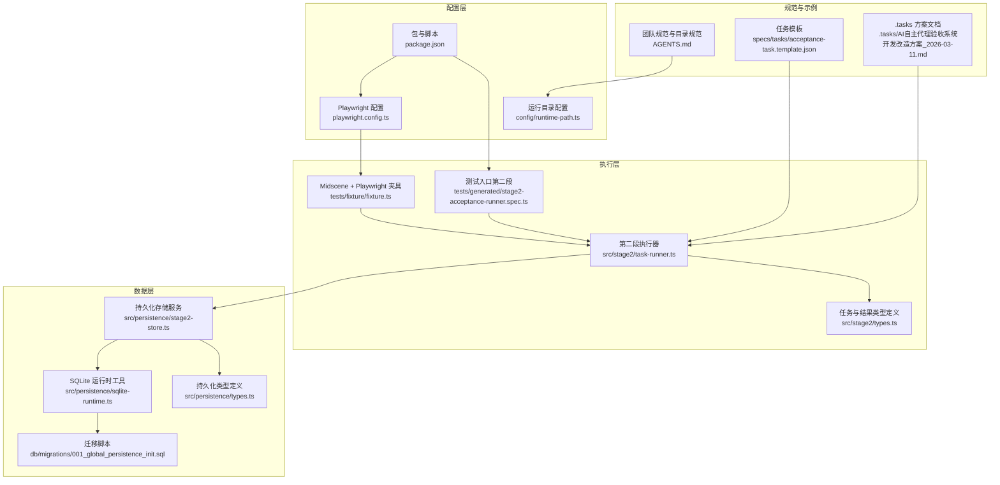
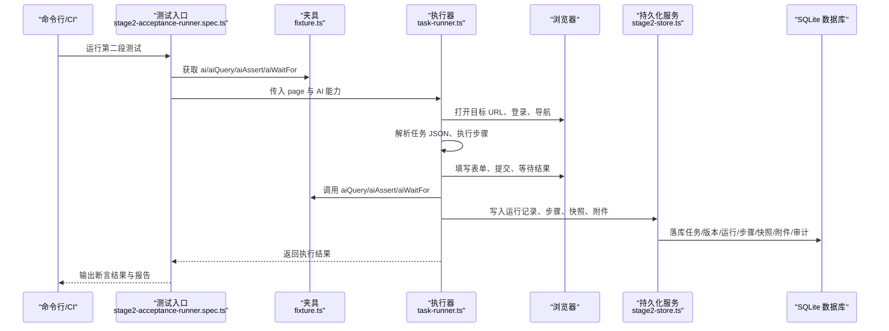
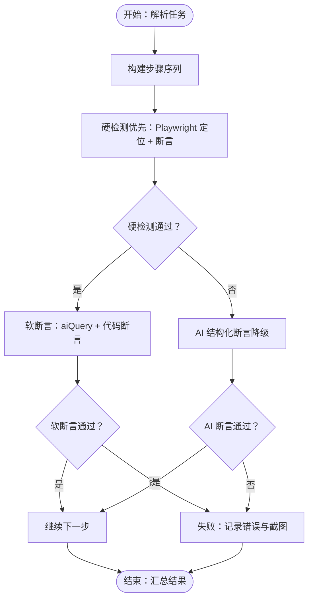
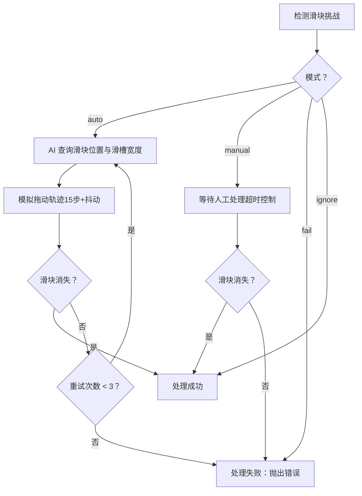
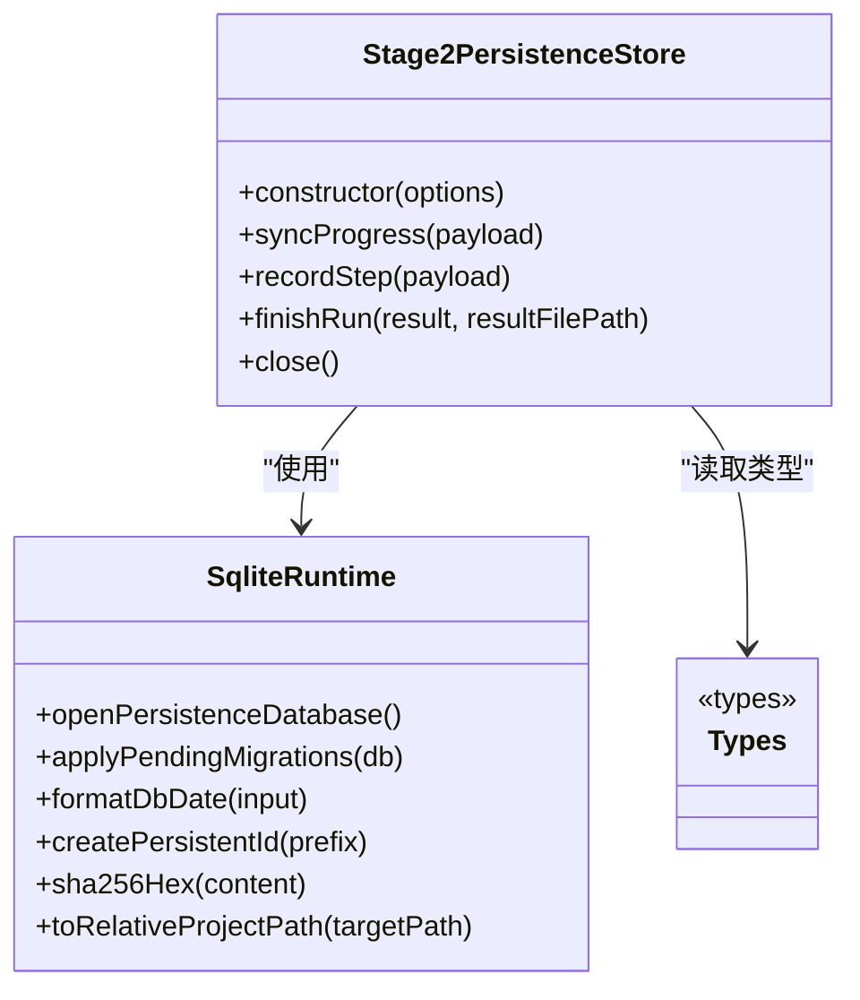
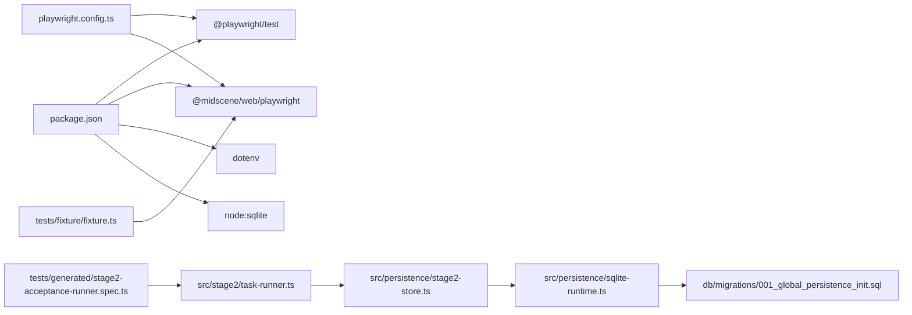

# 项目概述

<cite>
**本文档引用的文件**
- [README.md](file://README.md)
- [package.json](file://package.json)
- [playwright.config.ts](file://playwright.config.ts)
- [AGENTS.md](file://AGENTS.md)
- [src/stage2/types.ts](file://src/stage2/types.ts)
- [src/persistence/types.ts](file://src/persistence/types.ts)
- [src/persistence/sqlite-runtime.ts](file://src/persistence/sqlite-runtime.ts)
- [src/persistence/stage2-store.ts](file://src/persistence/stage2-store.ts)
- [src/stage2/task-runner.ts](file://src/stage2/task-runner.ts)
- [specs/tasks/acceptance-task.template.json](file://specs/tasks/acceptance-task.template.json)
- [config/runtime-path.ts](file://config/runtime-path.ts)
- [.tasks/AI自主代理验收系统开发改造方案_2026-03-11.md](file://.tasks/AI自主代理验收系统开发改造方案_2026-03-11.md)
- [db/migrations/001_global_persistence_init.sql](file://db/migrations/001_global_persistence_init.sql)
- [tests/generated/stage2-acceptance-runner.spec.ts](file://tests/generated/stage2-acceptance-runner.spec.ts)
- [tests/fixture/fixture.ts](file://tests/fixture/fixture.ts)
</cite>

## 目录
1. [引言](#引言)
2. [项目结构](#项目结构)
3. [核心组件](#核心组件)
4. [架构总览](#架构总览)
5. [详细组件分析](#详细组件分析)
6. [依赖关系分析](#依赖关系分析)
7. [性能考量](#性能考量)
8. [故障排查指南](#故障排查指南)
9. [结论](#结论)
10. [附录](#附录)

## 引言
HI-TEST 是一个基于 Playwright 与 Midscene AI 的智能化验收测试执行引擎。项目旨在通过“任务驱动 + AI 辅助”的方式，将自然语言业务场景转化为可执行的自动化验收流程，覆盖登录、菜单导航、弹窗表单、列表查询与断言等典型企业级 Web 应用验收场景。项目强调：
- 以 JSON 任务驱动的第二段执行器为核心，实现“输入结构化、步骤原子化、断言硬化、结果可沉淀”
- 通过 Midscene 的 AI 能力进行页面元素识别、结构化查询与断言，结合 Playwright 的强检测能力，构建高鲁棒性的验收流水线
- 提供滑块验证码自动处理、跨平台 UI Profile、结构化结果与报告、以及 SQLite 全局数据持久化底座

项目定位为“企业级自动化验收测试基础设施”，既可作为独立执行器使用，也为后续接入前端页面与任务调度系统预留标准接口。

## 项目结构
项目采用“按阶段分层 + 按职责解耦”的组织方式：
- 配置层：运行目录、数据库与环境变量统一管理
- 执行层：第二段任务执行器与 Playwright 测试入口
- 数据层：SQLite 全局持久化与迁移脚本
- 规范层：团队协作与运行产物目录规范
- 示例层：任务模板与示例任务 JSON

**图表来源**
- [config/runtime-path.ts:1-41](file://config/runtime-path.ts#L1-L41)
- [playwright.config.ts:1-95](file://playwright.config.ts#L1-L95)
- [package.json:1-26](file://package.json#L1-L26)
- [tests/fixture/fixture.ts:1-100](file://tests/fixture/fixture.ts#L1-L100)
- [tests/generated/stage2-acceptance-runner.spec.ts:1-39](file://tests/generated/stage2-acceptance-runner.spec.ts#L1-L39)
- [src/stage2/task-runner.ts:1-800](file://src/stage2/task-runner.ts#L1-L800)
- [src/stage2/types.ts:1-180](file://src/stage2/types.ts#L1-L180)
- [src/persistence/stage2-store.ts:1-655](file://src/persistence/stage2-store.ts#L1-L655)
- [src/persistence/sqlite-runtime.ts:1-116](file://src/persistence/sqlite-runtime.ts#L1-L116)
- [db/migrations/001_global_persistence_init.sql:1-128](file://db/migrations/001_global_persistence_init.sql#L1-L128)
- [AGENTS.md:1-61](file://AGENTS.md#L1-L61)
- [.tasks/AI自主代理验收系统开发改造方案_2026-03-11.md:1-463](file://.tasks/AI自主代理验收系统开发改造方案_2026-03-11.md#L1-L463)
- [specs/tasks/acceptance-task.template.json:1-141](file://specs/tasks/acceptance-task.template.json#L1-L141)

**章节来源**
- [README.md:1-223](file://README.md#L1-L223)
- [package.json:1-26](file://package.json#L1-L26)
- [playwright.config.ts:1-95](file://playwright.config.ts#L1-L95)
- [AGENTS.md:1-61](file://AGENTS.md#L1-L61)

## 核心组件
- 任务输入与类型定义
  - 任务 JSON 结构：目标系统、账户、导航、表单、搜索、断言、清理、运行参数等
  - 类型定义：AcceptanceTask、TaskAssertion、TaskCleanup、TaskRuntime 等
- Midscene + Playwright 夹具
  - 注入 ai、aiQuery、aiAssert、aiWaitFor 等 AI 能力，并统一缓存与报告目录
- 第二段执行器
  - 读取任务 JSON，按步骤执行登录、导航、弹窗表单、提交、搜索与断言
  - 集成滑块验证码自动处理（AI 识别 + Playwright 模拟拖动轨迹）
- 数据持久化
  - SQLite 本地数据库，统一迁移与写库服务，落库任务、版本、运行、步骤、快照与附件
- 运行产物与报告
  - Playwright HTML 报告、Midscene 报告、截图、结构化结果与审计日志

**章节来源**
- [src/stage2/types.ts:141-180](file://src/stage2/types.ts#L141-L180)
- [tests/fixture/fixture.ts:1-100](file://tests/fixture/fixture.ts#L1-L100)
- [src/stage2/task-runner.ts:1-800](file://src/stage2/task-runner.ts#L1-L800)
- [src/persistence/stage2-store.ts:1-655](file://src/persistence/stage2-store.ts#L1-L655)
- [README.md:132-190](file://README.md#L132-L190)

## 架构总览
整体架构围绕“任务 JSON 驱动 + Midscene + Playwright 执行 + SQLite 持久化”的闭环展开。执行链路从测试入口开始，经由夹具注入 AI 能力，交由执行器解析任务并驱动浏览器操作，期间通过 AI 进行结构化查询与断言，最终将结构化结果与报告写入数据库与文件系统。

**图表来源**
- [tests/generated/stage2-acceptance-runner.spec.ts:1-39](file://tests/generated/stage2-acceptance-runner.spec.ts#L1-L39)
- [tests/fixture/fixture.ts:1-100](file://tests/fixture/fixture.ts#L1-L100)
- [src/stage2/task-runner.ts:1-800](file://src/stage2/task-runner.ts#L1-L800)
- [src/persistence/stage2-store.ts:1-655](file://src/persistence/stage2-store.ts#L1-L655)

## 详细组件分析

### 任务模型与断言策略
- 任务模型
  - 目标系统、账户、导航、表单、搜索、断言、清理、运行参数等字段构成完整的验收任务
  - UI Profile 支持跨平台选择器优先级，提高断言与定位的稳定性
- 断言策略
  - 推荐优先使用 Playwright 硬检测（如 getByRole/getByLabel/getByTestId + 自动重试）
  - 复杂语义场景使用 aiQuery + 代码断言，降低 aiAssert 幻觉风险
  - 表格断言优先尝试 Playwright 表格列值提取，失败再降级到 AI 结构化断言
  - 最终验收建议以 table-row-exists 作为硬门槛；table-cell-* 仅校验少量关键列，且建议 soft=true

**图表来源**
- [README.md:146-152](file://README.md#L146-L152)
- [src/stage2/types.ts:67-88](file://src/stage2/types.ts#L67-L88)

**章节来源**
- [src/stage2/types.ts:1-180](file://src/stage2/types.ts#L1-L180)
- [README.md:146-152](file://README.md#L146-L152)

### 滑块验证码自动处理
- 检测策略
  - 文本关键词与选择器模式检测滑块挑战
- 自动处理
  - AI 查询滑块位置与滑槽宽度
  - Playwright 模拟真人拖动轨迹（15步渐进、easeOut 缓动、随机抖动）
  - 最多重试 3 次，验证滑块消失
- 模式控制
  - auto：自动处理（默认）
  - manual：人工处理，支持超时等待
  - fail：检测到即失败
  - ignore：忽略检测（不建议）

**图表来源**
- [src/stage2/task-runner.ts:483-706](file://src/stage2/task-runner.ts#L483-L706)
- [README.md:64-74](file://README.md#L64-L74)

**章节来源**
- [src/stage2/task-runner.ts:1-800](file://src/stage2/task-runner.ts#L1-L800)
- [README.md:56-74](file://README.md#L56-L74)

### 数据持久化底座
- 存储对象
  - ai_task、ai_task_version、ai_run、ai_run_step、ai_snapshot、ai_artifact、ai_audit_log
- 写库流程
  - 初始化与迁移：打开数据库、确保迁移表、按序执行 SQL 迁移
  - 任务与版本：去重、哈希校验、相对路径记录
  - 运行与步骤：运行记录、步骤记录、截图附件、快照与审计日志
- 兼容性
  - 基于 Node sqlite 的本地实现，表结构兼容 MySQL 子集，后续可平滑迁移

**图表来源**
- [src/persistence/stage2-store.ts:1-655](file://src/persistence/stage2-store.ts#L1-L655)
- [src/persistence/sqlite-runtime.ts:1-116](file://src/persistence/sqlite-runtime.ts#L1-L116)
- [src/persistence/types.ts:1-125](file://src/persistence/types.ts#L1-L125)

**章节来源**
- [src/persistence/stage2-store.ts:1-655](file://src/persistence/stage2-store.ts#L1-L655)
- [src/persistence/sqlite-runtime.ts:1-116](file://src/persistence/sqlite-runtime.ts#L1-L116)
- [db/migrations/001_global_persistence_init.sql:1-128](file://db/migrations/001_global_persistence_init.sql#L1-L128)

### 运行产物与报告
- 产物目录
  - Playwright 输出目录、HTML 报告目录、Midscene 运行目录、验收结果目录、数据库文件
- 报告与结果
  - Playwright HTML 报告、Midscene 报告、每步截图、结构化结果文件、审计日志
- 统一收敛
  - 通过 .env 与 runtime-path.ts 统一管理，避免硬编码路径

**章节来源**
- [README.md:76-96](file://README.md#L76-L96)
- [config/runtime-path.ts:1-41](file://config/runtime-path.ts#L1-L41)

## 依赖关系分析
- 运行时依赖
  - Playwright 测试框架与项目配置
  - Midscene Web 插件提供的 AI 能力与报告
  - Node sqlite 用于本地数据库
- 构建与脚本
  - npm scripts 提供数据库初始化与迁移、第二段执行入口
- 环境与配置
  - .env 管理模型、运行目录、任务文件、验证码模式等

**图表来源**
- [package.json:1-26](file://package.json#L1-L26)
- [playwright.config.ts:1-95](file://playwright.config.ts#L1-L95)
- [tests/fixture/fixture.ts:1-100](file://tests/fixture/fixture.ts#L1-L100)
- [tests/generated/stage2-acceptance-runner.spec.ts:1-39](file://tests/generated/stage2-acceptance-runner.spec.ts#L1-L39)
- [src/stage2/task-runner.ts:1-800](file://src/stage2/task-runner.ts#L1-L800)
- [src/persistence/stage2-store.ts:1-655](file://src/persistence/stage2-store.ts#L1-L655)
- [src/persistence/sqlite-runtime.ts:1-116](file://src/persistence/sqlite-runtime.ts#L1-L116)
- [db/migrations/001_global_persistence_init.sql:1-128](file://db/migrations/001_global_persistence_init.sql#L1-L128)

**章节来源**
- [package.json:1-26](file://package.json#L1-L26)
- [playwright.config.ts:1-95](file://playwright.config.ts#L1-L95)

## 性能考量
- 执行超时与重试
  - Playwright 全局超时、重试策略，以及任务运行时超时配置
- 等待与稳定性
  - 使用 aiWaitFor 与可见性检测，减少轮询与脆弱断言
- 缓存与报告
  - Midscene 缓存与报告生成，降低重复计算与提升可复盘性
- 数据库写入
  - 批量写入与幂等更新，避免重复落库与锁竞争

[本节为通用指导，无需特定文件引用]

## 故障排查指南
- 常见问题定位
  - 滑块验证码：检查模式配置、检测选择器、拖动轨迹与重试次数
  - 断言失败：区分硬检测与软断言，优先检查结构化查询与表格列映射
  - 运行产物：确认运行目录收敛、报告路径与截图保存
- 日志与审计
  - 查看 Playwright HTML 报告与 Midscene 报告
  - 通过 SQLite 审计日志定位运行状态与失败步骤
- 环境与依赖
  - 确认 .env 配置、浏览器安装、模型接入与缓存目录权限

**章节来源**
- [README.md:202-223](file://README.md#L202-L223)
- [src/persistence/stage2-store.ts:305-331](file://src/persistence/stage2-store.ts#L305-L331)

## 结论
HI-TEST 通过“任务驱动 + AI 能力 + Playwright 强检测 + SQLite 持久化”的组合，为企业级验收测试提供了高鲁棒、可复盘、可扩展的执行引擎。项目当前已完成第二段最小执行器、数据持久化接入、滑块验证码自动处理与跨平台 UI Profile 支持，具备独立落地与持续演进的基础。后续可在第一段探索建模与前端页面接入方面进一步完善，但第二段的稳定执行与结果沉淀已足以支撑企业日常验收需求。

[本节为总结性内容，无需特定文件引用]

## 附录
- 任务模板与示例
  - 任务模板文件提供字段结构与示例值，便于快速填充与联调
- 团队规范与目录收敛
  - 统一运行产物目录、配置管理与开发规范，降低协作成本
- 发展历程与推进顺序
  - 按“全局数据持久化底座 → 第二段数据持久化改造 → 第一段整体方案设计与开发”的顺序推进

**章节来源**
- [specs/tasks/acceptance-task.template.json:1-141](file://specs/tasks/acceptance-task.template.json#L1-L141)
- [AGENTS.md:1-61](file://AGENTS.md#L1-L61)
- [.tasks/AI自主代理验收系统开发改造方案_2026-03-11.md:216-223](file://.tasks/AI自主代理验收系统开发改造方案_2026-03-11.md#L216-L223)