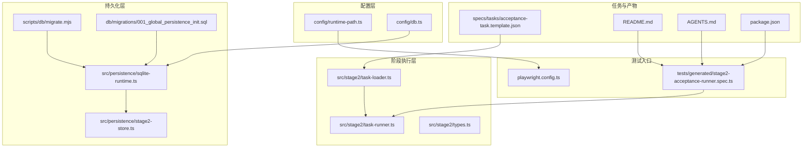
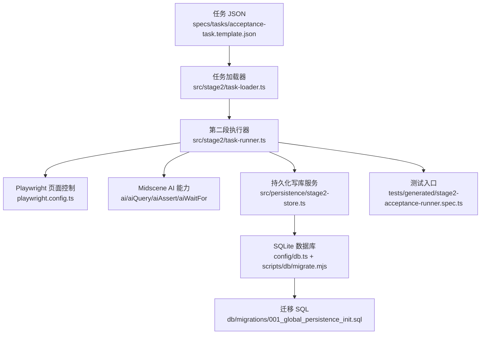
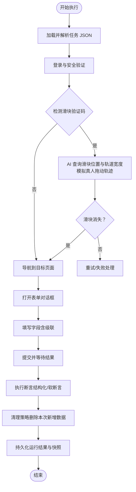
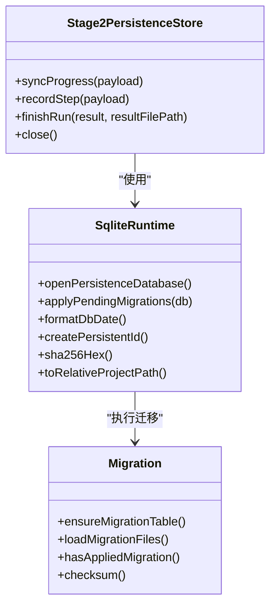
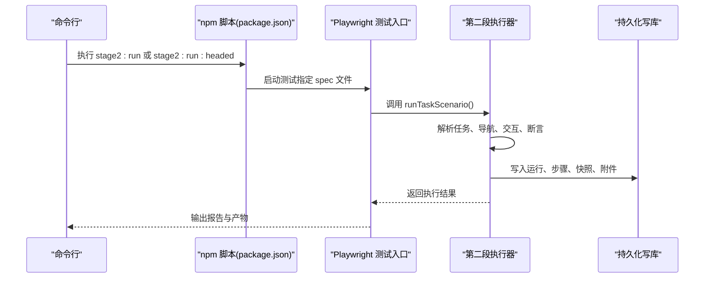
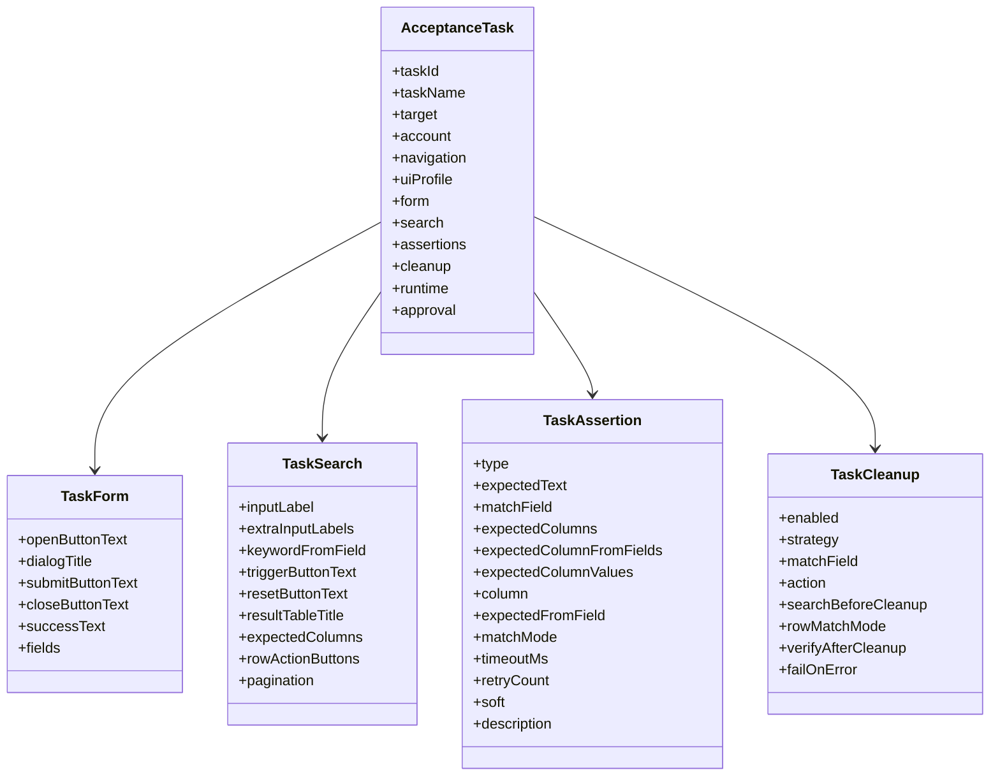
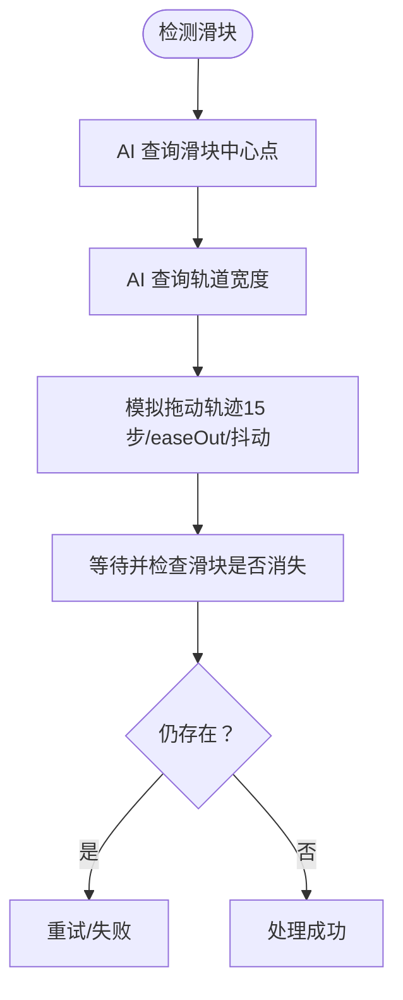
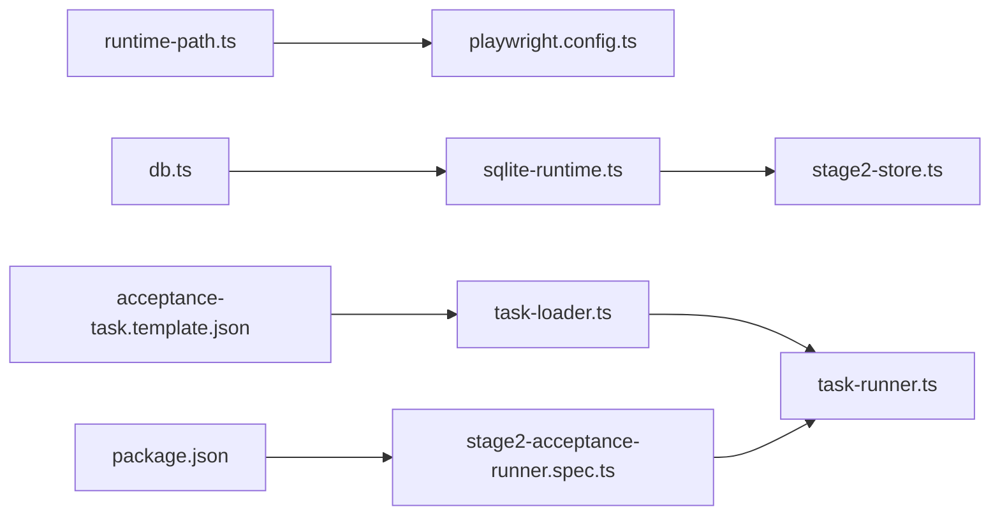

# 项目概述

<cite>
**本文引用的文件**
- [README.md](file://README.md)
- [package.json](file://package.json)
- [playwright.config.ts](file://playwright.config.ts)
- [AGENTS.md](file://AGENTS.md)
- [src/persistence/sqlite-runtime.ts](file://src/persistence/sqlite-runtime.ts)
- [src/persistence/stage2-store.ts](file://src/persistence/stage2-store.ts)
- [src/stage2/task-runner.ts](file://src/stage2/task-runner.ts)
- [src/stage2/task-loader.ts](file://src/stage2/task-loader.ts)
- [src/stage2/types.ts](file://src/stage2/types.ts)
- [config/runtime-path.ts](file://config/runtime-path.ts)
- [config/db.ts](file://config/db.ts)
- [specs/tasks/acceptance-task.template.json](file://specs/tasks/acceptance-task.template.json)
- [tests/generated/stage2-acceptance-runner.spec.ts](file://tests/generated/stage2-acceptance-runner.spec.ts)
- [scripts/db/migrate.mjs](file://scripts/db/migrate.mjs)
- [db/migrations/001_global_persistence_init.sql](file://db/migrations/001_global_persistence_init.sql)
</cite>

## 目录
1. [引言](#引言)
2. [项目结构](#项目结构)
3. [核心组件](#核心组件)
4. [架构总览](#架构总览)
5. [详细组件分析](#详细组件分析)
6. [依赖关系分析](#依赖关系分析)
7. [性能考量](#性能考量)
8. [故障排查指南](#故障排查指南)
9. [结论](#结论)
10. [附录](#附录)

## 引言
HI-TEST 是一个基于 Playwright 与 Midscene.js 的 AI 驱动 Web 自动化测试框架，旨在通过“自然语言 + 结构化 JSON 任务”的方式，实现端到端的验收测试与数据持久化。项目强调：
- 以 JSON 任务驱动的第二段执行器，将业务意图转化为可重复、可观测的自动化流程；
- 在登录等安全验证场景中，结合 Midscene 的 AI 能力与 Playwright 的真实用户交互，实现滑块验证码的自动处理；
- 通过 SQLite 数据库对任务、运行、步骤、快照与产物进行结构化归档，支撑企业级可追溯性与审计。

项目当前处于快速迭代阶段，已完成运行目录统一、任务模板、第二段执行器、数据持久化接入与滑块自动处理等关键能力，并在推进第一段整体方案设计与迁移。

## 项目结构
项目采用“配置-持久化-阶段执行-测试入口”的分层组织方式，核心目录与文件职责如下：
- config：运行时路径与数据库配置集中管理，统一从 .env 解析；
- src/persistence：SQLite 数据库初始化、迁移与写库服务；
- src/stage2：第二段执行器、任务加载与类型定义；
- specs/tasks：任务 JSON 模板与示例；
- tests：Playwright 测试入口与夹具；
- scripts/db：数据库迁移脚本；
- db/migrations：SQL 迁移文件；
- 根目录 README、AGENTS、package.json、playwright.config.ts 等提供安装、运行与规范说明。

图表来源
- [config/runtime-path.ts:1-41](file://config/runtime-path.ts#L1-L41)
- [config/db.ts:1-28](file://config/db.ts#L1-L28)
- [src/persistence/sqlite-runtime.ts:1-116](file://src/persistence/sqlite-runtime.ts#L1-L116)
- [src/persistence/stage2-store.ts:1-655](file://src/persistence/stage2-store.ts#L1-L655)
- [scripts/db/migrate.mjs:1-52](file://scripts/db/migrate.mjs#L1-L52)
- [db/migrations/001_global_persistence_init.sql:1-128](file://db/migrations/001_global_persistence_init.sql#L1-L128)
- [src/stage2/task-loader.ts:1-91](file://src/stage2/task-loader.ts#L1-L91)
- [src/stage2/task-runner.ts:1-800](file://src/stage2/task-runner.ts#L1-L800)
- [src/stage2/types.ts:1-180](file://src/stage2/types.ts#L1-L180)
- [tests/generated/stage2-acceptance-runner.spec.ts:1-39](file://tests/generated/stage2-acceptance-runner.spec.ts#L1-L39)
- [playwright.config.ts:1-95](file://playwright.config.ts#L1-L95)
- [specs/tasks/acceptance-task.template.json:1-141](file://specs/tasks/acceptance-task.template.json#L1-L141)
- [README.md:1-223](file://README.md#L1-L223)
- [AGENTS.md:1-61](file://AGENTS.md#L1-L61)
- [package.json:1-26](file://package.json#L1-L26)

章节来源
- [README.md:1-223](file://README.md#L1-L223)
- [AGENTS.md:1-61](file://AGENTS.md#L1-L61)
- [package.json:1-26](file://package.json#L1-L26)
- [playwright.config.ts:1-95](file://playwright.config.ts#L1-L95)

## 核心组件
- 运行时路径与环境变量解析：集中管理 t_runtime/* 产物目录，保证多模块共享与可配置；
- 数据库与迁移：SQLite 单文件数据库，提供任务、版本、运行、步骤、快照、附件与审计日志的结构化存储；
- 第二段执行器：从 JSON 任务加载、解析与执行，封装页面交互、AI 查询与断言、滑块验证码处理、清理与持久化；
- 测试入口：Playwright 测试用例，注入 Midscene 的 ai/aiQuery/aiAssert/aiWaitFor 能力，驱动第二段执行器；
- 任务模板：标准化的验收任务 JSON，定义目标站点、账户、导航、表单、搜索、断言与清理策略。

章节来源
- [config/runtime-path.ts:1-41](file://config/runtime-path.ts#L1-L41)
- [config/db.ts:1-28](file://config/db.ts#L1-L28)
- [src/persistence/sqlite-runtime.ts:1-116](file://src/persistence/sqlite-runtime.ts#L1-L116)
- [src/persistence/stage2-store.ts:1-655](file://src/persistence/stage2-store.ts#L1-L655)
- [src/stage2/task-runner.ts:1-800](file://src/stage2/task-runner.ts#L1-L800)
- [src/stage2/task-loader.ts:1-91](file://src/stage2/task-loader.ts#L1-L91)
- [src/stage2/types.ts:1-180](file://src/stage2/types.ts#L1-L180)
- [tests/generated/stage2-acceptance-runner.spec.ts:1-39](file://tests/generated/stage2-acceptance-runner.spec.ts#L1-L39)
- [specs/tasks/acceptance-task.template.json:1-141](file://specs/tasks/acceptance-task.template.json#L1-L141)

## 架构总览
整体架构围绕“JSON 任务 -> 执行器 -> Playwright + Midscene -> 数据库持久化”的闭环展开。执行器负责：
- 加载与解析任务 JSON，替换模板变量；
- 控制页面导航、表单填写、对话框交互、搜索与断言；
- 在遇到滑块验证码时，调用 AI 查询滑块位置与轨道宽度，再用 Playwright 模拟真人拖动轨迹；
- 将每一步的运行结果、截图与中间快照写入数据库与文件系统；
- 提供清理策略，删除本次新增数据并可选校验。

图表来源
- [specs/tasks/acceptance-task.template.json:1-141](file://specs/tasks/acceptance-task.template.json#L1-L141)
- [src/stage2/task-loader.ts:1-91](file://src/stage2/task-loader.ts#L1-L91)
- [src/stage2/task-runner.ts:1-800](file://src/stage2/task-runner.ts#L1-L800)
- [playwright.config.ts:1-95](file://playwright.config.ts#L1-L95)
- [src/persistence/stage2-store.ts:1-655](file://src/persistence/stage2-store.ts#L1-L655)
- [config/db.ts:1-28](file://config/db.ts#L1-L28)
- [scripts/db/migrate.mjs:1-52](file://scripts/db/migrate.mjs#L1-L52)
- [db/migrations/001_global_persistence_init.sql:1-128](file://db/migrations/001_global_persistence_init.sql#L1-L128)
- [tests/generated/stage2-acceptance-runner.spec.ts:1-39](file://tests/generated/stage2-acceptance-runner.spec.ts#L1-L39)

## 详细组件分析

### 组件一：第二段执行器（任务编排与页面交互）
- 负责从 JSON 任务中解析目标站点、账户、导航、表单、搜索、断言与清理策略；
- 封装页面可见性判断、级联选择器、对话框定位、按钮点击、输入填充与校验消息收集；
- 在登录场景中检测滑块验证码，调用 AI 查询滑块位置与轨道宽度，再用 Playwright 模拟真人拖动轨迹（15 步、easeOut 缓动、随机抖动），最多重试 3 次；
- 将每一步的运行结果、截图与中间快照写入数据库与文件系统；
- 支持多种断言类型（toast、table-row-exists、table-cell-equals/contains、custom），并提供软断言与超时重试配置。

图表来源
- [src/stage2/task-runner.ts:1-800](file://src/stage2/task-runner.ts#L1-L800)
- [src/stage2/types.ts:1-180](file://src/stage2/types.ts#L1-L180)
- [src/stage2/task-loader.ts:1-91](file://src/stage2/task-loader.ts#L1-L91)

章节来源
- [src/stage2/task-runner.ts:1-800](file://src/stage2/task-runner.ts#L1-L800)
- [src/stage2/types.ts:1-180](file://src/stage2/types.ts#L1-L180)
- [src/stage2/task-loader.ts:1-91](file://src/stage2/task-loader.ts#L1-L91)

### 组件二：数据持久化与迁移（SQLite）
- 通过 sqlite-runtime.ts 提供数据库打开、迁移表创建、迁移文件扫描与执行、校验和记录；
- 通过 stage2-store.ts 将任务、版本、运行、步骤、快照与附件写入数据库，并记录审计日志；
- 迁移脚本与 SQL 文件确保表结构与索引的一致性，便于后续扩展至 MySQL；
- 运行时路径与数据库路径均来自 config/runtime-path.ts 与 config/db.ts，统一由 .env 管理。

图表来源
- [src/persistence/stage2-store.ts:1-655](file://src/persistence/stage2-store.ts#L1-L655)
- [src/persistence/sqlite-runtime.ts:1-116](file://src/persistence/sqlite-runtime.ts#L1-L116)
- [scripts/db/migrate.mjs:1-52](file://scripts/db/migrate.mjs#L1-L52)
- [db/migrations/001_global_persistence_init.sql:1-128](file://db/migrations/001_global_persistence_init.sql#L1-L128)

章节来源
- [src/persistence/stage2-store.ts:1-655](file://src/persistence/stage2-store.ts#L1-L655)
- [src/persistence/sqlite-runtime.ts:1-116](file://src/persistence/sqlite-runtime.ts#L1-L116)
- [scripts/db/migrate.mjs:1-52](file://scripts/db/migrate.mjs#L1-L52)
- [db/migrations/001_global_persistence_init.sql:1-128](file://db/migrations/001_global_persistence_init.sql#L1-L128)
- [config/runtime-path.ts:1-41](file://config/runtime-path.ts#L1-L41)
- [config/db.ts:1-28](file://config/db.ts#L1-L28)

### 组件三：测试入口与运行配置
- tests/generated/stage2-acceptance-runner.spec.ts 注入 ai/aiQuery/aiAssert/aiWaitFor 能力，调用 runTaskScenario 执行第二段任务；
- playwright.config.ts 统一输出目录、HTML 报告、Midscene 报告与 Trace，支持 Chromium 设备；
- package.json 提供数据库初始化与迁移脚本、第二段执行命令。

图表来源
- [tests/generated/stage2-acceptance-runner.spec.ts:1-39](file://tests/generated/stage2-acceptance-runner.spec.ts#L1-L39)
- [src/stage2/task-runner.ts:1-800](file://src/stage2/task-runner.ts#L1-L800)
- [src/persistence/stage2-store.ts:1-655](file://src/persistence/stage2-store.ts#L1-L655)
- [package.json:1-26](file://package.json#L1-L26)
- [playwright.config.ts:1-95](file://playwright.config.ts#L1-L95)

章节来源
- [tests/generated/stage2-acceptance-runner.spec.ts:1-39](file://tests/generated/stage2-acceptance-runner.spec.ts#L1-L39)
- [package.json:1-26](file://package.json#L1-L26)
- [playwright.config.ts:1-95](file://playwright.config.ts#L1-L95)

### 组件四：任务模型与跨平台通用配置
- types.ts 定义了 AcceptanceTask、TaskForm、TaskSearch、TaskAssertion、TaskCleanup 等核心模型；
- 通过 uiProfile 字段支持跨平台的选择器优先级（表格行、Toast、弹窗），提升适配性；
- 推荐断言策略：优先使用 Playwright 硬检测，AI 断言作为兜底，table-row-exists 作为硬门槛，少量关键列使用 soft=true 的 table-cell-* 断言。

图表来源
- [src/stage2/types.ts:1-180](file://src/stage2/types.ts#L1-L180)

章节来源
- [src/stage2/types.ts:1-180](file://src/stage2/types.ts#L1-L180)
- [README.md:191-201](file://README.md#L191-L201)

### 组件五：滑块验证码自动处理（AI + Playwright）
- 检测滑块验证码出现（文本与选择器双策略）；
- 使用 AI 查询滑块中心点与轨道宽度，计算目标终点；
- 模拟真人拖动轨迹（15 步、easeOut 缓动、随机抖动），并最多重试 3 次；
- 失败时抛出明确错误，支持切换 manual/fail/ignore 模式。

图表来源
- [src/stage2/task-runner.ts:561-706](file://src/stage2/task-runner.ts#L561-L706)

章节来源
- [src/stage2/task-runner.ts:561-706](file://src/stage2/task-runner.ts#L561-L706)
- [README.md:64-74](file://README.md#L64-L74)

## 依赖关系分析
- 运行时路径与数据库配置：runtime-path.ts 与 db.ts 从 .env 读取配置，被 playwright.config.ts、stage2-store.ts、sqlite-runtime.ts 等模块复用；
- 执行器与持久化：task-runner.ts 通过 stage2-store.ts 写库，sqlite-runtime.ts 提供数据库与迁移能力；
- 测试入口：tests/generated/stage2-acceptance-runner.spec.ts 通过 Playwright 注入 Midscene 能力，调用 task-runner.ts；
- 任务模板：specs/tasks/acceptance-task.template.json 为执行器提供输入，task-loader.ts 负责解析与模板变量替换。

图表来源
- [config/runtime-path.ts:1-41](file://config/runtime-path.ts#L1-L41)
- [config/db.ts:1-28](file://config/db.ts#L1-L28)
- [src/persistence/sqlite-runtime.ts:1-116](file://src/persistence/sqlite-runtime.ts#L1-L116)
- [src/persistence/stage2-store.ts:1-655](file://src/persistence/stage2-store.ts#L1-L655)
- [src/stage2/task-loader.ts:1-91](file://src/stage2/task-loader.ts#L1-L91)
- [src/stage2/task-runner.ts:1-800](file://src/stage2/task-runner.ts#L1-L800)
- [specs/tasks/acceptance-task.template.json:1-141](file://specs/tasks/acceptance-task.template.json#L1-L141)
- [tests/generated/stage2-acceptance-runner.spec.ts:1-39](file://tests/generated/stage2-acceptance-runner.spec.ts#L1-L39)
- [package.json:1-26](file://package.json#L1-L26)

章节来源
- [config/runtime-path.ts:1-41](file://config/runtime-path.ts#L1-L41)
- [config/db.ts:1-28](file://config/db.ts#L1-L28)
- [src/persistence/sqlite-runtime.ts:1-116](file://src/persistence/sqlite-runtime.ts#L1-L116)
- [src/persistence/stage2-store.ts:1-655](file://src/persistence/stage2-store.ts#L1-L655)
- [src/stage2/task-loader.ts:1-91](file://src/stage2/task-loader.ts#L1-L91)
- [src/stage2/task-runner.ts:1-800](file://src/stage2/task-runner.ts#L1-L800)
- [specs/tasks/acceptance-task.template.json:1-141](file://specs/tasks/acceptance-task.template.json#L1-L141)
- [tests/generated/stage2-acceptance-runner.spec.ts:1-39](file://tests/generated/stage2-acceptance-runner.spec.ts#L1-L39)
- [package.json:1-26](file://package.json#L1-L26)

## 性能考量
- 执行器内部对页面可见性、定位候选与可见序号进行了优化，减少无效交互与等待；
- 滑块自动处理采用固定步数与缓动函数，兼顾成功率与稳定性；
- 数据持久化采用批量写入与事务（迁移脚本中的 BEGIN/COMMIT/ROLLBACK），降低 I/O 开销；
- 建议在 CI 中启用并行与重试策略，同时限制单步超时与截图频率以平衡可观测性与性能。

## 故障排查指南
- 滑块验证码处理失败：检查 STAGE2_CAPTCHA_MODE 与 STAGE2_CAPTCHA_WAIT_TIMEOUT_MS，必要时切换 manual 模式并调整检测选择器；
- 断言不稳定：优先使用 Playwright 硬检测，AI 断言作为兜底；对关键列使用 soft=true，避免过度幻觉；
- 运行产物缺失：确认 .env 中 RUNTIME_DIR_PREFIX、PLAYWRIGHT_OUTPUT_DIR、PLAYWRIGHT_HTML_REPORT_DIR、MIDSCENE_RUN_DIR、ACCEPTANCE_RESULT_DIR、DB_FILE_PATH；
- 数据库写入异常：检查 sqlite 驱动与迁移是否成功，核对 schema_migrations 记录与表结构一致性；
- 任务模板变量未替换：确认环境变量与 NOW_YYYYMMDDHHMMSS 模板令牌替换逻辑。

章节来源
- [README.md:56-74](file://README.md#L56-L74)
- [README.md:146-152](file://README.md#L146-L152)
- [README.md:76-96](file://README.md#L76-L96)
- [src/persistence/sqlite-runtime.ts:86-114](file://src/persistence/sqlite-runtime.ts#L86-L114)
- [src/stage2/task-runner.ts:650-706](file://src/stage2/task-runner.ts#L650-L706)
- [src/stage2/task-loader.ts:19-48](file://src/stage2/task-loader.ts#L19-L48)

## 结论
HI-TEST 将 Midscene 的 AI 能力与 Playwright 的真实浏览器交互相结合，形成“结构化任务 + AI 辅助 + 数据持久化”的验收测试体系。其核心价值在于：
- 以 JSON 任务驱动的可复用、可审计的自动化流程；
- 在复杂 UI 场景（如滑块验证码）中提供稳健的 AI + Playwright 解决方案；
- 通过 SQLite 数据持久化构建企业级可追溯性与审计能力。

当前项目已完成多项关键能力接入，建议在后续阶段推进第一段方案设计、跨平台 UI Profile 与断言优化、以及数据库驱动扩展（MySQL）。

## 附录
- 安装与运行：克隆仓库、安装依赖与浏览器、配置 .env、执行 npm run db:init 与 db:migrate、运行第二段任务；
- 运行产物：Playwright 报告、Midscene 报告、第二段结果与截图、SQLite 数据库文件；
- 规范与目录：统一运行产物目录、配置集中管理、日志与错误处理规范。

章节来源
- [README.md:10-131](file://README.md#L10-L131)
- [README.md:132-190](file://README.md#L132-L190)
- [AGENTS.md:1-61](file://AGENTS.md#L1-L61)