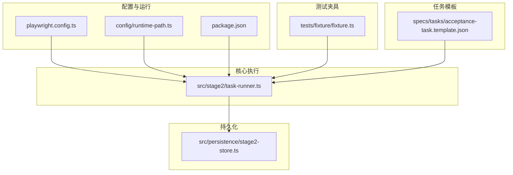
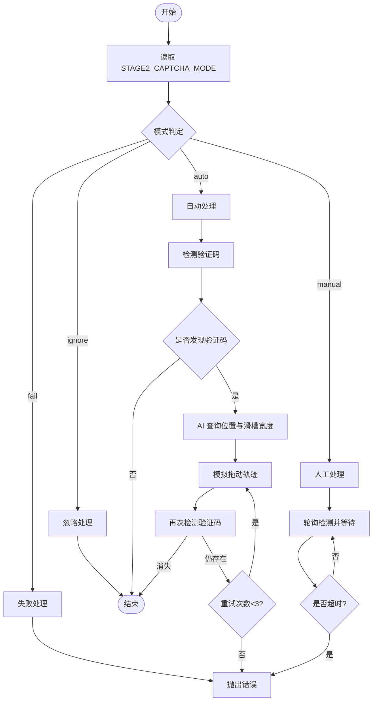
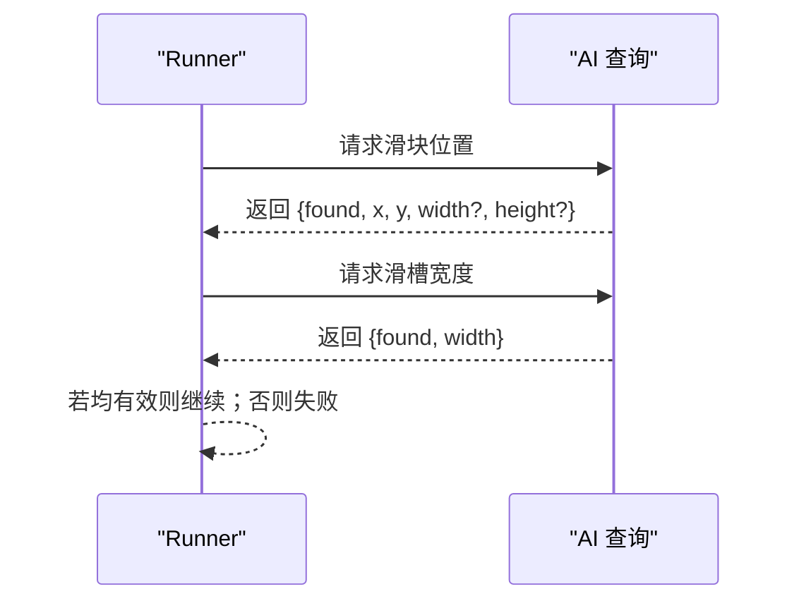
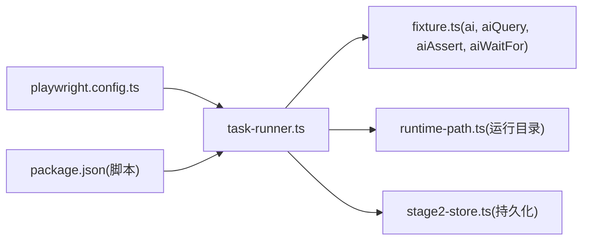

# 验证码处理

<cite>
**本文引用的文件**
- [README.md](file://README.md)
- [playwright.config.ts](file://playwright.config.ts)
- [src/stage2/task-runner.ts](file://src/stage2/task-runner.ts)
- [tests/fixture/fixture.ts](file://tests/fixture/fixture.ts)
- [src/persistence/stage2-store.ts](file://src/persistence/stage2-store.ts)
- [config/runtime-path.ts](file://config/runtime-path.ts)
- [specs/tasks/acceptance-task.template.json](file://specs/tasks/acceptance-task.template.json)
- [package.json](file://package.json)
- [.plans/stage2登录安全验证人工兜底方案_2026-03-12.md](file://.plans/stage2登录安全验证人工兜底方案_2026-03-12.md)
</cite>

## 目录
1. [简介](#简介)
2. [项目结构](#项目结构)
3. [核心组件](#核心组件)
4. [架构总览](#架构总览)
5. [详细组件分析](#详细组件分析)
6. [依赖关系分析](#依赖关系分析)
7. [性能考量](#性能考量)
8. [故障排查指南](#故障排查指南)
9. [结论](#结论)
10. [附录](#附录)

## 简介
本文件面向验证码处理系统，聚焦滑块验证码的自动识别与处理机制，涵盖以下内容：
- AI 分析滑块位置的算法实现思路与参数来源
- Playwright 模拟拖动轨迹的技术细节（步数、缓动、抖动、随机延时）
- 四种验证码处理模式的工作原理与适用场景：auto（自动处理）、manual（人工处理）、fail（失败处理）、ignore（忽略处理）
- 配置参数说明：超时时间与重试机制
- 人工兜底方案的设计思路与实现细节（含超时控制）
- 错误处理与故障恢复机制，保障测试流程稳定性
- 最佳实践与常见问题解决方案

## 项目结构
该仓库采用分层组织：测试夹具与运行配置位于 tests 与 config 目录；核心业务逻辑集中在 src/stage2；持久化与运行产物路径管理位于 src/persistence 与 config/runtime-path.ts；任务模板位于 specs。

**图表来源**
- [playwright.config.ts:1-95](file://playwright.config.ts#L1-L95)
- [config/runtime-path.ts:1-41](file://config/runtime-path.ts#L1-L41)
- [tests/fixture/fixture.ts:1-100](file://tests/fixture/fixture.ts#L1-L100)
- [src/stage2/task-runner.ts:1-120](file://src/stage2/task-runner.ts#L1-L120)
- [src/persistence/stage2-store.ts:1-120](file://src/persistence/stage2-store.ts#L1-L120)
- [specs/tasks/acceptance-task.template.json:1-141](file://specs/tasks/acceptance-task.template.json#L1-L141)
- [package.json:1-26](file://package.json#L1-L26)

**章节来源**
- [README.md:10-96](file://README.md#L10-L96)
- [playwright.config.ts:1-95](file://playwright.config.ts#L1-L95)
- [config/runtime-path.ts:1-41](file://config/runtime-path.ts#L1-L41)
- [tests/fixture/fixture.ts:1-100](file://tests/fixture/fixture.ts#L1-L100)
- [src/stage2/task-runner.ts:1-120](file://src/stage2/task-runner.ts#L1-L120)
- [src/persistence/stage2-store.ts:1-120](file://src/persistence/stage2-store.ts#L1-L120)
- [specs/tasks/acceptance-task.template.json:1-141](file://specs/tasks/acceptance-task.template.json#L1-L141)
- [package.json:1-26](file://package.json#L1-L26)

## 核心组件
- 验证码检测与处理模块：负责识别滑块验证码、解析滑块位置与滑槽宽度、模拟拖动轨迹、重试与超时控制。
- Midscene + Playwright 夹具：提供 ai、aiQuery、aiAssert、aiWaitFor 等能力，支撑 AI 辅助的页面元素定位与结构化提取。
- 运行时路径与产物管理：集中管理 t_runtime/* 目录的输出、报告与中间产物。
- 数据持久化：将运行记录、步骤、快照与附件落库，便于回溯与审计。

**章节来源**
- [src/stage2/task-runner.ts:35-87](file://src/stage2/task-runner.ts#L35-L87)
- [tests/fixture/fixture.ts:23-99](file://tests/fixture/fixture.ts#L23-L99)
- [config/runtime-path.ts:13-40](file://config/runtime-path.ts#L13-L40)
- [src/persistence/stage2-store.ts:74-123](file://src/persistence/stage2-store.ts#L74-L123)

## 架构总览
验证码处理在任务执行流程中的位置如下：

**图表来源**
- [src/stage2/task-runner.ts:483-501](file://src/stage2/task-runner.ts#L483-L501)
- [src/stage2/task-runner.ts:650-706](file://src/stage2/task-runner.ts#L650-L706)
- [src/stage2/task-runner.ts:510-559](file://src/stage2/task-runner.ts#L510-L559)
- [src/stage2/task-runner.ts:561-648](file://src/stage2/task-runner.ts#L561-L648)

## 详细组件分析

### 模式解析与配置
- 模式解析：从环境变量读取 STAGE2_CAPTCHA_MODE，支持 auto、manual、fail、ignore，默认 auto。
- 等待超时：STAGE2_CAPTCHA_WAIT_TIMEOUT_MS 控制 manual 模式的最长等待时间，默认 120000ms。
- 检测轮询间隔：固定 1000ms。
- 文本与选择器模式：内置多组文本关键词与 DOM 选择器用于识别验证码。

**图表来源**
- [src/stage2/task-runner.ts:61-87](file://src/stage2/task-runner.ts#L61-L87)
- [src/stage2/task-runner.ts:483-501](file://src/stage2/task-runner.ts#L483-L501)
- [src/stage2/task-runner.ts:650-706](file://src/stage2/task-runner.ts#L650-L706)
- [src/stage2/task-runner.ts:668-686](file://src/stage2/task-runner.ts#L668-L686)

**章节来源**
- [src/stage2/task-runner.ts:61-87](file://src/stage2/task-runner.ts#L61-L87)
- [src/stage2/task-runner.ts:483-501](file://src/stage2/task-runner.ts#L483-L501)
- [src/stage2/task-runner.ts:650-706](file://src/stage2/task-runner.ts#L650-L706)

### AI 分析滑块位置与滑槽宽度
- 滑块位置查询：通过 aiQuery 请求 AI 提取滑块按钮中心点坐标与尺寸，返回结构包含 found/x/y/width/height。
- 滑槽宽度查询：通过 aiQuery 请求 AI 提取滑槽总宽度，返回结构包含 found/width。
- 容错策略：AI 查询异常会被捕获并忽略，避免阻断流程。

**图表来源**
- [src/stage2/task-runner.ts:510-559](file://src/stage2/task-runner.ts#L510-L559)

**章节来源**
- [src/stage2/task-runner.ts:510-559](file://src/stage2/task-runner.ts#L510-L559)

### Playwright 模拟拖动轨迹
- 起始与按下：移动到滑块中心点，短暂等待后按下鼠标。
- 轨迹模拟：15 步缓动（easeOut），每步计算目标 X 坐标并加入 [-3,3] 水平与 [-2,2] 垂直抖动，随机延时 30–80ms。
- 到达目标：确保最终落在目标 X 坐标，短暂等待后释放鼠标。
- 结果验证：等待 2000ms 后再次检测验证码是否消失，若仍存在则判定失败。

**图表来源**
- [src/stage2/task-runner.ts:561-648](file://src/stage2/task-runner.ts#L561-L648)

**章节来源**
- [src/stage2/task-runner.ts:561-648](file://src/stage2/task-runner.ts#L561-L648)

### 四种验证码处理模式
- auto（自动处理）
  - 行为：检测到验证码后，调用 AI 查询滑块位置与滑槽宽度，随后模拟拖动轨迹；最多重试 3 次。
  - 适用场景：滑块样式稳定、AI 能准确识别。
- manual（人工处理）
  - 行为：检测到验证码后，进入轮询等待，每隔 1000ms 检测一次，直至验证码消失或达到 STAGE2_CAPTCHA_WAIT_TIMEOUT_MS 超时。
  - 适用场景：滑块样式变化频繁、AI 不稳定或需要人工干预。
- fail（失败处理）
  - 行为：检测到验证码即抛错终止。
  - 适用场景：严格禁止验证码阻塞自动化流程。
- ignore（忽略处理）
  - 行为：检测到验证码但不处理，继续执行后续步骤。
  - 适用场景：已知验证码不影响当前流程或有其他防护手段。

**章节来源**
- [README.md:56-62](file://README.md#L56-L62)
- [src/stage2/task-runner.ts:650-706](file://src/stage2/task-runner.ts#L650-L706)

### 配置参数说明
- STAGE2_CAPTCHA_MODE：验证码处理模式（auto/manual/fail/ignore）。
- STAGE2_CAPTCHA_WAIT_TIMEOUT_MS：manual 模式下的人工处理等待时长（毫秒）。
- 运行产物目录：由 RUNTIME_DIR_PREFIX、PLAYWRIGHT_OUTPUT_DIR、PLAYWRIGHT_HTML_REPORT_DIR、MIDSCENE_RUN_DIR、ACCEPTANCE_RESULT_DIR 等环境变量统一收敛到 t_runtime/ 下。

**章节来源**
- [README.md:39-54](file://README.md#L39-L54)
- [README.md:76-96](file://README.md#L76-L96)
- [config/runtime-path.ts:13-36](file://config/runtime-path.ts#L13-L36)

### 人工兜底方案设计与实现
- 设计思路：在验证码出现时，系统不再强制自动处理，而是进入轮询等待，允许人工完成验证；同时提供超时控制，避免无限等待。
- 实现细节：
  - 记录开始时间与超时阈值，循环检测验证码是否消失。
  - 每次检测间隔固定为 1000ms。
  - 超时后抛出错误，终止任务。
- 回滚策略：可通过设置 STAGE2_CAPTCHA_MODE=manual 或移除相关逻辑快速回退。

**章节来源**
- [src/stage2/task-runner.ts:688-706](file://src/stage2/task-runner.ts#L688-L706)
- [.plans/stage2登录安全验证人工兜底方案_2026-03-12.md:50-57](file://.plans/stage2登录安全验证人工兜底方案_2026-03-12.md#L50-L57)

### 错误处理与故障恢复
- AI 查询异常：捕获并忽略，保证流程继续。
- 拖动过程异常：捕获错误并确保释放鼠标，返回失败；最多重试 3 次。
- 人工模式超时：达到 STAGE2_CAPTCHA_WAIT_TIMEOUT_MS 后抛错终止。
- 数据持久化：无论成功或失败，都会将运行记录、步骤、快照与附件写入数据库，便于审计与回溯。

**章节来源**
- [src/stage2/task-runner.ts:534-537](file://src/stage2/task-runner.ts#L534-L537)
- [src/stage2/task-runner.ts:638-647](file://src/stage2/task-runner.ts#L638-L647)
- [src/stage2/task-runner.ts:688-706](file://src/stage2/task-runner.ts#L688-L706)
- [src/persistence/stage2-store.ts:125-133](file://src/persistence/stage2-store.ts#L125-L133)

## 依赖关系分析
- 任务执行器依赖 Playwright 页面对象与 Midscene AI 能力，通过夹具注入 ai/aiQuery/aiAssert/aiWaitFor。
- 运行时路径由 config/runtime-path.ts 统一解析，影响 Playwright 输出目录与 Midscene 日志目录。
- 数据持久化服务在任务执行期间写入数据库，包含运行记录、步骤、快照与附件。

**图表来源**
- [src/stage2/task-runner.ts:18-25](file://src/stage2/task-runner.ts#L18-L25)
- [tests/fixture/fixture.ts:23-99](file://tests/fixture/fixture.ts#L23-L99)
- [config/runtime-path.ts:38-40](file://config/runtime-path.ts#L38-L40)
- [src/persistence/stage2-store.ts:101-123](file://src/persistence/stage2-store.ts#L101-L123)
- [playwright.config.ts:22-48](file://playwright.config.ts#L22-L48)
- [package.json:6-11](file://package.json#L6-L11)

**章节来源**
- [src/stage2/task-runner.ts:18-25](file://src/stage2/task-runner.ts#L18-L25)
- [tests/fixture/fixture.ts:23-99](file://tests/fixture/fixture.ts#L23-L99)
- [config/runtime-path.ts:38-40](file://config/runtime-path.ts#L38-L40)
- [src/persistence/stage2-store.ts:101-123](file://src/persistence/stage2-store.ts#L101-L123)
- [playwright.config.ts:22-48](file://playwright.config.ts#L22-L48)
- [package.json:6-11](file://package.json#L6-L11)

## 性能考量
- 拖动轨迹步数与缓动：15 步 easeOut 缓动与随机抖动，兼顾成功率与仿真度。
- 随机延时：每步 30–80ms，降低被风控概率。
- 重试策略：自动模式最多重试 3 次，避免长时间卡死。
- 人工模式轮询：1000ms 间隔，平衡响应速度与资源占用。
- 产物收敛：统一输出目录减少磁盘 IO 压力，便于清理与归档。

[本节为通用指导，无需特定文件引用]

## 故障排查指南
- 自动处理失败
  - 现象：滑块验证仍存在。
  - 排查：检查页面截图确认滑块样式；调整为 manual 模式人工处理；调整滑块检测选择器与文本关键词。
  - 参考：自动处理最多重试 3 次，失败后抛出明确错误。
- 人工模式超时
  - 现象：验证码在设定时间内未完成。
  - 排查：增大 STAGE2_CAPTCHA_WAIT_TIMEOUT_MS；确认人工操作是否正确完成。
- 忽略处理导致后续步骤异常
  - 现象：验证码未消除，后续步骤失败。
  - 排查：改为 auto 或 manual 模式；或在前置步骤中增加等待与断言。
- AI 查询失败
  - 现象：滑块位置/滑槽宽度未返回有效值。
  - 排查：检查模型可用性与网络；放宽或调整选择器/文本关键词。

**章节来源**
- [src/stage2/task-runner.ts:668-686](file://src/stage2/task-runner.ts#L668-L686)
- [src/stage2/task-runner.ts:688-706](file://src/stage2/task-runner.ts#L688-L706)
- [README.md:64-74](file://README.md#L64-L74)

## 结论
该验证码处理系统通过 AI 与 Playwright 的协同，实现了滑块验证码的自动识别与仿真拖动；同时提供多种处理模式与人工兜底方案，兼顾稳定性与灵活性。配合统一的运行产物目录与数据持久化，能够有效提升测试流程的可观测性与可维护性。建议在不同场景下合理选择模式，并结合重试与超时策略，确保自动化流程的高成功率与高鲁棒性。

[本节为总结，无需特定文件引用]

## 附录
- 运行入口与脚本
  - npm run stage2:run / npm run stage2:run:headed
- 任务模板字段参考
  - 包含导航、表单、断言、清理等字段，便于扩展与定制。

**章节来源**
- [package.json:6-11](file://package.json#L6-L11)
- [specs/tasks/acceptance-task.template.json:1-141](file://specs/tasks/acceptance-task.template.json#L1-L141)