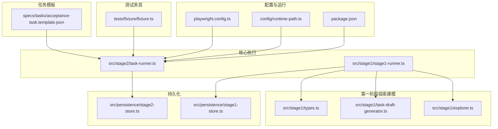
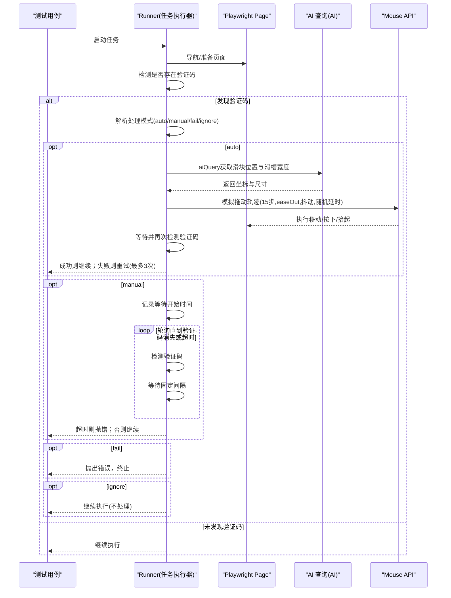
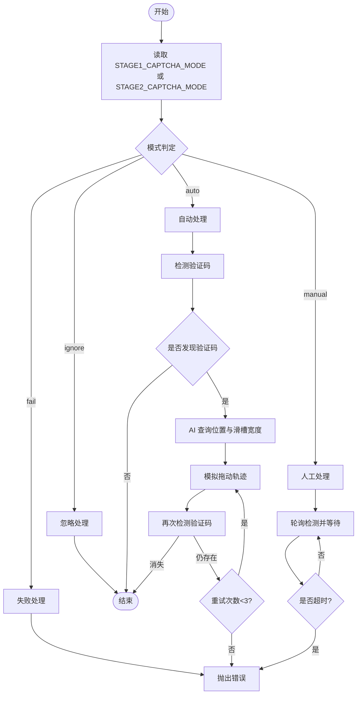
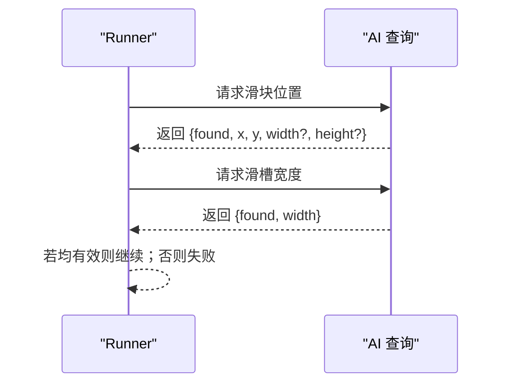
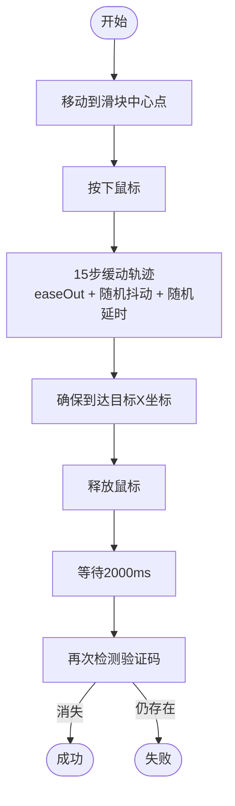
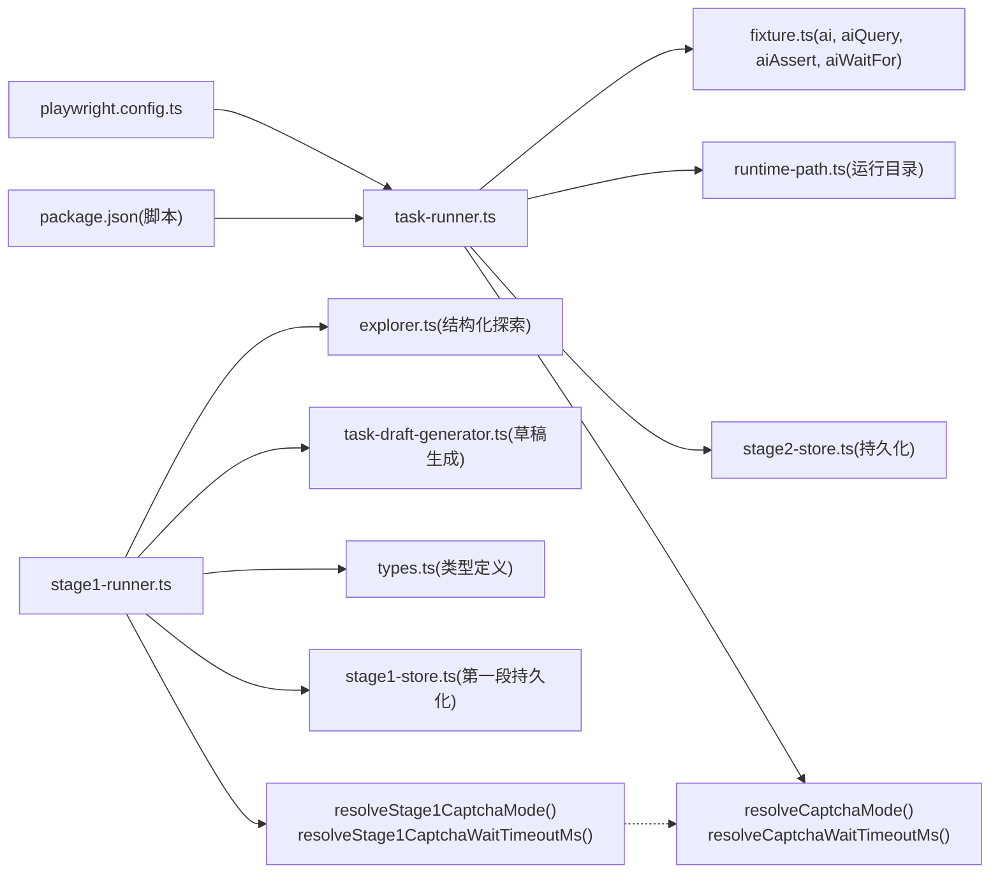

# 验证码处理

<cite>
**本文引用的文件**
- [README.md](file://README.md)
- [playwright.config.ts](file://playwright.config.ts)
- [src/stage2/task-runner.ts](file://src/stage2/task-runner.ts)
- [src/stage1/stage1-runner.ts](file://src/stage1/stage1-runner.ts)
- [tests/fixture/fixture.ts](file://tests/fixture/fixture.ts)
- [src/persistence/stage2-store.ts](file://src/persistence/stage2-store.ts)
- [src/persistence/stage1-store.ts](file://src/persistence/stage1-store.ts)
- [config/runtime-path.ts](file://config/runtime-path.ts)
- [specs/tasks/acceptance-task.template.json](file://specs/tasks/acceptance-task.template.json)
- [package.json](file://package.json)
- [.plans/stage2登录安全验证人工兜底方案_2026-03-12.md](file://.plans/stage2登录安全验证人工兜底方案_2026-03-12.md)
- [.tasks/第一段登录验证码处理增强_2026-03-13.md](file://.tasks/第一段登录验证码处理增强_2026-03-13.md)
- [src/stage1/explorer.ts](file://src/stage1/explorer.ts)
- [src/stage1/task-draft-generator.ts](file://src/stage1/task-draft-generator.ts)
- [src/stage1/types.ts](file://src/stage1/types.ts)
</cite>

## 更新摘要
**变更内容**
- 新增第一阶段探索建模系统对验证码处理的专用配置支持
- 增加第一段专用的验证码处理模式（STAGE1_CAPTCHA_MODE）和超时配置（STAGE1_CAPTCHA_WAIT_TIMEOUT_MS）
- 完善验证码处理机制的架构图和流程说明
- 增加基于AI的滑块位置识别和拖动轨迹模拟技术细节
- 完善验证码处理的配置参数和错误处理机制
- 补充人工兜底方案的设计思路和实现细节

## 目录
1. [简介](#简介)
2. [项目结构](#项目结构)
3. [核心组件](#核心组件)
4. [架构总览](#架构总览)
5. [详细组件分析](#详细组件分析)
6. [依赖关系分析](#依赖关系分析)
7. [性能考量](#性能考量)
8. [故障排查指南](#故障排查指南)
9. [结论](#结论)
10. [附录](#附录)

## 简介
本文件面向验证码处理系统，聚焦滑块验证码的自动识别与处理机制，涵盖以下内容：
- AI分析滑块位置的算法实现思路与参数来源
- Playwright模拟拖动轨迹的技术细节（步数、缓动、抖动、随机延时）
- 四种验证码处理模式的工作原理与适用场景：auto（自动处理）、manual（人工处理）、fail（失败处理）、ignore（忽略处理）
- 配置参数说明：超时时间与重试机制
- 人工兜底方案的设计思路与实现细节（含超时控制）
- 错误处理与故障恢复机制，保障测试流程稳定性
- 最佳实践与常见问题解决方案

**更新** 本版本增加了第一阶段探索建模系统对验证码处理的新支持，通过AI驱动的滑块识别和拖动模拟，提升了验证码处理的自动化程度和准确性。特别新增了第一段专用的验证码处理配置（STAGE1_CAPTCHA_MODE、STAGE1_CAPTCHA_WAIT_TIMEOUT_MS），实现了与第二段验证码处理机制的统一协调。

## 项目结构
该仓库采用分层组织：测试夹具与运行配置位于 tests 与 config 目录；核心业务逻辑集中在 src/stage2；第一阶段探索建模系统位于 src/stage1；持久化与运行产物路径管理位于 src/persistence 与 config/runtime-path.ts；任务模板位于 specs。

**图表来源**
- [playwright.config.ts:1-95](file://playwright.config.ts#L1-L95)
- [config/runtime-path.ts:1-41](file://config/runtime-path.ts#L1-L41)
- [tests/fixture/fixture.ts:1-100](file://tests/fixture/fixture.ts#L1-L100)
- [src/stage2/task-runner.ts:1-120](file://src/stage2/task-runner.ts#L1-L120)
- [src/stage1/stage1-runner.ts:1-120](file://src/stage1/stage1-runner.ts#L1-L120)
- [src/stage1/explorer.ts:1-120](file://src/stage1/explorer.ts#L1-L120)
- [src/stage1/task-draft-generator.ts:1-120](file://src/stage1/task-draft-generator.ts#L1-L120)
- [src/stage1/types.ts:1-109](file://src/stage1/types.ts#L1-L109)
- [src/persistence/stage2-store.ts:1-120](file://src/persistence/stage2-store.ts#L1-L120)
- [src/persistence/stage1-store.ts:1-120](file://src/persistence/stage1-store.ts#L1-L120)
- [specs/tasks/acceptance-task.template.json:1-141](file://specs/tasks/acceptance-task.template.json#L1-L141)
- [package.json:1-26](file://package.json#L1-L26)

**章节来源**
- [README.md:10-96](file://README.md#L10-L96)
- [playwright.config.ts:1-95](file://playwright.config.ts#L1-L95)
- [config/runtime-path.ts:1-41](file://config/runtime-path.ts#L1-L41)
- [tests/fixture/fixture.ts:1-100](file://tests/fixture/fixture.ts#L1-L100)
- [src/stage2/task-runner.ts:1-120](file://src/stage2/task-runner.ts#L1-L120)
- [src/stage1/stage1-runner.ts:1-120](file://src/stage1/stage1-runner.ts#L1-L120)
- [src/stage1/explorer.ts:1-120](file://src/stage1/explorer.ts#L1-L120)
- [src/stage1/task-draft-generator.ts:1-120](file://src/stage1/task-draft-generator.ts#L1-L120)
- [src/stage1/types.ts:1-109](file://src/stage1/types.ts#L1-L109)
- [src/persistence/stage2-store.ts:1-120](file://src/persistence/stage2-store.ts#L1-L120)
- [src/persistence/stage1-store.ts:1-120](file://src/persistence/stage1-store.ts#L1-L120)
- [specs/tasks/acceptance-task.template.json:1-141](file://specs/tasks/acceptance-task.template.json#L1-L141)
- [package.json:1-26](file://package.json#L1-L26)

## 核心组件
- 验证码检测与处理模块：负责识别滑块验证码、解析滑块位置与滑槽宽度、模拟拖动轨迹、重试与超时控制。
- Midscene + Playwright夹具：提供ai、aiQuery、aiAssert、aiWaitFor等能力，支撑AI辅助的页面元素定位与结构化提取。
- 第一阶段探索建模系统：通过AI驱动的页面结构化探索，为验证码处理提供更准确的页面信息和候选元素识别。
- 运行时路径与产物管理：集中管理t_runtime/*目录的输出、报告与中间产物。
- 数据持久化：将运行记录、步骤、快照与附件落库，便于回溯与审计。

**更新** 新增第一阶段探索建模系统，通过AI驱动的页面结构化探索，为验证码处理提供更准确的页面信息和候选元素识别，提升了验证码处理的自动化程度。特别新增了第一段专用的验证码处理配置，实现了与第二段验证码处理机制的统一协调。

**章节来源**
- [src/stage2/task-runner.ts:35-87](file://src/stage2/task-runner.ts#L35-L87)
- [src/stage1/stage1-runner.ts:30-94](file://src/stage1/stage1-runner.ts#L30-L94)
- [tests/fixture/fixture.ts:23-99](file://tests/fixture/fixture.ts#L23-L99)
- [config/runtime-path.ts:13-40](file://config/runtime-path.ts#L13-L40)
- [src/persistence/stage2-store.ts:74-123](file://src/persistence/stage2-store.ts#L74-L123)
- [src/persistence/stage1-store.ts:1-120](file://src/persistence/stage1-store.ts#L1-L120)
- [src/stage1/explorer.ts:37-120](file://src/stage1/explorer.ts#L37-L120)
- [src/stage1/task-draft-generator.ts:150-220](file://src/stage1/task-draft-generator.ts#L150-L220)

## 架构总览
验证码处理在任务执行流程中的位置如下：

**更新** 在自动模式下，验证码处理通过AI查询获取滑块位置和滑槽宽度，然后使用Playwright模拟拖动轨迹。在人工模式下，系统进入轮询等待，允许人工完成验证。第一段和第二段验证码处理机制现在共享相同的配置参数和处理逻辑。

**图表来源**
- [src/stage2/task-runner.ts:483-501](file://src/stage2/task-runner.ts#L483-L501)
- [src/stage2/task-runner.ts:650-706](file://src/stage2/task-runner.ts#L650-L706)
- [src/stage2/task-runner.ts:510-559](file://src/stage2/task-runner.ts#L510-L559)
- [src/stage2/task-runner.ts:561-648](file://src/stage2/task-runner.ts#L561-L648)
- [src/stage1/stage1-runner.ts:314-360](file://src/stage1/stage1-runner.ts#L314-L360)

## 详细组件分析

### 模式解析与配置
- 模式解析：从环境变量读取STAGE2_CAPTCHA_MODE，支持auto、manual、fail、ignore，默认auto。
- 等待超时：STAGE2_CAPTCHA_WAIT_TIMEOUT_MS控制manual模式的最长等待时间，默认120000ms。
- 检测轮询间隔：固定1000ms。
- 文本与选择器模式：内置多组文本关键词与DOM选择器用于识别验证码。

**更新** 新增第一段专用配置支持，通过resolveStage1CaptchaMode()函数实现，支持STAGE1_CAPTCHA_MODE环境变量，若未设置则回退到STAGE2_CAPTCHA_MODE，确保两段验证码处理的一致性。

**图表来源**
- [src/stage2/task-runner.ts:61-87](file://src/stage2/task-runner.ts#L61-L87)
- [src/stage1/stage1-runner.ts:63-81](file://src/stage1/stage1-runner.ts#L63-L81)
- [src/stage2/task-runner.ts:483-501](file://src/stage2/task-runner.ts#L483-L501)
- [src/stage2/task-runner.ts:650-706](file://src/stage2/task-runner.ts#L650-L706)
- [src/stage1/stage1-runner.ts:314-360](file://src/stage1/stage1-runner.ts#L314-L360)

**章节来源**
- [src/stage2/task-runner.ts:61-87](file://src/stage2/task-runner.ts#L61-L87)
- [src/stage1/stage1-runner.ts:63-81](file://src/stage1/stage1-runner.ts#L63-L81)
- [src/stage2/task-runner.ts:483-501](file://src/stage2/task-runner.ts#L483-L501)
- [src/stage2/task-runner.ts:650-706](file://src/stage2/task-runner.ts#L650-L706)
- [src/stage1/stage1-runner.ts:314-360](file://src/stage1/stage1-runner.ts#L314-L360)

### AI分析滑块位置与滑槽宽度
- 滑块位置查询：通过aiQuery请求AI提取滑块按钮中心点坐标与尺寸，返回结构包含found/x/y/width/height。
- 滑槽宽度查询：通过aiQuery请求AI提取滑槽总宽度，返回结构包含found/width。
- 容错策略：AI查询异常会被捕获并忽略，避免阻断流程。

**图表来源**
- [src/stage2/task-runner.ts:510-559](file://src/stage2/task-runner.ts#L510-L559)
- [src/stage1/stage1-runner.ts:210-238](file://src/stage1/stage1-runner.ts#L210-L238)

**章节来源**
- [src/stage2/task-runner.ts:510-559](file://src/stage2/task-runner.ts#L510-L559)
- [src/stage1/stage1-runner.ts:210-238](file://src/stage1/stage1-runner.ts#L210-L238)

### Playwright模拟拖动轨迹
- 起始与按下：移动到滑块中心点，短暂等待后按下鼠标。
- 轨迹模拟：15步缓动（easeOut），每步计算目标X坐标并加入[-3,3]水平与[-2,2]垂直抖动，随机延时30–80ms。
- 到达目标：确保最终落在目标X坐标，短暂等待后释放鼠标。
- 结果验证：等待2000ms后再次检测验证码是否消失，若仍存在则判定失败。

**图表来源**
- [src/stage2/task-runner.ts:561-648](file://src/stage2/task-runner.ts#L561-L648)
- [src/stage1/stage1-runner.ts:261-312](file://src/stage1/stage1-runner.ts#L261-L312)

**章节来源**
- [src/stage2/task-runner.ts:561-648](file://src/stage2/task-runner.ts#L561-L648)
- [src/stage1/stage1-runner.ts:261-312](file://src/stage1/stage1-runner.ts#L261-L312)

### 四种验证码处理模式
- auto（自动处理）
  - 行为：检测到验证码后，调用AI查询滑块位置与滑槽宽度，随后模拟拖动轨迹；最多重试3次。
  - 适用场景：滑块样式稳定、AI能准确识别。
- manual（人工处理）
  - 行为：检测到验证码后，进入轮询等待，每隔1000ms检测一次，直至验证码消失或达到STAGE2_CAPTCHA_WAIT_TIMEOUT_MS超时。
  - 适用场景：滑块样式变化频繁、AI不稳定或需要人工干预。
- fail（失败处理）
  - 行为：检测到验证码即抛错终止。
  - 适用场景：严格禁止验证码阻塞自动化流程。
- ignore（忽略处理）
  - 行为：检测到验证码但不处理，继续执行后续步骤。
  - 适用场景：已知验证码不影响当前流程或有其他防护手段。

**更新** 第一段和第二段验证码处理模式完全一致，通过统一的配置参数实现协调。第一段支持STAGE1_CAPTCHA_MODE和STAGE1_CAPTCHA_WAIT_TIMEOUT_MS，若未设置则回退到STAGE2_CAPTCHA_MODE和STAGE2_CAPTCHA_WAIT_TIMEOUT_MS。

**章节来源**
- [README.md:56-62](file://README.md#L56-L62)
- [src/stage2/task-runner.ts:650-706](file://src/stage2/task-runner.ts#L650-L706)
- [src/stage1/stage1-runner.ts:314-360](file://src/stage1/stage1-runner.ts#L314-L360)

### 配置参数说明
- STAGE2_CAPTCHA_MODE：验证码处理模式（auto/manual/fail/ignore）。
- STAGE2_CAPTCHA_WAIT_TIMEOUT_MS：manual模式下的人工处理等待时长（毫秒）。
- STAGE1_CAPTCHA_MODE：第一段专用验证码处理模式，若未设置则回退到STAGE2_CAPTCHA_MODE。
- STAGE1_CAPTCHA_WAIT_TIMEOUT_MS：第一段专用人工处理等待时长，若未设置则回退到STAGE2_CAPTCHA_WAIT_TIMEOUT_MS。
- 运行产物目录：由RUNTIME_DIR_PREFIX、PLAYWRIGHT_OUTPUT_DIR、PLAYWRIGHT_HTML_REPORT_DIR、MIDSCENE_RUN_DIR、ACCEPTANCE_RESULT_DIR等环境变量统一收敛到t_runtime/下。

**更新** 新增第一段专用配置参数，实现与第二段验证码处理机制的统一协调，确保两段执行的一致性。

**章节来源**
- [README.md:39-54](file://README.md#L39-L54)
- [README.md:61-67](file://README.md#L61-L67)
- [README.md:76-96](file://README.md#L76-L96)
- [src/stage1/stage1-runner.ts:63-94](file://src/stage1/stage1-runner.ts#L63-L94)
- [src/stage2/task-runner.ts:61-87](file://src/stage2/task-runner.ts#L61-L87)
- [config/runtime-path.ts:13-36](file://config/runtime-path.ts#L13-L36)

### 人工兜底方案设计与实现
- 设计思路：在验证码出现时，系统不再强制自动处理，而是进入轮询等待，允许人工完成验证；同时提供超时控制，避免无限等待。
- 实现细节：
  - 记录开始时间与超时阈值，循环检测验证码是否消失。
  - 每次检测间隔固定为1000ms。
  - 超时后抛出错误，终止任务。
- 回滚策略：可通过设置STAGE2_CAPTCHA_MODE=manual或移除相关逻辑快速回退。

**更新** 第一段和第二段人工兜底方案实现完全一致，通过统一的超时控制和轮询检测机制，确保验证码处理的可靠性。

**章节来源**
- [src/stage2/task-runner.ts:688-706](file://src/stage2/task-runner.ts#L688-L706)
- [src/stage1/stage1-runner.ts:346-360](file://src/stage1/stage1-runner.ts#L346-L360)
- [.plans/stage2登录安全验证人工兜底方案_2026-03-12.md:50-57](file://.plans/stage2登录安全验证人工兜底方案_2026-03-12.md#L50-L57)

### 错误处理与故障恢复
- AI查询异常：捕获并忽略，保证流程继续。
- 拖动过程异常：捕获错误并确保释放鼠标，返回失败；最多重试3次。
- 人工模式超时：达到STAGE2_CAPTCHA_WAIT_TIMEOUT_MS后抛错终止。
- 数据持久化：无论成功或失败，都会将运行记录、步骤、快照与附件写入数据库，便于审计与回溯。

**更新** 第一段和第二段错误处理机制完全一致，通过统一的日志记录和异常处理策略，确保验证码处理的稳定性和可追踪性。

**章节来源**
- [src/stage2/task-runner.ts:534-537](file://src/stage2/task-runner.ts#L534-L537)
- [src/stage2/task-runner.ts:638-647](file://src/stage2/task-runner.ts#L638-L647)
- [src/stage2/task-runner.ts:688-706](file://src/stage2/task-runner.ts#L688-L706)
- [src/stage1/stage1-runner.ts:304-312](file://src/stage1/stage1-runner.ts#L304-L312)
- [src/persistence/stage2-store.ts:125-133](file://src/persistence/stage2-store.ts#L125-L133)
- [src/persistence/stage1-store.ts:1-120](file://src/persistence/stage1-store.ts#L1-L120)

### 第一阶段探索建模系统集成
- 页面结构化探索：通过AI驱动的页面元素识别，为验证码处理提供更准确的候选元素。
- 字段映射与断言策略：基于探索结果自动生成第二段任务草稿，包含验证码处理相关的断言和清理策略。
- 人工复核包：提供详细的不确定性项说明和人工确认建议，确保验证码处理策略的准确性。

**更新** 新增第一阶段专用验证码处理配置，通过resolveStage1CaptchaMode()函数实现与第二段的统一协调，确保两段验证码处理机制的一致性。

**章节来源**
- [src/stage1/explorer.ts:37-120](file://src/stage1/explorer.ts#L37-L120)
- [src/stage1/task-draft-generator.ts:150-220](file://src/stage1/task-draft-generator.ts#L150-L220)
- [src/stage1/stage1-runner.ts:298-325](file://src/stage1/stage1-runner.ts#L298-L325)
- [src/stage1/stage1-runner.ts:314-360](file://src/stage1/stage1-runner.ts#L314-L360)

## 依赖关系分析
- 任务执行器依赖Playwright页面对象与Midscene AI能力，通过夹具注入ai/aiQuery/aiAssert/aiWaitFor。
- 第一阶段探索建模系统依赖AI驱动的页面结构化探索和任务草稿生成功能。
- 运行时路径由config/runtime-path.ts统一解析，影响Playwright输出目录与Midscene日志目录。
- 数据持久化服务在任务执行期间写入数据库，包含运行记录、步骤、快照与附件。

**更新** 第一段和第二段验证码处理机制现在共享相同的配置参数和处理逻辑，通过统一的resolveCaptchaMode()和resolveCaptchaWaitTimeoutMs()函数实现协调。

**图表来源**
- [src/stage2/task-runner.ts:18-25](file://src/stage2/task-runner.ts#L18-L25)
- [src/stage1/stage1-runner.ts:63-94](file://src/stage1/stage1-runner.ts#L63-L94)
- [tests/fixture/fixture.ts:23-99](file://tests/fixture/fixture.ts#L23-L99)
- [config/runtime-path.ts:38-40](file://config/runtime-path.ts#L38-L40)
- [src/persistence/stage2-store.ts:101-123](file://src/persistence/stage2-store.ts#L101-L123)
- [playwright.config.ts:22-48](file://playwright.config.ts#L22-L48)
- [package.json:6-11](file://package.json#L6-L11)
- [src/stage1/stage1-runner.ts:16-24](file://src/stage1/stage1-runner.ts#L16-L24)
- [src/stage1/explorer.ts:1-10](file://src/stage1/explorer.ts#L1-L10)
- [src/stage1/task-draft-generator.ts:1-10](file://src/stage1/task-draft-generator.ts#L1-L10)
- [src/stage1/types.ts:1-10](file://src/stage1/types.ts#L1-L10)
- [src/persistence/stage1-store.ts:1-120](file://src/persistence/stage1-store.ts#L1-L120)

**章节来源**
- [src/stage2/task-runner.ts:18-25](file://src/stage2/task-runner.ts#L18-L25)
- [src/stage1/stage1-runner.ts:63-94](file://src/stage1/stage1-runner.ts#L63-L94)
- [tests/fixture/fixture.ts:23-99](file://tests/fixture/fixture.ts#L23-L99)
- [config/runtime-path.ts:38-40](file://config/runtime-path.ts#L38-L40)
- [src/persistence/stage2-store.ts:101-123](file://src/persistence/stage2-store.ts#L101-L123)
- [playwright.config.ts:22-48](file://playwright.config.ts#L22-L48)
- [package.json:6-11](file://package.json#L6-L11)
- [src/stage1/stage1-runner.ts:16-24](file://src/stage1/stage1-runner.ts#L16-L24)
- [src/stage1/explorer.ts:1-10](file://src/stage1/explorer.ts#L1-L10)
- [src/stage1/task-draft-generator.ts:1-10](file://src/stage1/task-draft-generator.ts#L1-L10)
- [src/stage1/types.ts:1-10](file://src/stage1/types.ts#L1-L10)
- [src/persistence/stage1-store.ts:1-120](file://src/persistence/stage1-store.ts#L1-L120)

## 性能考量
- 拖动轨迹步数与缓动：15步easeOut缓动与随机抖动，兼顾成功率与仿真度。
- 随机延时：每步30–80ms，降低被风控概率。
- 重试策略：自动模式最多重试3次，避免长时间卡死。
- 人工模式轮询：1000ms间隔，平衡响应速度与资源占用。
- 产物收敛：统一输出目录减少磁盘IO压力，便于清理与归档。
- AI查询优化：通过智能容错机制避免AI查询失败影响整体流程。
- 配置一致性：第一段和第二段验证码处理配置统一，避免重复实现带来的性能开销。

**更新** 新增配置一致性考量，通过统一的验证码处理配置和模式，避免第一段和第二段重复实现带来的性能开销。

## 故障排查指南
- 自动处理失败
  - 现象：滑块验证仍存在。
  - 排查：检查页面截图确认滑块样式；调整为manual模式人工处理；调整滑块检测选择器与文本关键词。
  - 参考：自动处理最多重试3次，失败后抛出明确错误。
- 人工模式超时
  - 现象：验证码在设定时间内未完成。
  - 排查：增大STAGE2_CAPTCHA_WAIT_TIMEOUT_MS；确认人工操作是否正确完成。
- 忽略处理导致后续步骤异常
  - 现象：验证码未消除，后续步骤失败。
  - 排查：改为auto或manual模式；或在前置步骤中增加等待与断言。
- AI查询失败
  - 现象：滑块位置/滑槽宽度未返回有效值。
  - 排查：检查模型可用性与网络；放宽或调整选择器/文本关键词。
- 第一阶段探索建模失败
  - 现象：验证码处理策略不准确或不完整。
  - 排查：检查第一段探索结果；人工复核不确定性项；调整探索范围和参数。
- 配置不一致
  - 现象：第一段和第二段验证码处理行为不一致。
  - 排查：检查STAGE1_CAPTCHA_MODE是否设置，若未设置则回退到STAGE2_CAPTCHA_MODE。

**更新** 新增配置不一致排查指南，帮助解决第一段和第二段验证码处理行为不一致的问题。

**章节来源**
- [src/stage2/task-runner.ts:668-686](file://src/stage2/task-runner.ts#L668-L686)
- [src/stage2/task-runner.ts:688-706](file://src/stage2/task-runner.ts#L688-L706)
- [README.md:64-74](file://README.md#L64-L74)
- [src/stage1/explorer.ts:265-289](file://src/stage1/explorer.ts#L265-L289)
- [src/stage1/stage1-runner.ts:63-81](file://src/stage1/stage1-runner.ts#L63-L81)

## 结论
该验证码处理系统通过AI与Playwright的协同，实现了滑块验证码的自动识别与仿真拖动；同时提供多种处理模式与人工兜底方案，兼顾稳定性与灵活性。配合统一的运行产物目录与数据持久化，能够有效提升测试流程的可观测性与可维护性。第一阶段探索建模系统的集成进一步增强了验证码处理的自动化程度和准确性，通过AI驱动的页面结构化探索为验证码处理提供了更可靠的基础信息。

**更新** 新增第一阶段专用验证码处理配置，通过统一的配置参数和处理逻辑，实现了第一段和第二段验证码处理机制的协调统一，显著提升了验证码处理的自动化程度和准确性，为后续的验证码处理提供了更坚实的技术基础。

## 附录
- 运行入口与脚本
  - npm run stage2:run / npm run stage2:run:headed
  - npm run stage1:run:headed（第一阶段探索建模）
- 任务模板字段参考
  - 包含导航、表单、断言、清理等字段，便于扩展与定制。
- 第一阶段探索建模输出
  - 结构化探索结果：stage1-result.json
  - 任务草稿：draft.acceptance-task.json
  - 人工复核说明：review-notes.md

**章节来源**
- [package.json:6-11](file://package.json#L6-L11)
- [specs/tasks/acceptance-task.template.json:1-141](file://specs/tasks/acceptance-task.template.json#L1-L141)
- [src/stage1/stage1-runner.ts:135-136](file://src/stage1/stage1-runner.ts#L135-L136)
- [src/stage1/stage1-runner.ts:304-325](file://src/stage1/stage1-runner.ts#L304-L325)