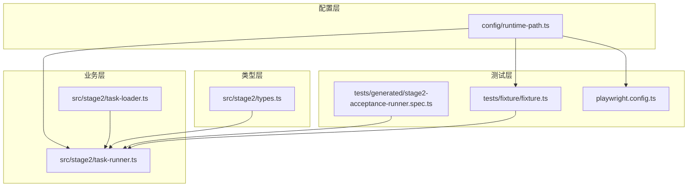
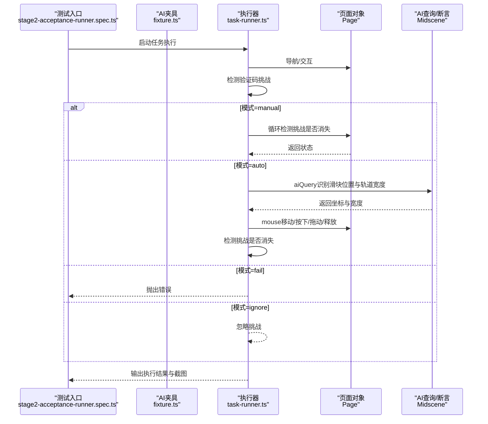
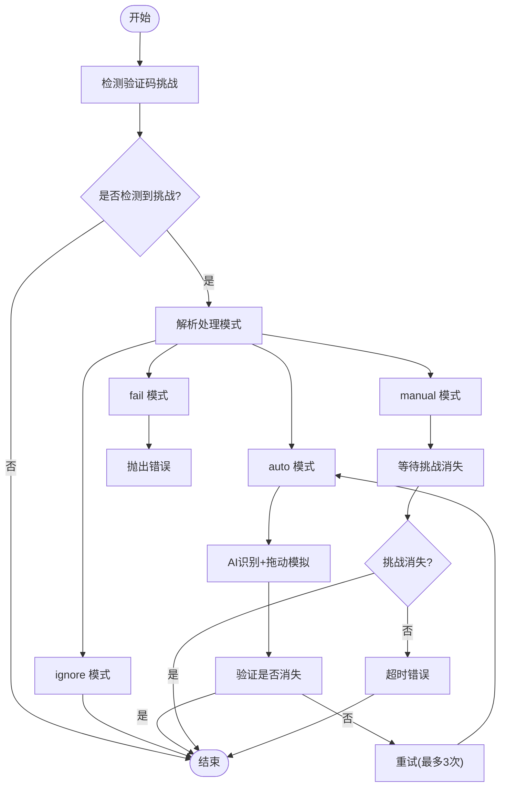
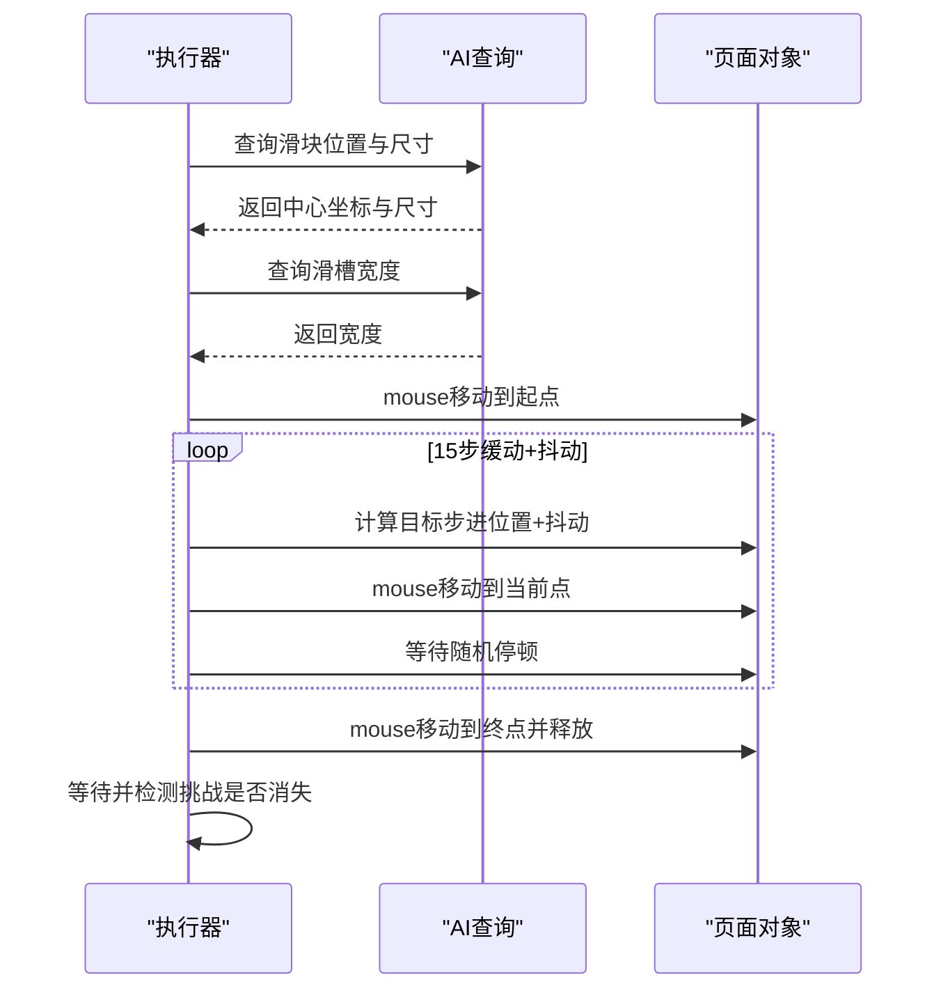
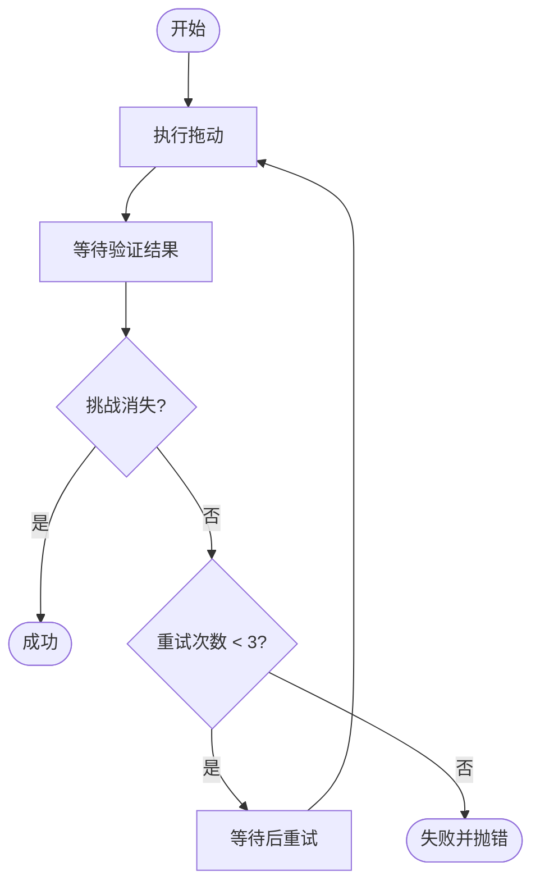
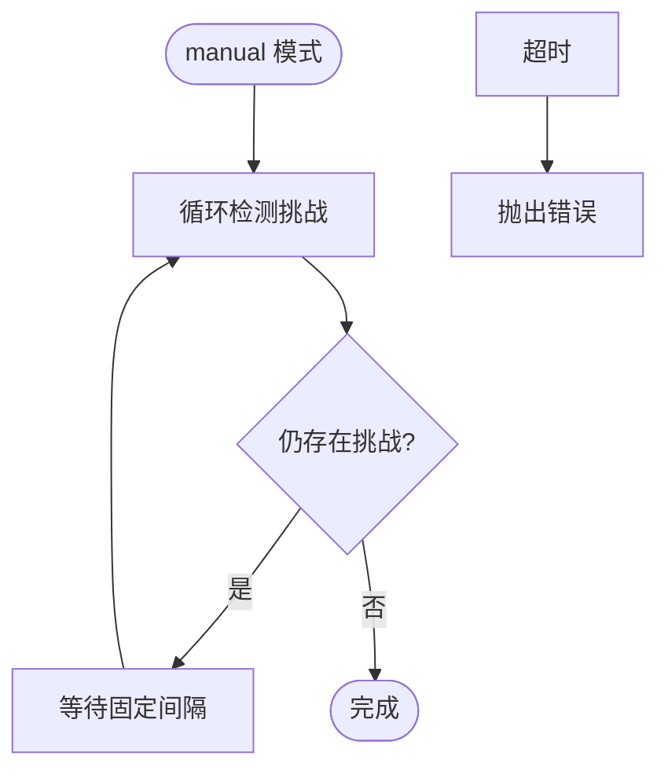
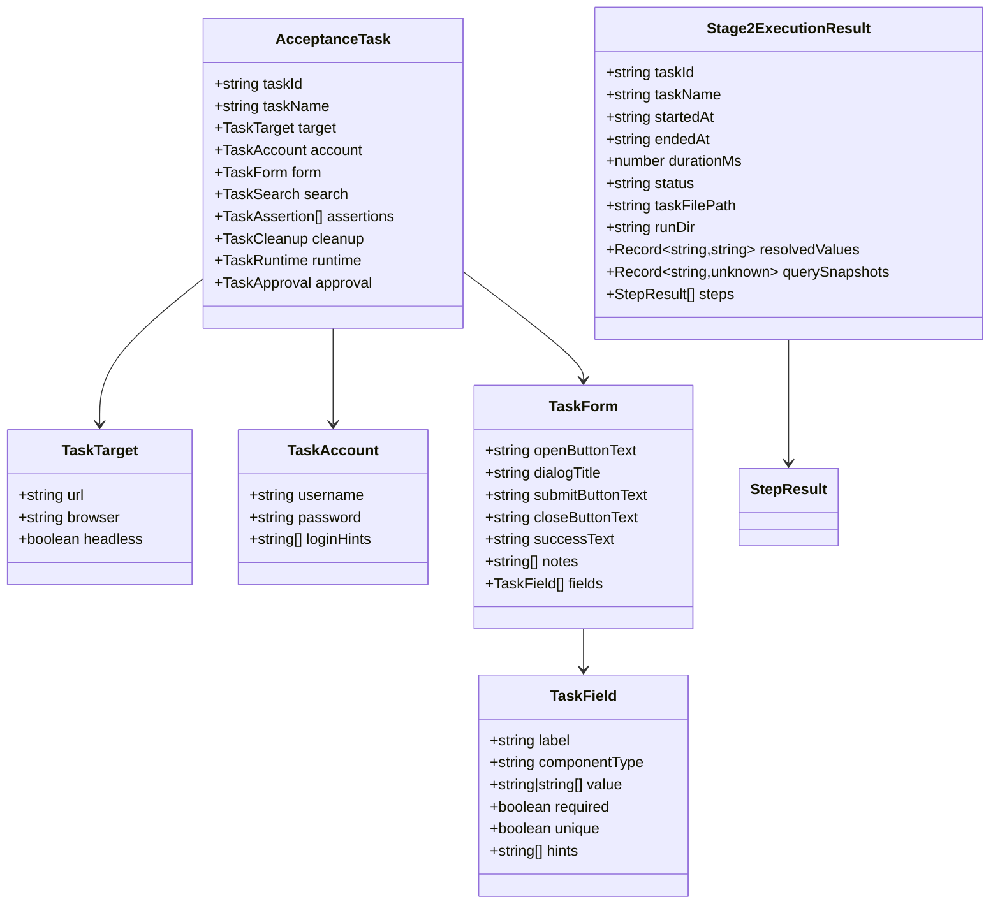
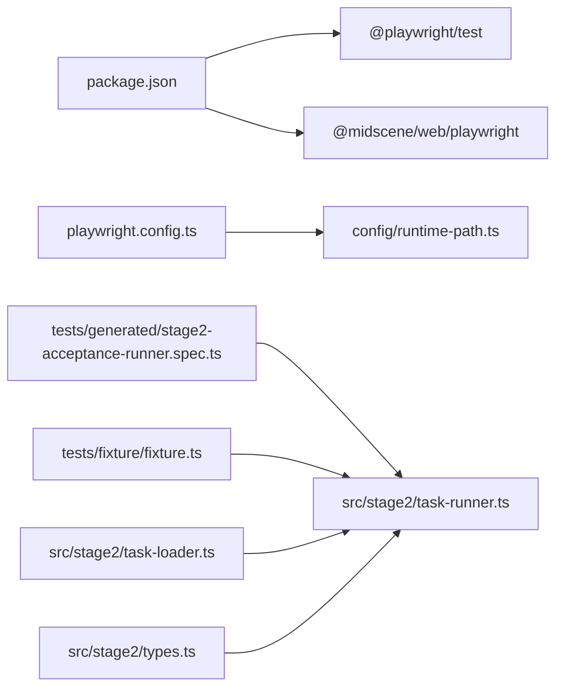

# 验证码处理

<cite>
**本文引用的文件**
- [README.md](file://README.md)
- [package.json](file://package.json)
- [playwright.config.ts](file://playwright.config.ts)
- [src/stage2/task-runner.ts](file://src/stage2/task-runner.ts)
- [src/stage2/types.ts](file://src/stage2/types.ts)
- [src/stage2/task-loader.ts](file://src/stage2/task-loader.ts)
- [tests/generated/stage2-acceptance-runner.spec.ts](file://tests/generated/stage2-acceptance-runner.spec.ts)
- [tests/fixture/fixture.ts](file://tests/fixture/fixture.ts)
- [config/runtime-path.ts](file://config/runtime-path.ts)
</cite>

## 目录
1. [简介](#简介)
2. [项目结构](#项目结构)
3. [核心组件](#核心组件)
4. [架构总览](#架构总览)
5. [详细组件分析](#详细组件分析)
6. [依赖关系分析](#依赖关系分析)
7. [性能考虑](#性能考虑)
8. [故障排查指南](#故障排查指南)
9. [结论](#结论)
10. [附录](#附录)

## 简介
本技术文档聚焦于 HI-TEST 验证码处理系统，特别是滑块验证码的自动处理机制。系统基于 Playwright 与 Midscene.js 的组合，通过 AI 识别页面中的滑块元素，模拟真实用户拖动轨迹，并在验证结束后进行结果校验。同时，系统支持通过环境变量配置验证码处理模式（auto、manual、fail、ignore），并提供人工兜底方案与调试手段。

## 项目结构
项目采用分层与功能模块结合的组织方式：
- 配置层：运行目录与环境变量解析，集中管理输出路径与运行参数
- 测试层：Playwright 测试入口与 Midscene 夹具，提供 AI 能力注入
- 业务层：第二段任务执行器，负责加载任务、执行步骤、处理验证码挑战
- 类型层：任务与执行结果的数据模型定义

图表来源
- [config/runtime-path.ts](file://config/runtime-path.ts#L1-L41)
- [playwright.config.ts](file://playwright.config.ts#L1-L95)
- [tests/fixture/fixture.ts](file://tests/fixture/fixture.ts#L1-L100)
- [tests/generated/stage2-acceptance-runner.spec.ts](file://tests/generated/stage2-acceptance-runner.spec.ts#L1-L39)
- [src/stage2/task-runner.ts](file://src/stage2/task-runner.ts#L1-L1344)
- [src/stage2/task-loader.ts](file://src/stage2/task-loader.ts#L1-L91)
- [src/stage2/types.ts](file://src/stage2/types.ts#L1-L125)

章节来源
- [README.md](file://README.md#L1-L144)
- [package.json](file://package.json#L1-L24)
- [playwright.config.ts](file://playwright.config.ts#L1-L95)
- [config/runtime-path.ts](file://config/runtime-path.ts#L1-L41)

## 核心组件
- 验证码检测与模式解析
  - 检测逻辑：通过文本关键字与特定选择器组合判断页面是否存在滑块/安全验证挑战
  - 模式解析：根据环境变量解析验证码处理模式（auto/manual/fail/ignore），并提供默认值与容错
- AI 识别与拖动模拟
  - 滑块位置与轨道宽度识别：通过 AI 查询接口获取滑块中心坐标与滑槽宽度
  - 拖动轨迹模拟：15 步缓动（easeOut）、随机抖动、随机停顿，模拟真实人类操作
- 结果验证与重试
  - 验证滑块是否消失；失败时最多重试 3 次；每次重试间隔固定等待
- 人工兜底与超时控制
  - manual 模式下循环检测挑战是否消失，超时则报错；超时时间可配置
- 任务执行与结果落盘
  - 加载任务 JSON，执行步骤，记录每步状态、截图与结果文件

章节来源
- [src/stage2/task-runner.ts](file://src/stage2/task-runner.ts#L32-L84)
- [src/stage2/task-runner.ts](file://src/stage2/task-runner.ts#L480-L498)
- [src/stage2/task-runner.ts](file://src/stage2/task-runner.ts#L507-L556)
- [src/stage2/task-runner.ts](file://src/stage2/task-runner.ts#L558-L645)
- [src/stage2/task-runner.ts](file://src/stage2/task-runner.ts#L647-L703)
- [src/stage2/task-loader.ts](file://src/stage2/task-loader.ts#L71-L91)
- [src/stage2/types.ts](file://src/stage2/types.ts#L86-L125)

## 架构总览
系统整体工作流如下：
- 测试入口加载任务并启动执行器
- 执行器在每个关键节点检测验证码挑战
- 根据模式选择自动处理或人工等待
- 自动模式下调用 AI 识别滑块位置与轨道宽度，模拟拖动轨迹
- 验证滑块是否消失，失败则重试
- 记录执行结果与截图，生成报告

图表来源
- [tests/generated/stage2-acceptance-runner.spec.ts](file://tests/generated/stage2-acceptance-runner.spec.ts#L1-L39)
- [tests/fixture/fixture.ts](file://tests/fixture/fixture.ts#L1-L100)
- [src/stage2/task-runner.ts](file://src/stage2/task-runner.ts#L480-L703)

## 详细组件分析

### 验证码检测与模式解析
- 文本关键字与选择器
  - 关键字集合用于匹配“请完成安全验证/请按住滑块/拖动到最右边/向右滑动”等提示
  - 选择器集合覆盖常见滑块容器与验证码相关节点
- 模式解析
  - 支持 auto、manual、fail、ignore 四种模式，不合法值回退为默认 manual
  - 提供等待超时时间解析，非法值回退为默认值

图表来源
- [src/stage2/task-runner.ts](file://src/stage2/task-runner.ts#L32-L84)
- [src/stage2/task-runner.ts](file://src/stage2/task-runner.ts#L480-L498)
- [src/stage2/task-runner.ts](file://src/stage2/task-runner.ts#L647-L703)

章节来源
- [src/stage2/task-runner.ts](file://src/stage2/task-runner.ts#L32-L84)
- [src/stage2/task-runner.ts](file://src/stage2/task-runner.ts#L480-L498)
- [src/stage2/task-runner.ts](file://src/stage2/task-runner.ts#L647-L703)

### AI 识别与拖动轨迹模拟
- 滑块位置与轨道宽度识别
  - 通过 AI 查询接口返回滑块中心坐标与尺寸，若缺失则使用默认尺寸
  - 通过 AI 查询接口返回滑槽宽度，用于计算目标终点
- 拖动轨迹模拟
  - 15 步缓动（easeOut）：先快后慢，提升逼真度
  - 每步添加随机抖动（-3~3 像素水平/较小范围垂直）
  - 每步随机停顿（30~80ms），模拟人类自然节奏
  - 到达目标后释放鼠标，等待验证结果

图表来源
- [src/stage2/task-runner.ts](file://src/stage2/task-runner.ts#L507-L556)
- [src/stage2/task-runner.ts](file://src/stage2/task-runner.ts#L558-L645)

章节来源
- [src/stage2/task-runner.ts](file://src/stage2/task-runner.ts#L507-L556)
- [src/stage2/task-runner.ts](file://src/stage2/task-runner.ts#L558-L645)

### 结果验证与重试机制
- 验证策略
  - 拖动完成后等待一段时间，再次检测挑战是否消失
  - 成功则结束；失败则进入重试流程
- 重试策略
  - 最多重试 3 次，每次重试前等待固定时间
  - 若多次失败，抛出明确错误，建议检查页面样式与选择器

图表来源
- [src/stage2/task-runner.ts](file://src/stage2/task-runner.ts#L647-L703)

章节来源
- [src/stage2/task-runner.ts](file://src/stage2/task-runner.ts#L647-L703)

### 人工兜底方案
- 模式说明
  - manual：检测到挑战后，系统持续轮询挑战是否消失，直到超时
  - fail：检测到挑战即抛错，阻止继续执行
  - ignore：忽略挑战，不进行任何处理
- 超时控制
  - 通过环境变量设置等待超时时间，非法值回退为默认值
  - 超时后抛出错误，便于快速定位问题

图表来源
- [src/stage2/task-runner.ts](file://src/stage2/task-runner.ts#L685-L703)

章节来源
- [src/stage2/task-runner.ts](file://src/stage2/task-runner.ts#L685-L703)

### 数据模型与任务执行
- 任务模型
  - 包含目标站点、账号信息、表单字段、断言、清理策略、运行时参数等
- 执行器
  - 加载任务文件，解析模板变量，执行步骤，收集截图与结果
  - 在关键节点插入验证码处理逻辑

图表来源
- [src/stage2/types.ts](file://src/stage2/types.ts#L1-L125)

章节来源
- [src/stage2/types.ts](file://src/stage2/types.ts#L1-L125)
- [src/stage2/task-loader.ts](file://src/stage2/task-loader.ts#L71-L91)
- [tests/generated/stage2-acceptance-runner.spec.ts](file://tests/generated/stage2-acceptance-runner.spec.ts#L1-L39)

## 依赖关系分析
- 外部依赖
  - Playwright：UI 自动化与页面交互
  - Midscene.js：AI 能力（ai、aiQuery、aiAssert、aiWaitFor）
- 内部依赖
  - 配置层为测试层与业务层提供统一的运行目录与环境变量解析
  - 业务层依赖类型层的数据模型与任务加载器
  - 测试层通过夹具注入 AI 能力，驱动业务层执行

图表来源
- [package.json](file://package.json#L1-L24)
- [playwright.config.ts](file://playwright.config.ts#L1-L95)
- [config/runtime-path.ts](file://config/runtime-path.ts#L1-L41)
- [tests/generated/stage2-acceptance-runner.spec.ts](file://tests/generated/stage2-acceptance-runner.spec.ts#L1-L39)
- [tests/fixture/fixture.ts](file://tests/fixture/fixture.ts#L1-L100)
- [src/stage2/task-runner.ts](file://src/stage2/task-runner.ts#L1-L1344)
- [src/stage2/task-loader.ts](file://src/stage2/task-loader.ts#L1-L91)
- [src/stage2/types.ts](file://src/stage2/types.ts#L1-L125)

章节来源
- [package.json](file://package.json#L1-L24)
- [playwright.config.ts](file://playwright.config.ts#L1-L95)
- [config/runtime-path.ts](file://config/runtime-path.ts#L1-L41)

## 性能考虑
- 超时与重试
  - 页面级超时与步骤级超时需结合使用，避免单点阻塞
  - 自动模式下的重试次数与间隔应平衡成功率与耗时
- 拖动轨迹
  - 步数与停顿时间影响稳定性与速度，可根据目标网站反爬强度调整
  - 随机抖动与停顿越接近真实人类，越能降低被识别的风险
- 资源与报告
  - 运行目录统一收敛，便于清理与分析；HTML 报告与 Midscene 报告有助于定位问题

章节来源
- [playwright.config.ts](file://playwright.config.ts#L22-L48)
- [src/stage2/task-runner.ts](file://src/stage2/task-runner.ts#L667-L682)

## 故障排查指南
- 常见问题与定位
  - 滑块未被识别：检查 AI 查询提示词与页面截图一致性；确认滑块样式变化
  - 拖动轨迹异常：检查缓动函数与抖动范围；确认鼠标按下/释放时机
  - 验证失败：增加重试次数或延长等待时间；检查页面是否出现二次验证
  - 人工模式超时：增大等待超时时间；确认页面是否卡死或网络异常
- 调试建议
  - 开启有头模式运行，观察页面交互与截图
  - 查看 Midscene 报告与 Playwright HTML 报告
  - 在关键节点打印日志，记录滑块位置、轨道宽度与验证结果
- 人工兜底
  - 将模式切换为 manual，配合较长的等待超时，确保人工完成验证后再继续

章节来源
- [README.md](file://README.md#L39-L72)
- [src/stage2/task-runner.ts](file://src/stage2/task-runner.ts#L685-L703)

## 结论
HI-TEST 验证码处理系统通过 AI 识别与真实轨迹模拟，实现了滑块验证码的自动化处理，并提供了多种模式以适配不同场景。系统具备完善的检测、重试与人工兜底机制，配合统一的运行目录与报告体系，能够有效支撑端到端验收测试的稳定性与可维护性。

## 附录
- 环境变量与配置要点
  - 验证码模式：auto、manual、fail、ignore
  - 人工等待超时：毫秒级，用于 manual 模式
  - 运行目录：统一收敛至 t_runtime/ 下，便于管理与归档

章节来源
- [README.md](file://README.md#L39-L72)
- [config/runtime-path.ts](file://config/runtime-path.ts#L1-L41)