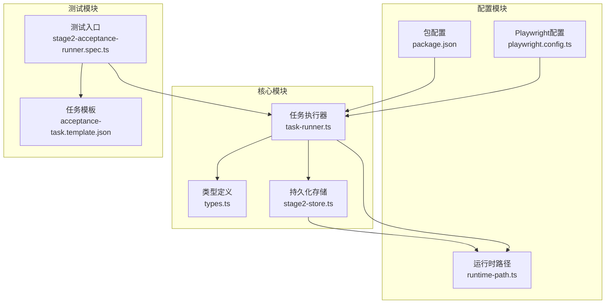
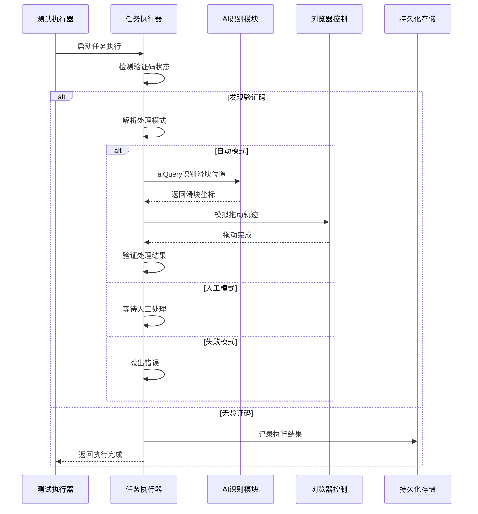
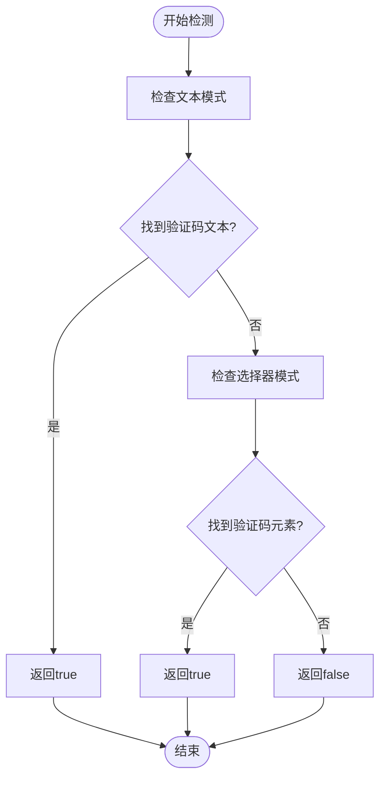
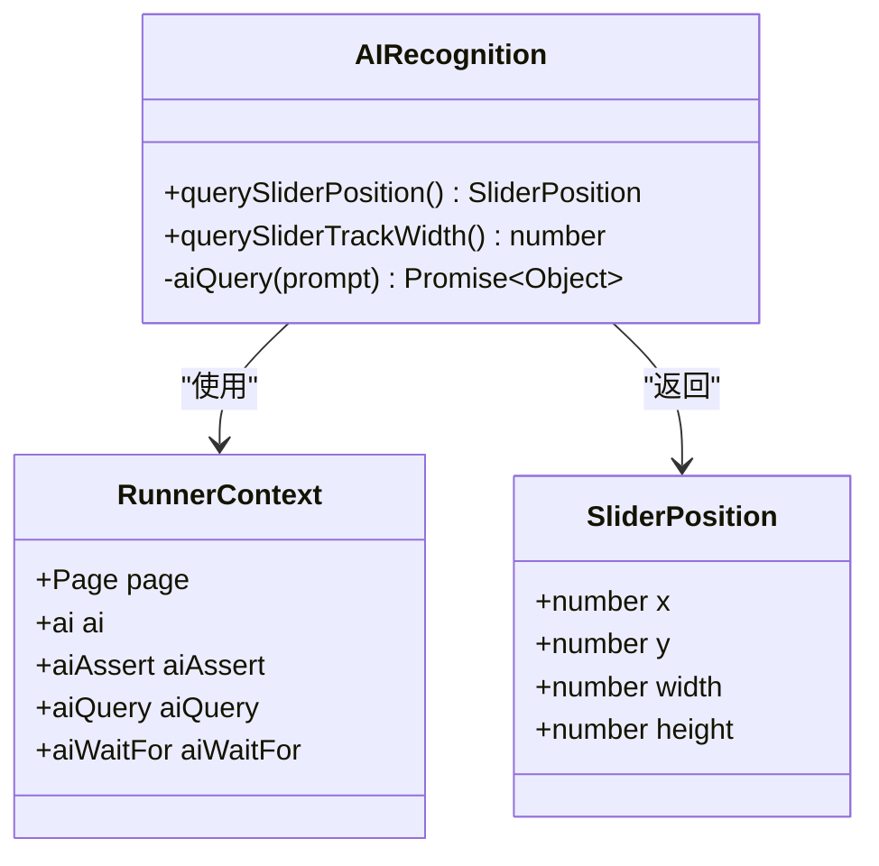
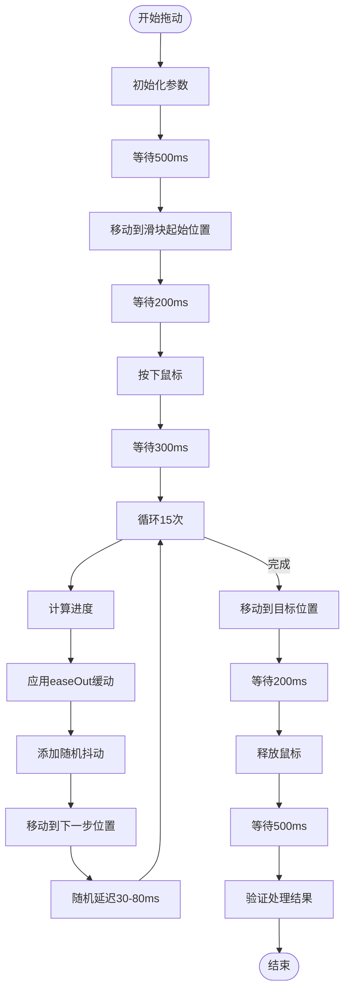
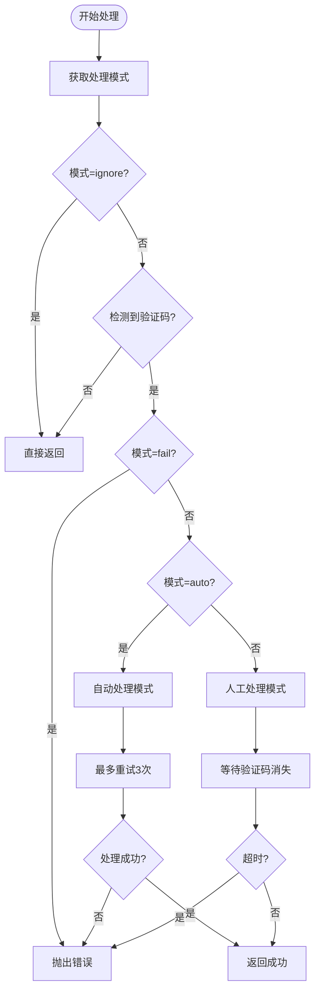
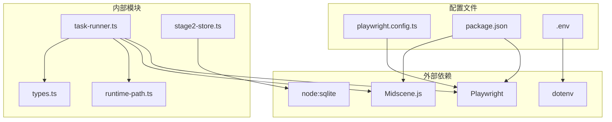

# 验证码处理系统

<cite>
**本文引用的文件**
- [README.md](file://README.md)
- [task-runner.ts](file://src/stage2/task-runner.ts)
- [types.ts](file://src/stage2/types.ts)
- [stage2-store.ts](file://src/persistence/stage2-store.ts)
- [runtime-path.ts](file://config/runtime-path.ts)
- [playwright.config.ts](file://playwright.config.ts)
- [stage2-acceptance-runner.spec.ts](file://tests/generated/stage2-acceptance-runner.spec.ts)
- [acceptance-task.template.json](file://specs/tasks/acceptance-task.template.json)
- [package.json](file://package.json)
</cite>

## 目录
1. [简介](#简介)
2. [项目结构](#项目结构)
3. [核心组件](#核心组件)
4. [架构概览](#架构概览)
5. [详细组件分析](#详细组件分析)
6. [依赖关系分析](#依赖关系分析)
7. [性能考虑](#性能考虑)
8. [故障排查指南](#故障排查指南)
9. [结论](#结论)
10. [附录](#附录)

## 简介
本项目是一个基于 Playwright 和 Midscene.js 的 AI 自动化测试项目，专注于滑块验证码的自动处理。系统通过 AI 识别算法、模拟拖动轨迹生成和结果验证流程，实现了四种验证码处理模式（auto、manual、fail、ignore），并在失败时提供明确的错误提示和回退策略。

## 项目结构
项目采用模块化设计，主要包含以下核心模块：
- stage2 执行器：负责任务执行和验证码处理
- 持久化存储：基于 SQLite 的数据持久化
- 配置管理：环境变量和运行时路径解析
- 测试框架：Playwright 测试套件



**图表来源**
- [task-runner.ts:1-80](file://src/stage2/task-runner.ts#L1-L80)
- [stage2-store.ts:1-50](file://src/persistence/stage2-store.ts#L1-L50)
- [runtime-path.ts:1-41](file://config/runtime-path.ts#L1-L41)

**章节来源**
- [README.md:1-223](file://README.md#L1-L223)
- [package.json:1-26](file://package.json#L1-L26)

## 核心组件
验证码处理系统的核心组件包括：

### 验证码处理模式
系统支持四种验证码处理模式：
- **auto（自动模式）**：默认模式，使用 AI 自动处理滑块验证码
- **manual（人工模式）**：检测到验证码后等待人工处理
- **fail（失败模式）**：检测到验证码立即失败
- **ignore（忽略模式）**：忽略验证码检测（不建议）

### AI 识别算法
系统使用 Midscene 的 `aiQuery` 方法进行页面分析：
- 滑块按钮位置识别（中心点坐标和尺寸）
- 滑槽宽度分析
- 返回结构化数据供后续处理

### 模拟拖动轨迹生成
拖动轨迹采用真实用户行为模拟：
- 15步渐进拖动
- easeOut 缓动函数（先快后慢）
- 随机抖动（-3~3像素水平，-2~2像素垂直）
- 随机延迟（30-80ms）

### 结果验证流程
验证采用多轮检测：
- 检查滑块是否消失
- 最多重试3次
- 失败时抛出明确错误信息

**章节来源**
- [README.md:56-74](file://README.md#L56-L74)
- [task-runner.ts:35-75](file://src/stage2/task-runner.ts#L35-L75)
- [task-runner.ts:510-559](file://src/stage2/task-runner.ts#L510-L559)
- [task-runner.ts:561-648](file://src/stage2/task-runner.ts#L561-L648)

## 架构概览
系统采用分层架构设计，各层职责清晰分离：



**图表来源**
- [task-runner.ts:650-706](file://src/stage2/task-runner.ts#L650-L706)
- [stage2-store.ts:495-590](file://src/persistence/stage2-store.ts#L495-L590)

## 详细组件分析

### 验证码检测组件
验证码检测组件负责识别页面中的验证码状态：



**图表来源**
- [task-runner.ts:483-501](file://src/stage2/task-runner.ts#L483-L501)

检测逻辑包含两个层面：
1. **文本模式检测**：检查特定文本关键词
2. **选择器模式检测**：使用预定义的选择器匹配验证码元素

**章节来源**
- [task-runner.ts:42-53](file://src/stage2/task-runner.ts#L42-L53)
- [task-runner.ts:483-501](file://src/stage2/task-runner.ts#L483-L501)

### AI 识别组件
AI 识别组件负责从页面截图中提取验证码相关信息：



**图表来源**
- [task-runner.ts:503-559](file://src/stage2/task-runner.ts#L503-L559)

AI 识别功能包括：
- 滑块按钮位置识别（中心点坐标）
- 滑槽宽度测量
- 结构化数据返回

**章节来源**
- [task-runner.ts:510-559](file://src/stage2/task-runner.ts#L510-L559)

### 拖动轨迹模拟组件
拖动轨迹模拟组件实现真实用户行为：



**图表来源**
- [task-runner.ts:592-621](file://src/stage2/task-runner.ts#L592-L621)

轨迹模拟参数：
- **步数**：15步
- **缓动函数**：easeOut
- **抖动范围**：±3像素（水平），±2像素（垂直）
- **延迟范围**：30-80ms

**章节来源**
- [task-runner.ts:592-621](file://src/stage2/task-runner.ts#L592-L621)

### 处理模式决策组件
处理模式决策组件根据配置选择相应的处理策略：



**图表来源**
- [task-runner.ts:650-706](file://src/stage2/task-runner.ts#L650-L706)

**章节来源**
- [task-runner.ts:61-75](file://src/stage2/task-runner.ts#L61-L75)
- [task-runner.ts:650-706](file://src/stage2/task-runner.ts#L650-L706)

## 依赖关系分析



**图表来源**
- [package.json:15-24](file://package.json#L15-L24)
- [playwright.config.ts:1-95](file://playwright.config.ts#L1-L95)

**章节来源**
- [package.json:15-24](file://package.json#L15-L24)
- [playwright.config.ts:1-95](file://playwright.config.ts#L1-L95)

## 性能考虑
系统在性能方面采用了多项优化策略：

### 1. 智能重试机制
- **最大重试次数**：3次
- **重试间隔**：2秒
- **失败回退**：自动切换到人工模式

### 2. 缓存和稳定性优化
- **AI查询缓存**：利用 Midscene 的缓存机制
- **页面等待策略**：合理的等待时间配置
- **错误恢复**：确保鼠标状态正确释放

### 3. 资源管理
- **数据库连接池**：SQLite 单连接模式
- **文件系统清理**：自动清理临时文件
- **内存使用控制**：避免大数据量加载

### 4. 并发控制
- **单线程执行**：避免竞态条件
- **异步操作**：非阻塞等待
- **超时控制**：防止无限等待

## 故障排查指南

### 常见问题及解决方案

#### 1. 验证码识别失败
**症状**：AI无法识别滑块位置
**解决方案**：
- 检查页面截图质量
- 调整 AI 查询提示词
- 验证 Midscene 模型配置

#### 2. 拖动轨迹异常
**症状**：拖动过程中鼠标状态异常
**解决方案**：
- 确保拖动完成后鼠标释放
- 检查浏览器兼容性
- 调整拖动参数

#### 3. 处理超时
**症状**：验证码处理超过设定时间
**解决方案**：
- 增加 `STAGE2_CAPTCHA_WAIT_TIMEOUT_MS` 配置
- 检查网络连接状况
- 优化页面加载速度

#### 4. 模式配置错误
**症状**：验证码处理不符合预期
**解决方案**：
- 检查 `STAGE2_CAPTCHA_MODE` 环境变量
- 验证配置文件格式
- 确认环境变量加载顺序

**章节来源**
- [task-runner.ts:683-685](file://src/stage2/task-runner.ts#L683-L685)
- [README.md:56-62](file://README.md#L56-L62)

### 日志和调试
系统提供了丰富的日志输出：
- **验证码检测日志**：记录检测到的验证码状态
- **AI识别日志**：显示识别结果和坐标信息
- **拖动过程日志**：跟踪拖动轨迹和参数
- **错误处理日志**：记录异常情况和回退策略

## 结论
验证码处理系统通过 AI 识别算法、真实用户行为模拟和智能重试机制，实现了高成功率的自动化验证码处理。系统的设计充分考虑了可靠性、可维护性和扩展性，为后续的功能增强奠定了坚实基础。

主要优势包括：
1. **高精度识别**：基于 AI 的滑块位置识别
2. **真实行为模拟**：符合人类操作习惯的拖动轨迹
3. **灵活处理模式**：适应不同场景需求
4. **完善的错误处理**：提供多种回退策略
5. **可观测性**：完整的日志和监控支持

## 附录

### 配置参数说明
- **STAGE2_CAPTCHA_MODE**：验证码处理模式（auto/manual/fail/ignore）
- **STAGE2_CAPTCHA_WAIT_TIMEOUT_MS**：人工处理等待超时时间（毫秒）
- **MIDSCENE_MODEL_NAME**：AI 模型名称
- **RUNTIME_DIR_PREFIX**：运行时目录前缀

### 环境变量配置示例
```dotenv
STAGE2_CAPTCHA_MODE=auto
STAGE2_CAPTCHA_WAIT_TIMEOUT_MS=120000
MIDSCENE_MODEL_NAME=qwen3-vl-plus
RUNTIME_DIR_PREFIX=t_runtime/
```

### 执行命令
```bash
# 初始化数据库
npm run db:init

# 执行迁移
npm run db:migrate

# 运行测试（无头模式）
npm run stage2:run

# 运行测试（有头模式）
npm run stage2:run:headed
```

**章节来源**
- [README.md:39-54](file://README.md#L39-L54)
- [package.json:6-10](file://package.json#L6-L10)